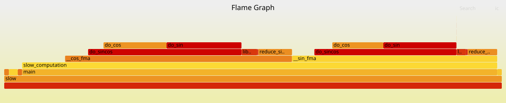
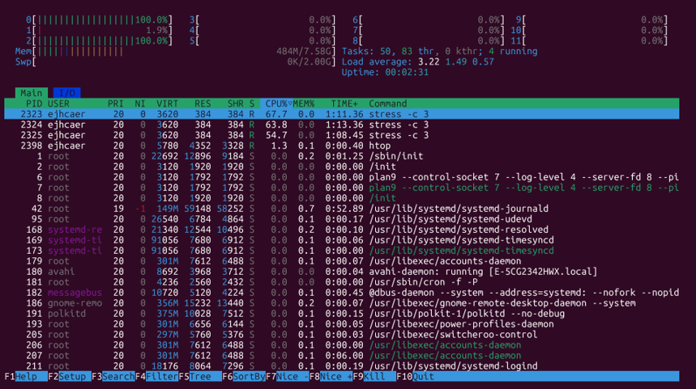
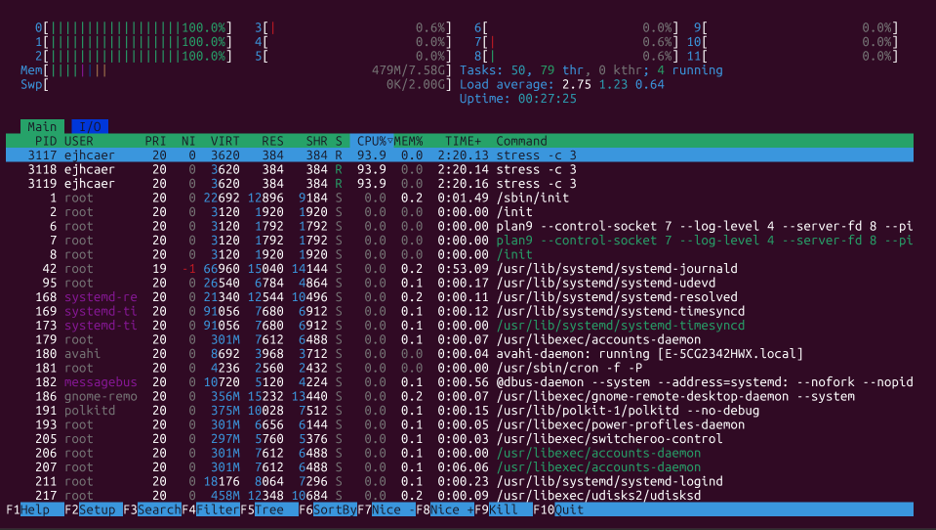

# Exercises

> Testing Environment: 
> 1. Windows11 + WSL2 (Ubuntu 24.04 LTS)
> 2. Linux (Ubuntu 24.04 LTS)

## Debugging

1. **Debug a sorting algorithm**: The following pseudocode implements merge sort but contains a bug. Implement it in a language of your choice, then use a debugger (gdb, lldb, pdb, or your IDE's debugger) to find and fix the bug.

    ```
    function merge_sort(arr):
        if length(arr) <= 1:
            return arr
        mid = length(arr) / 2
        left = merge_sort(arr[0..mid])
        right = merge_sort(arr[mid..end])
        return merge(left, right)

    function merge(left, right):
        result = []
        i = 0, j = 0
        while i < length(left) AND j < length(right):
            if left[i] <= right[j]:
                append result, left[i]
                i = i + 1
            else:
                append result, right[i]
                j = j + 1
        append remaining elements from left and right
        return result
    ```

    Test vector: `merge_sort([3, 1, 4, 1, 5, 9, 2, 6])` should return `[1, 1, 2, 3, 4, 5, 6, 9]`. Use breakpoints and step through the merge function to find where the incorrect element is being selected.

    ## **Answer**
    ### Original Merge Sort Code in C
    ```c
    #include <stdio.h>
    #include <stdlib.h>

    /* merge(left, right) */
    int* merge(int *left, int left_len, int *right, int right_len, int *result_len) {
        // result = []
        int *result = malloc(sizeof(int) * (left_len + right_len));
        int k = 0;

        // i = 0, j = 0
        int i = 0, j = 0;

        // while i < length(left) AND j < length(right):
        while (i < left_len && j < right_len) {
            if (left[i] <= right[j]) {
                // append result, left[i]
                result[k++] = left[i];
                // i = i + 1
                i = i + 1;
            } else {
                // append result, right[i]
                result[k++] = right[i];
                // j = j + 1
                j = j + 1;
            }
        }

        // append remaining elements from left and right
        while (i < left_len) {
            result[k++] = left[i];
            i++;
        }
        while (j < right_len) {
            result[k++] = right[j];
            j++;
        }

        *result_len = k;

        // return result
        return result;
    }

    /* merge_sort(arr) */
    int* merge_sort(int *arr, int len, int *out_len) {
        // if length(arr) <= 1: return arr
        if (len <= 1) {
            int *result = malloc(sizeof(int) * (len > 0 ? len : 1));
            for (int i = 0; i < len; i++) {
                result[i] = arr[i];
            }
            *out_len = len;
            return result;
        }

        // mid = length(arr) / 2
        int mid = len / 2;

        // left = merge_sort(arr[0..mid])
        int left_len;
        int *left = merge_sort(arr, mid, &left_len);

        // right = merge_sort(arr[mid..end])
        int right_len;
        int *right = merge_sort(arr + mid, len - mid, &right_len);

        // return merge(left, right)
        int *merged = merge(left, left_len, right, right_len, out_len);

        free(left);
        free(right);

        return merged;
    }

    int main(void) {
        int arr[] = {3, 1, 4, 1, 5, 9, 2, 6};
        int n = sizeof(arr) / sizeof(arr[0]);
        int out_len;

        int *sorted = merge_sort(arr, n, &out_len);

        printf("Result of merge sort: ");
        for (int i = 0; i < out_len; i++) {
            printf("%d ", sorted[i]);
        }
        printf("\n");

        free(sorted);
        return 0;
    }
    ```

    ### Demo1 (Run Original C Code)
    ```console
    rightbear@Rightbear:~ $ gcc merge_sort.c -o merge_sort && ./merge_sort
    Result of merge sort: 1 5 4 3 4 5 6 9
    ```

    ### Debugging Strategy
    For this task, the debugging tool used here is `gdb`. Then use breakpoints and step through the merge function to find where the incorrect element is being selected.  
    As seen in the demo below, when the merge function reaches the stage where `left_len=2` and `right_len=2` and `i=1`, `j=0`, the program actually writes `right[i]=4` to `result[1]` on line 22, but logically it should take `right[j]=1`. The two values are completely different, proving that the `else` branch of `merge()` accessed the wrong index (writing `j` as `i`). Continuing a few steps further (`next`) and looking at `result[k-1]`, we find that 4 is written instead of the expected 1, meaning the sorting result is corrupted.  
    Finally, using `backtrace` to confirm which layer the recursive call triggered the merge, it was found that the merge was triggered when the outermost array with a length of 8 was switched to the layer with a length of 4, and the problem occurred.

    ### Demo2 (Debug Original Code)
    ```console
    rightbear@Rightbear:~ $ gdb ./merge_sort
    GNU gdb (Ubuntu 15.1-1ubuntu1~24.04.1) 15.1
    Copyright (C) 2024 Free Software Foundation, Inc.
    License GPLv3+: GNU GPL version 3 or later <http://gnu.org/licenses/gpl.html>
    This is free software: you are free to change and redistribute it.
    There is NO WARRANTY, to the extent permitted by law.
    Type "show copying" and "show warranty" for details.
    This GDB was configured as "x86_64-linux-gnu".
    Type "show configuration" for configuration details.
    For bug reporting instructions, please see:
    <https://www.gnu.org/software/gdb/bugs/>.
    Find the GDB manual and other documentation resources online at:
        <http://www.gnu.org/software/gdb/documentation/>.

    For help, type "help".
    Type "apropos word" to search for commands related to "word"...
    Reading symbols from ./merge_sort...
    (gdb) break merge
    Breakpoint 1 at 0x11e7: file merge_sort.c, line 7.
    (gdb) run
    Starting program: /home/rightbear/merge_sort
    [Thread debugging using libthread_db enabled]
    Using host libthread_db library "/lib/x86_64-linux-gnu/libthread_db.so.1".

    Breakpoint 1, merge (left=0x5555555592a0, left_len=1, right=0x5555555592c0, right_len=1, result_len=0x7fffffffdd08) at merge_sort.c:7
    7           int *result = malloc(sizeof(int) * (left_len + right_len));
    (gdb) continue
    Continuing.

    Breakpoint 1, merge (left=0x5555555592c0, left_len=1, right=0x5555555592a0, right_len=1, result_len=0x7fffffffdd0c) at merge_sort.c:7
    7           int *result = malloc(sizeof(int) * (left_len + right_len));
    (gdb) continue
    Continuing.

    Breakpoint 1, merge (left=0x5555555592e0, left_len=2, right=0x555555559300, right_len=2, result_len=0x7fffffffdd78) at merge_sort.c:7
    7           int *result = malloc(sizeof(int) * (left_len + right_len));
    (gdb) next
    8           int k = 0;
    (gdb) next
    11          int i = 0, j = 0;
    (gdb) next
    14          while (i < left_len && j < right_len) {
    (gdb) next
    15              if (left[i] <= right[j]) {
    (gdb) next
    17                  result[k++] = left[i];
    (gdb) next
    19                  i = i + 1;
    (gdb) print k
    $1 = 1
    (gdb) print result[0]@k
    $2 = {1}
    (gdb) next
    14          while (i < left_len && j < right_len) {
    (gdb) next
    15              if (left[i] <= right[j]) {
    (gdb) next
    22                  result[k++] = right[i];
    (gdb) print {i, j, right[i], right[j]}
    $3 = {1, 0, 4, 1}
    (gdb) next
    24                  j = j + 1;
    (gdb) print k
    $4 = 2
    (gdb) print result[0]@k
    $5 = {1, 4}
    (gdb) backtrace 3
    #0  merge (left=0x5555555592e0, left_len=2, right=0x555555559300, right_len=2, result_len=0x7fffffffdd78) at merge_sort.c:24
    #1  0x0000555555555474 in merge_sort (arr=0x7fffffffdde0, len=4, out_len=0x7fffffffdd78) at merge_sort.c:68
    #2  0x0000555555555426 in merge_sort (arr=0x7fffffffdde0, len=8, out_len=0x7fffffffddcc) at merge_sort.c:61
    (More stack frames follow...)
    (gdb) quit
    A debugging session is active.

            Inferior 1 [process 21117] will be killed.

    Quit anyway? (y or n) y
    ```

    ### Modified Merge Sort Code in C
    The problem is confirmed to be after line 22; changing right[i] to right[j] will fix the issue.

    ```c
    #include <stdio.h>
    #include <stdlib.h>

    /* merge(left, right) */
    int* merge(int *left, int left_len, int *right, int right_len, int *result_len) {
        // result = []
        int *result = malloc(sizeof(int) * (left_len + right_len));
        int k = 0;
    
        // i = 0, j = 0
        int i = 0, j = 0;
    
        // while i < length(left) AND j < length(right):
        while (i < left_len && j < right_len) {
            if (left[i] <= right[j]) {
                // append result, left[i]
                result[k++] = left[i];
                // i = i + 1
                i = i + 1;
            } else {
                // append result, right[j]
                result[k++] = right[j];
                // j = j + 1
                j = j + 1;
            }
        }
    
        // append remaining elements from left and right
        while (i < left_len) {
            result[k++] = left[i];
            i++;
        }
        while (j < right_len) {
            result[k++] = right[j];
            j++;
        }
    
        *result_len = k;
    
        // return result
        return result;
    }

    /* merge_sort(arr) */
    int* merge_sort(int *arr, int len, int *out_len) {
        // if length(arr) <= 1: return arr
        if (len <= 1) {
            int *result = malloc(sizeof(int) * (len > 0 ? len : 1));
            for (int i = 0; i < len; i++) {
                result[i] = arr[i];
            }
            *out_len = len;
            return result;
        }
    
        // mid = length(arr) / 2
        int mid = len / 2;
    
        // left = merge_sort(arr[0..mid])
        int left_len;
        int *left = merge_sort(arr, mid, &left_len);
    
        // right = merge_sort(arr[mid..end])
        int right_len;
        int *right = merge_sort(arr + mid, len - mid, &right_len);
    
        // return merge(left, right)
        int *merged = merge(left, left_len, right, right_len, out_len);
    
        free(left);
        free(right);
    
        return merged;
    }

    int main(void) {
        int arr[] = {3, 1, 4, 1, 5, 9, 2, 6};
        int n = sizeof(arr) / sizeof(arr[0]);
        int out_len;
    
        int *sorted = merge_sort(arr, n, &out_len);
    
        printf("Result of merge sort: ");
        for (int i = 0; i < out_len; i++) {
            printf("%d ", sorted[i]);
        }
        printf("\n");
    
        free(sorted);
        return 0;
    }
    ```

    ### Demo3 (Run Modified C Code)
    ```console
    rightbear@Rightbear:~ $ gcc merge_sort.c -o merge_sort && ./merge_sort
    Result of merge sort: 1 1 2 3 4 5 6 9
    ```

2. Install [`rr`](https://rr-project.org/) and use reverse debugging to find a corruption bug. Save this program as `corruption.c`:

    ```c
    #include <stdio.h>

    typedef struct {
        int id;
        int scores[3];
    } Student;

    Student students[2];

    void init() {
        students[0].id = 1001;
        students[0].scores[0] = 85;
        students[0].scores[1] = 92;
        students[0].scores[2] = 78;

        students[1].id = 1002;
        students[1].scores[0] = 90;
        students[1].scores[1] = 88;
        students[1].scores[2] = 95;
    }

    void curve_scores(int student_idx, int curve) {
        for (int i = 0; i < 4; i++) {
            students[student_idx].scores[i] += curve;
        }
    }

    int main() {
        init();
        printf("=== Initial state ===\n");
        printf("Student 0: id=%d\n", students[0].id);
        printf("Student 1: id=%d\n", students[1].id);

        curve_scores(0, 5);

        printf("\n=== After curving ===\n");
        printf("Student 0: id=%d\n", students[0].id);
        printf("Student 1: id=%d\n", students[1].id);

        if (students[1].id != 1002) {
            printf("\nERROR: Student 1's ID was corrupted! Expected 1002, got %d\n",
                    students[1].id);
            return 1;
        }
        return 0;
    }
    ```

    Compile with `gcc -g corruption.c -o corruption` and run it. Student 1's ID gets corrupted, but the corruption happens in a function that only touches student 0. Use `rr record ./corruption` and `rr replay` to find the culprit. Set a watchpoint on `students[1].id` and use `reverse-continue` after the corruption to find exactly which line of code overwrote it.

    ## **Answer**
    ### Demo1 (Run Original C Code)
    ```console
    debuglabtest@missing-semester-test:~ $ gcc -g corruption.c -o corruption
    debuglabtest@missing-semester-test:~ $
    debuglabtest@missing-semester-test:~ $ ./corruption
    === Initial state ===
    Student 0: id=1001
    Student 1: id=1002

    === After curving ===
    Student 0: id=1001
    Student 1: id=1007

    ERROR: Student 1's ID was corrupted! Expected 1002, got 1007
    ```

    ### Debugging Strategy
    For this task, the debugging tool used here is `rr` combined with `gdb`, following a "record $\rightarrow$ replay $\rightarrow$ reverse-execute" workflow to precisely pinpoint the exact line of code where the data was unexpectedly overwritten.  
    As seen in the demo below, after starting a fresh `rr` replay session, I let the program `continue` to completion first to observe its behavior, then used `list` to browse the source code and confirmed the `scores` array in the `students` struct only has 3 elements declared (`scores[0..2]`), yet the loop in `curve_scores` runs up to `i=3` — a clear sign of a potential out-of-bounds write.  
    I set a breakpoint at line 40 and rerun the program, confirming that `students[1].id` had already become the incorrect value 1007 by this point — meaning the field had been overwritten at some earlier point in execution.  
    To find the actual write location, I set a hardware watchpoint on `students[1].id`. I reverse-executed the program with `reverse-continue`, letting it run backward from the current (corrupted) state until the value of this variable changed. The result showed that `students[1].id` was overwritten during the execution of line 24 inside `curve_scores` — but logically, this line should only be writing to `scores[i]`, not `id`! This confirmed my earlier suspicion from reading the source code: the loop boundary was off (`i` reached 3, but `scores` only has 3 slots), causing an out-of-bounds write that happened to overwrite the memory immediately following it — the `id` field.  
    Finally, using `backtrace` to confirm that the corrupting write was triggered from line 34 in `main()`, which calls `curve_scores(0, 5)`. In other words, while applying a grade curve to `student_idx=0`, the array out-of-bounds write inadvertently spread the corruption into `students[1].id`.

    ### Demo2 (Debug Original Code)
    ```console
    debuglabtest@missing-semester-test:~ $ rr record ./corruption
    rr: Saving execution to trace directory `/home/debuglabtest/.local/share/rr/corruption-0'.
    === Initial state ===
    Student 0: id=1001
    Student 1: id=1002

    === After curving ===
    Student 0: id=1001
    Student 1: id=1007

    ERROR: Student 1's ID was corrupted! Expected 1002, got 1007
    debuglabtest@missing-semester-test:~ $ rr replay
    GNU gdb (Ubuntu 15.0.50.20240403-0ubuntu1) 15.0.50.20240403-git
    Copyright (C) 2024 Free Software Foundation, Inc.
    License GPLv3+: GNU GPL version 3 or later <http://gnu.org/licenses/gpl.html>
    This is free software: you are free to change and redistribute it.
    There is NO WARRANTY, to the extent permitted by law.
    Type "show copying" and "show warranty" for details.
    This GDB was configured as "x86_64-linux-gnu".
    Type "show configuration" for configuration details.
    For bug reporting instructions, please see:
    <https://www.gnu.org/software/gdb/bugs/>.
    Find the GDB manual and other documentation resources online at:
        <http://www.gnu.org/software/gdb/documentation/>.

    For help, type "help".
    Type "apropos word" to search for commands related to "word"...
    Reading symbols from /home/debuglabtest/.local/share/rr/corruption-0/mmap_hardlink_4_corruption...
    <string>:39: SyntaxWarning: invalid escape sequence '\w'
    Really redefine built-in command "restart"? (y or n) [answered Y; input not from terminal]
    Really redefine built-in command "jump"? (y or n) [answered Y; input not from terminal]
    <string>:2: SyntaxWarning: invalid escape sequence '\.'
    Remote debugging using 127.0.0.1:3551
    Reading symbols from /lib64/ld-linux-x86-64.so.2...
    Reading symbols from /usr/lib/debug/.build-id/f5/8808c9c8a388055b126492a1706d732761f86e.debug...
    BFD: warning: system-supplied DSO at 0x6fffd000 has a section extending past end of file

    This GDB supports auto-downloading debuginfo from the following URLs:
    <https://debuginfod.ubuntu.com>
    Enable debuginfod for this session? (y or [n])
    Debuginfod has been disabled.
    To make this setting permanent, add 'set debuginfod enabled off' to .gdbinit.
    0x0000760d30fc7540 in _start () from /lib64/ld-linux-x86-64.so.2
    (rr) continue
    Continuing.
    === Initial state ===
    Student 0: id=1001
    Student 1: id=1002

    === After curving ===
    Student 0: id=1001
    Student 1: id=1007

    ERROR: Student 1's ID was corrupted! Expected 1002, got 1007

    Program received signal SIGKILL, Killed.
    0x0000000070000002 in syscall_traced ()
    (rr) list
    15
    16          students[1].id = 1002;
    17          students[1].scores[0] = 90;
    18          students[1].scores[1] = 88;
    19          students[1].scores[2] = 95;
    20      }
    21
    22      void curve_scores(int student_idx, int curve) {
    23          for (int i = 0; i < 4; i++) {
    24              students[student_idx].scores[i] += curve;
    (rr) list
    25          }
    26      }
    27
    28      int main() {
    29          init();
    30          printf("=== Initial state ===\n");
    31          printf("Student 0: id=%d\n", students[0].id);
    32          printf("Student 1: id=%d\n", students[1].id);
    33
    34          curve_scores(0, 5);
    (rr) list
    35
    36          printf("\n=== After curving ===\n");
    37          printf("Student 0: id=%d\n", students[0].id);
    38          printf("Student 1: id=%d\n", students[1].id);
    39
    40          if (students[1].id != 1002) {
    41              printf("\nERROR: Student 1's ID was corrupted! Expected 1002, got %d\n",
    42                     students[1].id);
    43              return 1;
    44          }
    (rr) break 40
    Breakpoint 1 at 0x581b58d392e6: file corruption.c, line 40.
    (rr) run
    [Inferior 1 (process 2625) exited normally]
    Starting program: /home/debuglabtest/.local/share/rr/corruption-0/mmap_hardlink_4_corruption

    Program stopped.
    0x0000760d30fc7540 in _start () from /lib64/ld-linux-x86-64.so.2
    (rr) continue
    Continuing.
    === Initial state ===
    Student 0: id=1001
    Student 1: id=1002

    === After curving ===
    Student 0: id=1001
    Student 1: id=1007

    Breakpoint 1, main () at corruption.c:40
    40          if (students[1].id != 1002) {
    (rr) print students[1].id
    $1 = 1007
    (rr) watch students[1].id
    Hardware watchpoint 2: students[1].id
    (rr) reverse-continue
    Continuing.

    Hardware watchpoint 2: students[1].id

    Old value = 1007
    New value = 1002
    0x0000581b58d39226 in curve_scores (student_idx=0, curve=5) at corruption.c:24
    24              students[student_idx].scores[i] += curve;
    (rr) backtrace
    #0  0x0000581b58d39226 in curve_scores (student_idx=0, curve=5) at corruption.c:24
    #1  0x0000581b58d3929f in main () at corruption.c:34
    (rr) list curve_scores
    17          students[1].scores[0] = 90;
    18          students[1].scores[1] = 88;
    19          students[1].scores[2] = 95;
    20      }
    21
    22      void curve_scores(int student_idx, int curve) {
    23          for (int i = 0; i < 4; i++) {
    24              students[student_idx].scores[i] += curve;
    25          }
    26      }
    (rr) quit
    A debugging session is active.

            Inferior 1 [process 2625] will be detached.

    Quit anyway? (y or n) y
    Detaching from program: /home/debuglabtest/.local/share/rr/corruption-0/mmap_hardlink_4_corruption, process 2625
    [Inferior 1 (process 2625) detached]
    ```

3. Debug a memory error with AddressSanitizer. Save this as `uaf.c`:

    ```c
    #include <stdlib.h>
    #include <string.h>
    #include <stdio.h>

    int main() {
        char *greeting = malloc(32);
        strcpy(greeting, "Hello, world!");
        printf("%s\n", greeting);

        free(greeting);

        greeting[0] = 'J';
        printf("%s\n", greeting);

        return 0;
    }
    ```

    First compile and run without sanitizers: `gcc uaf.c -o uaf && ./uaf`. It may appear to work. Now compile with AddressSanitizer: `gcc -fsanitize=address -g uaf.c -o uaf && ./uaf`. Read the error report. What bug does ASan find? Fix the issue it identifies.

    ## **Answer**
    ### Demo1 (Run Original C Code)
    ```console
    rightbear@Rightbear:~ $ gcc uaf.c -o uaf && ./uaf
    Hello, world!
    JSó
    rightbear@Rightbear:~ $ gcc -fsanitize=address -g uaf.c -o uaf && ./uaf
    Hello, world!
    =================================================================
    ==3887==ERROR: AddressSanitizer: heap-use-after-free on address 0x503000000040 at pc 0x5edbdbcb02ca bp 0x7ffd31d4ee30 sp 0x7ffd31d4ee20
    WRITE of size 1 at 0x503000000040 thread T0
        #0 0x5edbdbcb02c9 in main /home/rightbear/uaf.c:12
        #1 0x732fc162a1c9 in __libc_start_call_main ../sysdeps/nptl/libc_start_call_main.h:58
        #2 0x732fc162a28a in __libc_start_main_impl ../csu/libc-start.c:360
        #3 0x5edbdbcb0184 in _start (/home/rightbear/uaf+0x1184) (BuildId: 58523824db0a5d5d2efe861da18664f11143c57b)

    0x503000000040 is located 0 bytes inside of 32-byte region [0x503000000040,0x503000000060)
    freed by thread T0 here:
        #0 0x732fc1afc4d8 in free ../../../../src/libsanitizer/asan/asan_malloc_linux.cpp:52
        #1 0x5edbdbcb0295 in main /home/rightbear/uaf.c:10
        #2 0x732fc162a1c9 in __libc_start_call_main ../sysdeps/nptl/libc_start_call_main.h:58
        #3 0x732fc162a28a in __libc_start_main_impl ../csu/libc-start.c:360
        #4 0x5edbdbcb0184 in _start (/home/rightbear/uaf+0x1184) (BuildId: 58523824db0a5d5d2efe861da18664f11143c57b)

    previously allocated by thread T0 here:
        #0 0x732fc1afd9c7 in malloc ../../../../src/libsanitizer/asan/asan_malloc_linux.cpp:69
        #1 0x5edbdbcb025e in main /home/rightbear/uaf.c:6
        #2 0x732fc162a1c9 in __libc_start_call_main ../sysdeps/nptl/libc_start_call_main.h:58
        #3 0x732fc162a28a in __libc_start_main_impl ../csu/libc-start.c:360
        #4 0x5edbdbcb0184 in _start (/home/rightbear/uaf+0x1184) (BuildId: 58523824db0a5d5d2efe861da18664f11143c57b)

    SUMMARY: AddressSanitizer: heap-use-after-free /home/rightbear/uaf.c:12 in main
    Shadow bytes around the buggy address:
    0x502ffffffd80: 00 00 00 00 00 00 00 00 00 00 00 00 00 00 00 00
    0x502ffffffe00: 00 00 00 00 00 00 00 00 00 00 00 00 00 00 00 00
    0x502ffffffe80: 00 00 00 00 00 00 00 00 00 00 00 00 00 00 00 00
    0x502fffffff00: 00 00 00 00 00 00 00 00 00 00 00 00 00 00 00 00
    0x502fffffff80: 00 00 00 00 00 00 00 00 00 00 00 00 00 00 00 00
    =>0x503000000000: fa fa 00 00 00 fa fa fa[fd]fd fd fd fa fa fa fa
    0x503000000080: fa fa fa fa fa fa fa fa fa fa fa fa fa fa fa fa
    0x503000000100: fa fa fa fa fa fa fa fa fa fa fa fa fa fa fa fa
    0x503000000180: fa fa fa fa fa fa fa fa fa fa fa fa fa fa fa fa
    0x503000000200: fa fa fa fa fa fa fa fa fa fa fa fa fa fa fa fa
    0x503000000280: fa fa fa fa fa fa fa fa fa fa fa fa fa fa fa fa
    Shadow byte legend (one shadow byte represents 8 application bytes):
    Addressable:           00
    Partially addressable: 01 02 03 04 05 06 07
    Heap left redzone:       fa
    Freed heap region:       fd
    Stack left redzone:      f1
    Stack mid redzone:       f2
    Stack right redzone:     f3
    Stack after return:      f5
    Stack use after scope:   f8
    Global redzone:          f9
    Global init order:       f6
    Poisoned by user:        f7
    Container overflow:      fc
    Array cookie:            ac
    Intra object redzone:    bb
    ASan internal:           fe
    Left alloca redzone:     ca
    Right alloca redzone:    cb
    ==3887==ABORTING
    ```

    ### Debugging Strategy
    AddressSanitizer detected a `heap-use-after-free` vulnerability.
    The program frees dynamically allocated memory using `free(greeting)` and subsequently attempts to write to and read from that same deallocated address (`greeting[0] = 'J'` and `printf("%s\n", greeting);`).  
    To avoid the vulnerability, perform all modifications and reads while the buffer is valid, and call `free()` only when finished using the allocated memory.

    ### Modified Use after Free Code in C
    ```c
    #include <stdlib.h>
    #include <string.h>
    #include <stdio.h>

    int main() {
        char *greeting = malloc(32);
        if (!greeting) return 1;

        strcpy(greeting, "Hello, world!");
        printf("%s\n", greeting);

        // Modify and print while memory is still allocated
        greeting[0] = 'J';
        printf("%s\n", greeting);

        // Free memory only when completely finished
        free(greeting);
        greeting = NULL; // Prevent accidental dangling pointer access

        return 0;
    }
    ```

    ### Demo2 (Run Modified C Code)
    ```console
    rightbear@Rightbear:~ $ gcc uaf.c -o uaf && ./uaf
    Hello, world!
    Jello, world!
    rightbear@Rightbear:~ $ gcc -fsanitize=address -g uaf.c -o uaf && ./uaf
    Hello, world!
    Jello, world!
    ```    

4. Use `strace` (Linux) or `dtruss` (macOS) to trace the system calls made by a command like `ls -l`. What system calls is it making? Try tracing a more complex program and see what files it opens.

    ## **Answer**
    ### Demo1 (`strace` command `ls -l`)

    <details>
    <summary>Click here to check the detailed output logs</summary>

    ```console
    rightbear@Rightbear:~ $ ls -l
    total 96
    drwxr-xr-x  2 rightbear rightbear  4096 Mar 23 10:39 Downloads
    -rw-r--r--  1 rightbear rightbear     0 Apr 22 11:53 RECORD_LOG
    drwxr-xr-x  3 rightbear rightbear  4096 Jul 17 16:42 dotfiles
    drwxr-xr-x  3 rightbear rightbear  4096 Jul 17 16:44 dotfiles_stow
    drwxr-xr-x 13 rightbear rightbear  4096 Apr 29 11:50 mosh
    -rw-r--r--  1 rightbear rightbear    86 Mar 19 17:11 package-lock.json
    -rw-r--r--  1 rightbear rightbear     3 Mar 19 17:11 package.json
    -rw-r--r--  1 rightbear rightbear     0 Apr  9 17:38 selected
    rightbear@Rightbear:~ $ strace -f ls -l 2>&1
    execve("/usr/bin/ls", ["ls", "-l"], 0x7fff9e494c50 /* 33 vars */) = 0
    brk(NULL)                               = 0x64aa63bcc000
    mmap(NULL, 8192, PROT_READ|PROT_WRITE, MAP_PRIVATE|MAP_ANONYMOUS, -1, 0) = 0x7c4b289a7000
    access("/etc/ld.so.preload", R_OK)      = -1 ENOENT (No such file or directory)
    openat(AT_FDCWD, "/etc/ld.so.cache", O_RDONLY|O_CLOEXEC) = 3
    fstat(3, {st_mode=S_IFREG|0644, st_size=72895, ...}) = 0
    mmap(NULL, 72895, PROT_READ, MAP_PRIVATE, 3, 0) = 0x7c4b28995000
    close(3)                                = 0
    openat(AT_FDCWD, "/lib/x86_64-linux-gnu/libselinux.so.1", O_RDONLY|O_CLOEXEC) = 3
    read(3, "\177ELF\2\1\1\0\0\0\0\0\0\0\0\0\3\0>\0\1\0\0\0\0\0\0\0\0\0\0\0"..., 832) = 832
    fstat(3, {st_mode=S_IFREG|0644, st_size=174472, ...}) = 0
    mmap(NULL, 181960, PROT_READ, MAP_PRIVATE|MAP_DENYWRITE, 3, 0) = 0x7c4b28968000
    mmap(0x7c4b2896e000, 118784, PROT_READ|PROT_EXEC, MAP_PRIVATE|MAP_FIXED|MAP_DENYWRITE, 3, 0x6000) = 0x7c4b2896e000
    mmap(0x7c4b2898b000, 24576, PROT_READ, MAP_PRIVATE|MAP_FIXED|MAP_DENYWRITE, 3, 0x23000) = 0x7c4b2898b000
    mmap(0x7c4b28991000, 8192, PROT_READ|PROT_WRITE, MAP_PRIVATE|MAP_FIXED|MAP_DENYWRITE, 3, 0x29000) = 0x7c4b28991000
    mmap(0x7c4b28993000, 5832, PROT_READ|PROT_WRITE, MAP_PRIVATE|MAP_FIXED|MAP_ANONYMOUS, -1, 0) = 0x7c4b28993000
    close(3)                                = 0
    openat(AT_FDCWD, "/lib/x86_64-linux-gnu/libc.so.6", O_RDONLY|O_CLOEXEC) = 3
    read(3, "\177ELF\2\1\1\3\0\0\0\0\0\0\0\0\3\0>\0\1\0\0\0\220\243\2\0\0\0\0\0"..., 832) = 832
    pread64(3, "\6\0\0\0\4\0\0\0@\0\0\0\0\0\0\0@\0\0\0\0\0\0\0@\0\0\0\0\0\0\0"..., 784, 64) = 784
    fstat(3, {st_mode=S_IFREG|0755, st_size=2125328, ...}) = 0
    pread64(3, "\6\0\0\0\4\0\0\0@\0\0\0\0\0\0\0@\0\0\0\0\0\0\0@\0\0\0\0\0\0\0"..., 784, 64) = 784
    mmap(NULL, 2170256, PROT_READ, MAP_PRIVATE|MAP_DENYWRITE, 3, 0) = 0x7c4b28600000
    mmap(0x7c4b28628000, 1605632, PROT_READ|PROT_EXEC, MAP_PRIVATE|MAP_FIXED|MAP_DENYWRITE, 3, 0x28000) = 0x7c4b28628000
    mmap(0x7c4b287b0000, 323584, PROT_READ, MAP_PRIVATE|MAP_FIXED|MAP_DENYWRITE, 3, 0x1b0000) = 0x7c4b287b0000
    mmap(0x7c4b287ff000, 24576, PROT_READ|PROT_WRITE, MAP_PRIVATE|MAP_FIXED|MAP_DENYWRITE, 3, 0x1fe000) = 0x7c4b287ff000
    mmap(0x7c4b28805000, 52624, PROT_READ|PROT_WRITE, MAP_PRIVATE|MAP_FIXED|MAP_ANONYMOUS, -1, 0) = 0x7c4b28805000
    close(3)                                = 0
    openat(AT_FDCWD, "/lib/x86_64-linux-gnu/libpcre2-8.so.0", O_RDONLY|O_CLOEXEC) = 3
    read(3, "\177ELF\2\1\1\0\0\0\0\0\0\0\0\0\3\0>\0\1\0\0\0\0\0\0\0\0\0\0\0"..., 832) = 832
    fstat(3, {st_mode=S_IFREG|0644, st_size=625344, ...}) = 0
    mmap(NULL, 627472, PROT_READ, MAP_PRIVATE|MAP_DENYWRITE, 3, 0) = 0x7c4b288ce000
    mmap(0x7c4b288d0000, 450560, PROT_READ|PROT_EXEC, MAP_PRIVATE|MAP_FIXED|MAP_DENYWRITE, 3, 0x2000) = 0x7c4b288d0000
    mmap(0x7c4b2893e000, 163840, PROT_READ, MAP_PRIVATE|MAP_FIXED|MAP_DENYWRITE, 3, 0x70000) = 0x7c4b2893e000
    mmap(0x7c4b28966000, 8192, PROT_READ|PROT_WRITE, MAP_PRIVATE|MAP_FIXED|MAP_DENYWRITE, 3, 0x97000) = 0x7c4b28966000
    close(3)                                = 0
    mmap(NULL, 12288, PROT_READ|PROT_WRITE, MAP_PRIVATE|MAP_ANONYMOUS, -1, 0) = 0x7c4b288cb000
    arch_prctl(ARCH_SET_FS, 0x7c4b288cb800) = 0
    set_tid_address(0x7c4b288cbad0)         = 4190
    set_robust_list(0x7c4b288cbae0, 24)     = 0
    rseq(0x7c4b288cc120, 0x20, 0, 0x53053053) = 0
    mprotect(0x7c4b287ff000, 16384, PROT_READ) = 0
    mprotect(0x7c4b28966000, 4096, PROT_READ) = 0
    mprotect(0x7c4b28991000, 4096, PROT_READ) = 0
    mprotect(0x64aa55d74000, 8192, PROT_READ) = 0
    mprotect(0x7c4b289df000, 8192, PROT_READ) = 0
    prlimit64(0, RLIMIT_STACK, NULL, {rlim_cur=8192*1024, rlim_max=RLIM64_INFINITY}) = 0
    munmap(0x7c4b28995000, 72895)           = 0
    statfs("/sys/fs/selinux", {f_type=SYSFS_MAGIC, f_bsize=4096, f_blocks=0, f_bfree=0, f_bavail=0, f_files=0, f_ffree=0, f_fsid={val=[0x3e8f9ce7, 0x49ca8c3e]}, f_namelen=255, f_frsize=4096, f_flags=ST_VALID|ST_NOSUID|ST_NODEV|ST_NOEXEC|ST_NOATIME}) = 0
    statfs("/selinux", 0x7ffd1d5321e0)      = -1 ENOENT (No such file or directory)
    getrandom("\x25\x29\x96\x0a\x0c\x8f\xef\x20", 8, GRND_NONBLOCK) = 8
    brk(NULL)                               = 0x64aa63bcc000
    brk(0x64aa63bed000)                     = 0x64aa63bed000
    openat(AT_FDCWD, "/proc/filesystems", O_RDONLY|O_CLOEXEC) = 3
    fstat(3, {st_mode=S_IFREG|0444, st_size=0, ...}) = 0
    read(3, "nodev\tsysfs\nnodev\ttmpfs\nnodev\tbd"..., 1024) = 442
    close(3)                                = 0
    openat(AT_FDCWD, "/proc/mounts", O_RDONLY|O_CLOEXEC) = 3
    fstat(3, {st_mode=S_IFREG|0444, st_size=0, ...}) = 0
    read(3, "none /usr/lib/modules/6.6.87.2-m"..., 1024) = 1024
    read(3, "\ndevpts /dev/pts devpts rw,nosui"..., 1024) = 1024
    read(3, "getlbfs /dev/hugepages hugetlbfs"..., 1024) = 686
    read(3, "", 1024)                       = 0
    close(3)                                = 0
    access("/etc/selinux/config", F_OK)     = -1 ENOENT (No such file or directory)
    openat(AT_FDCWD, "/usr/lib/locale/locale-archive", O_RDONLY|O_CLOEXEC) = -1 ENOENT (No such file or directory)
    openat(AT_FDCWD, "/usr/share/locale/locale.alias", O_RDONLY|O_CLOEXEC) = 3
    fstat(3, {st_mode=S_IFREG|0644, st_size=2996, ...}) = 0
    read(3, "# Locale name alias data base.\n#"..., 4096) = 2996
    read(3, "", 4096)                       = 0
    close(3)                                = 0
    openat(AT_FDCWD, "/usr/lib/locale/C.UTF-8/LC_IDENTIFICATION", O_RDONLY|O_CLOEXEC) = -1 ENOENT (No such file or directory)
    openat(AT_FDCWD, "/usr/lib/locale/C.utf8/LC_IDENTIFICATION", O_RDONLY|O_CLOEXEC) = 3
    fstat(3, {st_mode=S_IFREG|0644, st_size=258, ...}) = 0
    mmap(NULL, 258, PROT_READ, MAP_PRIVATE, 3, 0) = 0x7c4b289a6000
    close(3)                                = 0
    openat(AT_FDCWD, "/usr/lib/x86_64-linux-gnu/gconv/gconv-modules.cache", O_RDONLY|O_CLOEXEC) = 3
    fstat(3, {st_mode=S_IFREG|0644, st_size=27028, ...}) = 0
    mmap(NULL, 27028, PROT_READ, MAP_SHARED, 3, 0) = 0x7c4b2899f000
    close(3)                                = 0
    futex(0x7c4b2880472c, FUTEX_WAKE_PRIVATE, 2147483647) = 0
    openat(AT_FDCWD, "/usr/lib/locale/C.UTF-8/LC_MEASUREMENT", O_RDONLY|O_CLOEXEC) = -1 ENOENT (No such file or directory)
    openat(AT_FDCWD, "/usr/lib/locale/C.utf8/LC_MEASUREMENT", O_RDONLY|O_CLOEXEC) = 3
    fstat(3, {st_mode=S_IFREG|0644, st_size=23, ...}) = 0
    mmap(NULL, 23, PROT_READ, MAP_PRIVATE, 3, 0) = 0x7c4b2899e000
    close(3)                                = 0
    openat(AT_FDCWD, "/usr/lib/locale/C.UTF-8/LC_TELEPHONE", O_RDONLY|O_CLOEXEC) = -1 ENOENT (No such file or directory)
    openat(AT_FDCWD, "/usr/lib/locale/C.utf8/LC_TELEPHONE", O_RDONLY|O_CLOEXEC) = 3
    fstat(3, {st_mode=S_IFREG|0644, st_size=47, ...}) = 0
    mmap(NULL, 47, PROT_READ, MAP_PRIVATE, 3, 0) = 0x7c4b2899d000
    close(3)                                = 0
    openat(AT_FDCWD, "/usr/lib/locale/C.UTF-8/LC_ADDRESS", O_RDONLY|O_CLOEXEC) = -1 ENOENT (No such file or directory)
    openat(AT_FDCWD, "/usr/lib/locale/C.utf8/LC_ADDRESS", O_RDONLY|O_CLOEXEC) = 3
    fstat(3, {st_mode=S_IFREG|0644, st_size=127, ...}) = 0
    mmap(NULL, 127, PROT_READ, MAP_PRIVATE, 3, 0) = 0x7c4b2899c000
    close(3)                                = 0
    openat(AT_FDCWD, "/usr/lib/locale/C.UTF-8/LC_NAME", O_RDONLY|O_CLOEXEC) = -1 ENOENT (No such file or directory)
    openat(AT_FDCWD, "/usr/lib/locale/C.utf8/LC_NAME", O_RDONLY|O_CLOEXEC) = 3
    fstat(3, {st_mode=S_IFREG|0644, st_size=62, ...}) = 0
    mmap(NULL, 62, PROT_READ, MAP_PRIVATE, 3, 0) = 0x7c4b2899b000
    close(3)                                = 0
    openat(AT_FDCWD, "/usr/lib/locale/C.UTF-8/LC_PAPER", O_RDONLY|O_CLOEXEC) = -1 ENOENT (No such file or directory)
    openat(AT_FDCWD, "/usr/lib/locale/C.utf8/LC_PAPER", O_RDONLY|O_CLOEXEC) = 3
    fstat(3, {st_mode=S_IFREG|0644, st_size=34, ...}) = 0
    mmap(NULL, 34, PROT_READ, MAP_PRIVATE, 3, 0) = 0x7c4b2899a000
    close(3)                                = 0
    openat(AT_FDCWD, "/usr/lib/locale/C.UTF-8/LC_MESSAGES", O_RDONLY|O_CLOEXEC) = -1 ENOENT (No such file or directory)
    openat(AT_FDCWD, "/usr/lib/locale/C.utf8/LC_MESSAGES", O_RDONLY|O_CLOEXEC) = 3
    fstat(3, {st_mode=S_IFDIR|0755, st_size=4096, ...}) = 0
    close(3)                                = 0
    openat(AT_FDCWD, "/usr/lib/locale/C.utf8/LC_MESSAGES/SYS_LC_MESSAGES", O_RDONLY|O_CLOEXEC) = 3
    fstat(3, {st_mode=S_IFREG|0644, st_size=48, ...}) = 0
    mmap(NULL, 48, PROT_READ, MAP_PRIVATE, 3, 0) = 0x7c4b28999000
    close(3)                                = 0
    openat(AT_FDCWD, "/usr/lib/locale/C.UTF-8/LC_MONETARY", O_RDONLY|O_CLOEXEC) = -1 ENOENT (No such file or directory)
    openat(AT_FDCWD, "/usr/lib/locale/C.utf8/LC_MONETARY", O_RDONLY|O_CLOEXEC) = 3
    fstat(3, {st_mode=S_IFREG|0644, st_size=270, ...}) = 0
    mmap(NULL, 270, PROT_READ, MAP_PRIVATE, 3, 0) = 0x7c4b28998000
    close(3)                                = 0
    openat(AT_FDCWD, "/usr/lib/locale/C.UTF-8/LC_COLLATE", O_RDONLY|O_CLOEXEC) = -1 ENOENT (No such file or directory)
    openat(AT_FDCWD, "/usr/lib/locale/C.utf8/LC_COLLATE", O_RDONLY|O_CLOEXEC) = 3
    fstat(3, {st_mode=S_IFREG|0644, st_size=1406, ...}) = 0
    mmap(NULL, 1406, PROT_READ, MAP_PRIVATE, 3, 0) = 0x7c4b28997000
    close(3)                                = 0
    openat(AT_FDCWD, "/usr/lib/locale/C.UTF-8/LC_TIME", O_RDONLY|O_CLOEXEC) = -1 ENOENT (No such file or directory)
    openat(AT_FDCWD, "/usr/lib/locale/C.utf8/LC_TIME", O_RDONLY|O_CLOEXEC) = 3
    fstat(3, {st_mode=S_IFREG|0644, st_size=3360, ...}) = 0
    mmap(NULL, 3360, PROT_READ, MAP_PRIVATE, 3, 0) = 0x7c4b28996000
    close(3)                                = 0
    openat(AT_FDCWD, "/usr/lib/locale/C.UTF-8/LC_NUMERIC", O_RDONLY|O_CLOEXEC) = -1 ENOENT (No such file or directory)
    openat(AT_FDCWD, "/usr/lib/locale/C.utf8/LC_NUMERIC", O_RDONLY|O_CLOEXEC) = 3
    fstat(3, {st_mode=S_IFREG|0644, st_size=50, ...}) = 0
    mmap(NULL, 50, PROT_READ, MAP_PRIVATE, 3, 0) = 0x7c4b28995000
    close(3)                                = 0
    openat(AT_FDCWD, "/usr/lib/locale/C.UTF-8/LC_CTYPE", O_RDONLY|O_CLOEXEC) = -1 ENOENT (No such file or directory)
    openat(AT_FDCWD, "/usr/lib/locale/C.utf8/LC_CTYPE", O_RDONLY|O_CLOEXEC) = 3
    fstat(3, {st_mode=S_IFREG|0644, st_size=360460, ...}) = 0
    mmap(NULL, 360460, PROT_READ, MAP_PRIVATE, 3, 0) = 0x7c4b28872000
    close(3)                                = 0
    ioctl(1, TCGETS, {c_iflag=ICRNL|IXON, c_oflag=NL0|CR0|TAB0|BS0|VT0|FF0|OPOST|ONLCR, c_cflag=B38400|CS8|CREAD, c_lflag=ISIG|ICANON|ECHO|ECHOE|ECHOK|IEXTEN|ECHOCTL|ECHOKE, ...}) = 0
    openat(AT_FDCWD, ".", O_RDONLY|O_NONBLOCK|O_CLOEXEC|O_DIRECTORY) = 3
    fstat(3, {st_mode=S_IFDIR|0750, st_size=4096, ...}) = 0
    getdents64(3, 0x64aa63bd5a90 /* 48 entries */, 32768) = 1568
    statx(AT_FDCWD, "dotfiles_stow", AT_STATX_SYNC_AS_STAT|AT_SYMLINK_NOFOLLOW|AT_NO_AUTOMOUNT, STATX_MODE|STATX_NLINK|STATX_UID|STATX_GID|STATX_MTIME|STATX_SIZE, {stx_mask=STATX_BASIC_STATS|STATX_MNT_ID, stx_attributes=0, stx_mode=S_IFDIR|0755, stx_size=4096, ...}) = 0
    lgetxattr("dotfiles_stow", "security.selinux", 0x64aa63bddaa0, 255) = -1 ENODATA (No data available)
    listxattr("dotfiles_stow", "", 152)     = 0
    socket(AF_UNIX, SOCK_STREAM|SOCK_CLOEXEC|SOCK_NONBLOCK, 0) = 4
    connect(4, {sa_family=AF_UNIX, sun_path="/var/run/nscd/socket"}, 110) = -1 ENOENT (No such file or directory)
    close(4)                                = 0
    socket(AF_UNIX, SOCK_STREAM|SOCK_CLOEXEC|SOCK_NONBLOCK, 0) = 4
    connect(4, {sa_family=AF_UNIX, sun_path="/var/run/nscd/socket"}, 110) = -1 ENOENT (No such file or directory)
    close(4)                                = 0
    newfstatat(AT_FDCWD, "/etc/nsswitch.conf", {st_mode=S_IFREG|0644, st_size=558, ...}, 0) = 0
    newfstatat(AT_FDCWD, "/", {st_mode=S_IFDIR|0755, st_size=4096, ...}, 0) = 0
    openat(AT_FDCWD, "/etc/nsswitch.conf", O_RDONLY|O_CLOEXEC) = 4
    fstat(4, {st_mode=S_IFREG|0644, st_size=558, ...}) = 0
    read(4, "# /etc/nsswitch.conf\n#\n# Example"..., 4096) = 558
    read(4, "", 4096)                       = 0
    fstat(4, {st_mode=S_IFREG|0644, st_size=558, ...}) = 0
    close(4)                                = 0
    openat(AT_FDCWD, "/etc/passwd", O_RDONLY|O_CLOEXEC) = 4
    fstat(4, {st_mode=S_IFREG|0644, st_size=2482, ...}) = 0
    lseek(4, 0, SEEK_SET)                   = 0
    read(4, "root:x:0:0:root:/root:/bin/bash\n"..., 4096) = 2482
    close(4)                                = 0
    socket(AF_UNIX, SOCK_STREAM|SOCK_CLOEXEC|SOCK_NONBLOCK, 0) = 4
    connect(4, {sa_family=AF_UNIX, sun_path="/var/run/nscd/socket"}, 110) = -1 ENOENT (No such file or directory)
    close(4)                                = 0
    socket(AF_UNIX, SOCK_STREAM|SOCK_CLOEXEC|SOCK_NONBLOCK, 0) = 4
    connect(4, {sa_family=AF_UNIX, sun_path="/var/run/nscd/socket"}, 110) = -1 ENOENT (No such file or directory)
    close(4)                                = 0
    newfstatat(AT_FDCWD, "/etc/nsswitch.conf", {st_mode=S_IFREG|0644, st_size=558, ...}, 0) = 0
    openat(AT_FDCWD, "/etc/group", O_RDONLY|O_CLOEXEC) = 4
    fstat(4, {st_mode=S_IFREG|0644, st_size=1095, ...}) = 0
    lseek(4, 0, SEEK_SET)                   = 0
    read(4, "root:x:0:\ndaemon:x:1:\nbin:x:2:\ns"..., 4096) = 1095
    close(4)                                = 0
    statx(AT_FDCWD, "dotfiles", AT_STATX_SYNC_AS_STAT|AT_SYMLINK_NOFOLLOW|AT_NO_AUTOMOUNT, STATX_MODE|STATX_NLINK|STATX_UID|STATX_GID|STATX_MTIME|STATX_SIZE, {stx_mask=STATX_BASIC_STATS|STATX_MNT_ID, stx_attributes=0, stx_mode=S_IFDIR|0755, stx_size=4096, ...}) = 0
    lgetxattr("dotfiles", "security.selinux", 0x64aa63bde180, 255) = -1 ENODATA (No data available)
    listxattr("dotfiles", "", 152)          = 0
    statx(AT_FDCWD, "mosh", AT_STATX_SYNC_AS_STAT|AT_SYMLINK_NOFOLLOW|AT_NO_AUTOMOUNT, STATX_MODE|STATX_NLINK|STATX_UID|STATX_GID|STATX_MTIME|STATX_SIZE, {stx_mask=STATX_BASIC_STATS|STATX_MNT_ID, stx_attributes=0, stx_mode=S_IFDIR|0755, stx_size=4096, ...}) = 0
    lgetxattr("mosh", "security.selinux", 0x64aa63bde2b0, 255) = -1 ENODATA (No data available)
    listxattr("mosh", "", 152)              = 0
    statx(AT_FDCWD, "package.json", AT_STATX_SYNC_AS_STAT|AT_SYMLINK_NOFOLLOW|AT_NO_AUTOMOUNT, STATX_MODE|STATX_NLINK|STATX_UID|STATX_GID|STATX_MTIME|STATX_SIZE, {stx_mask=STATX_BASIC_STATS|STATX_MNT_ID, stx_attributes=0, stx_mode=S_IFREG|0644, stx_size=3, ...}) = 0
    lgetxattr("package.json", "security.selinux", 0x64aa63bde3e0, 255) = -1 ENODATA (No data available)
    listxattr("package.json", "", 152)      = 0
    statx(AT_FDCWD, "Downloads", AT_STATX_SYNC_AS_STAT|AT_SYMLINK_NOFOLLOW|AT_NO_AUTOMOUNT, STATX_MODE|STATX_NLINK|STATX_UID|STATX_GID|STATX_MTIME|STATX_SIZE, {stx_mask=STATX_BASIC_STATS|STATX_MNT_ID, stx_attributes=0, stx_mode=S_IFDIR|0755, stx_size=4096, ...}) = 0
    lgetxattr("Downloads", "security.selinux", 0x64aa63bde510, 255) = -1 ENODATA (No data available)
    listxattr("Downloads", "", 152)         = 0
    statx(AT_FDCWD, "package-lock.json", AT_STATX_SYNC_AS_STAT|AT_SYMLINK_NOFOLLOW|AT_NO_AUTOMOUNT, STATX_MODE|STATX_NLINK|STATX_UID|STATX_GID|STATX_MTIME|STATX_SIZE, {stx_mask=STATX_BASIC_STATS|STATX_MNT_ID, stx_attributes=0, stx_mode=S_IFREG|0644, stx_size=86, ...}) = 0
    lgetxattr("package-lock.json", "security.selinux", 0x64aa63bde640, 255) = -1 ENODATA (No data available)
    listxattr("package-lock.json", "", 152) = 0
    statx(AT_FDCWD, "RECORD_LOG", AT_STATX_SYNC_AS_STAT|AT_SYMLINK_NOFOLLOW|AT_NO_AUTOMOUNT, STATX_MODE|STATX_NLINK|STATX_UID|STATX_GID|STATX_MTIME|STATX_SIZE, {stx_mask=STATX_BASIC_STATS|STATX_MNT_ID, stx_attributes=0, stx_mode=S_IFREG|0644, stx_size=0, ...}) = 0
    lgetxattr("RECORD_LOG", "security.selinux", 0x64aa63bde770, 255) = -1 ENODATA (No data available)
    listxattr("RECORD_LOG", "", 152)        = 0
    statx(AT_FDCWD, "selected", AT_STATX_SYNC_AS_STAT|AT_SYMLINK_NOFOLLOW|AT_NO_AUTOMOUNT, STATX_MODE|STATX_NLINK|STATX_UID|STATX_GID|STATX_MTIME|STATX_SIZE, {stx_mask=STATX_BASIC_STATS|STATX_MNT_ID, stx_attributes=0, stx_mode=S_IFREG|0644, stx_size=0, ...}) = 0
    lgetxattr("selected", "security.selinux", 0x64aa63bde8a0, 255) = -1 ENODATA (No data available)
    listxattr("selected", "", 152)          = 0
    getdents64(3, 0x64aa63bd5a90 /* 0 entries */, 32768) = 0
    close(3)                                = 0
    fstat(1, {st_mode=S_IFCHR|0620, st_rdev=makedev(0x88, 0), ...}) = 0
    write(1, "total 24\n", 9total 24
    )               = 9
    openat(AT_FDCWD, "/etc/localtime", O_RDONLY|O_CLOEXEC) = 3
    fstat(3, {st_mode=S_IFREG|0644, st_size=761, ...}) = 0
    fstat(3, {st_mode=S_IFREG|0644, st_size=761, ...}) = 0
    read(3, "TZif2\0\0\0\0\0\0\0\0\0\0\0\0\0\0\0\0\0\0\0\0\0\0\0\0\0\0\0"..., 4096) = 761
    lseek(3, -466, SEEK_CUR)                = 295
    read(3, "TZif2\0\0\0\0\0\0\0\0\0\0\0\0\0\0\0\0\0\0\0\0\0\0\0\0\0\0\0"..., 4096) = 466
    close(3)                                = 0
    write(1, "drwxr-xr-x  2 rightbear rightbear 40"..., 58drwxr-xr-x  2 rightbear rightbear 4096 Mar 23 10:39 Downloads
    ) = 58
    write(1, "-rw-r--r--  1 rightbear rightbear   "..., 59-rw-r--r--  1 rightbear rightbear    0 Apr 22 11:53 RECORD_LOG
    ) = 59
    write(1, "drwxr-xr-x  3 rightbear rightbear 40"..., 57drwxr-xr-x  3 rightbear rightbear 4096 Jul 17 16:42 dotfiles
    ) = 57
    write(1, "drwxr-xr-x  3 rightbear rightbear 40"..., 62drwxr-xr-x  3 rightbear rightbear 4096 Jul 17 16:44 dotfiles_stow
    ) = 62
    write(1, "drwxr-xr-x 13 rightbear rightbear 40"..., 53drwxr-xr-x 13 rightbear rightbear 4096 Apr 29 11:50 mosh
    ) = 53
    write(1, "-rw-r--r--  1 rightbear rightbear   "..., 66-rw-r--r--  1 rightbear rightbear   86 Mar 19 17:11 package-lock.json
    ) = 66
    write(1, "-rw-r--r--  1 rightbear rightbear   "..., 61-rw-r--r--  1 rightbear rightbear    3 Mar 19 17:11 package.json
    ) = 61
    write(1, "-rw-r--r--  1 rightbear rightbear   "..., 57-rw-r--r--  1 rightbear rightbear    0 Apr  9 17:38 selected
    ) = 57
    close(1)                                = 0
    close(2)                                = 0
    exit_group(0)                           = ?
    +++ exited with 0 +++
    ```

    </details>

    ### Explanation1 (`strace` command `ls -l`)
    Running `strace ls -l` shows the full set of system calls the command makes:

    `access`, `arch_prctl`, `brk`, `close`, `connect`, `execve`, `exit_group`, `fstat`, `futex`, `getdents64`, `getrandom`, `ioctl`, `lgetxattr`, `listxattr`, `lseek`, `mmap`, `mprotect`, `munmap`, `newfstatat`, `openat`, `pread64`, `prlimit64`, `read`, `rseq`, `set_robust_list`, `set_tid_address`, `socket`, `statfs`, `statx`, `write`

    The result can break down into a handful of clear phases:

    #### 1. Program startup
    ```console
    execve("/usr/bin/ls", ["ls", "-l"], 0x7fff9e494c50 /* 33 vars */) = 0
    …
    ```
    This is the very first syscall. It's how the process comes into existence.

    #### 2. Dynamic linking shared library loading 
    ```console
    …
    openat(AT_FDCWD, "/etc/ld.so.cache", O_RDONLY|O_CLOEXEC) = 3
    fstat(3, {st_mode=S_IFREG|0644, st_size=72895, ...}) = 0
    mmap(NULL, 72895, PROT_READ, MAP_PRIVATE, 3, 0) = 0x7c4b28995000
    close(3)                                = 0
    openat(AT_FDCWD, "/lib/x86_64-linux-gnu/libselinux.so.1", O_RDONLY|O_CLOEXEC) = 3
    read(3, "\177ELF\2\1\1\0\0\0\0\0\0\0\0\0\3\0>\0\1\0\0\0\0\0\0\0\0\0\0\0"..., 832) = 832
    fstat(3, {st_mode=S_IFREG|0644, st_size=174472, ...}) = 0
    mmap(NULL, 181960, PROT_READ, MAP_PRIVATE|MAP_DENYWRITE, 3, 0) = 0x7c4b28968000
    …
    ```
    A long sequence of `openat`, `read`, `fstat`, `mmap`, and `close` calls, one cluster per shared library which `ls` depends on includes: `/etc/ld.so.cache` (the linker's index of where libraries live), `libselinux.so.1`, `libc.so.6`, `libpcre2-8.so.0`.
    Each library is opened via `openat`, its ELF header read via `read`, its size retrieved using `fstat`, mapped into memory with `mmap`, and then closed. This is the OS/loader setting up the process's address space. 

    #### 3. Thread-local storage / process setup
    ```console
    …
    arch_prctl(ARCH_SET_FS, 0x7c4b288cb800) = 0
    set_tid_address(0x7c4b288cbad0)         = 4190
    set_robust_list(0x7c4b288cbae0, 24)     = 0
    rseq(0x7c4b288cc120, 0x20, 0, 0x53053053) = 0
    mprotect(0x7c4b287ff000, 16384, PROT_READ) = 0
    …
    prlimit64(0, RLIMIT_STACK, NULL, {rlim_cur=8192*1024, rlim_max=RLIM64_INFINITY}) = 0
    …
    ```
    A sequence of  `arch_prctl`, `set_tid_address`, `set_robust_list`, `rseq`, `mprotect` (locking down memory permissions after relocation), `prlimit64` (checking stack limits).

    #### 4. Locale handling
    ```console
    …
    openat(AT_FDCWD, "/usr/lib/locale/C.UTF-8/LC_IDENTIFICATION", O_RDONLY|O_CLOEXEC) = -1 ENOENT (No such file or directory)
    openat(AT_FDCWD, "/usr/lib/locale/C.utf8/LC_IDENTIFICATION", O_RDONLY|O_CLOEXEC) = 3
    fstat(3, {st_mode=S_IFREG|0644, st_size=258, ...}) = 0
    mmap(NULL, 258, PROT_READ, MAP_PRIVATE, 3, 0) = 0x7c4b289a6000
    close(3)                                = 0
    …
    ```
    A big batch of `openat` calls to `/usr/lib/locale/C.utf8/LC_*`. `ls` is loading locale data (collation, formatting, etc.) so it can sort and display things correctly. Notice most of the `C.UTF-8` variants fail with `ENOENT` and it falls back to `C.utf8` which is the example of trial-and-error path lookups.

    #### 5. The actual "ls" work
    ```console
    …
    openat(AT_FDCWD, ".", O_RDONLY|O_NONBLOCK|O_CLOEXEC|O_DIRECTORY) = 3
    fstat(3, {st_mode=S_IFDIR|0750, st_size=4096, ...}) = 0
    getdents64(3, 0x64aa63bd5a90 /* 48 entries */, 32768) = 1568
    statx(AT_FDCWD, "dotfiles_stow", AT_STATX_SYNC_AS_STAT|AT_SYMLINK_NOFOLLOW|AT_NO_AUTOMOUNT, STATX_MODE|STATX_NLINK|STATX_UID|STATX_GID|STATX_MTIME|STATX_SIZE, {stx_mask=STATX_BASIC_STATS|STATX_MNT_ID, stx_attributes=0, stx_mode=S_IFDIR|0755, stx_size=4096, ...}) = 0
    lgetxattr("dotfiles_stow", "security.selinux", 0x64aa63bddaa0, 255) = -1 ENODATA (No data available)
    …
    ```
    For every file in the directory, `ls -l` opens the current directory. Then `ls -l` reads directory entries and calls `statx` + `lgetxattr` + `listxattr` to get the permissions, owner, size, timestamp, and any extended attributes needed for the long-format listing.

    #### 6. User/group name resolution
    ```console
    …
    connect(4, {sa_family=AF_UNIX, sun_path="/var/run/nscd/socket"}, 110) = -1 ENOENT (No such file or directory)
    …
    openat(AT_FDCWD, "/etc/passwd", O_RDONLY|O_CLOEXEC) = 4
    …
    openat(AT_FDCWD, "/etc/group", O_RDONLY|O_CLOEXEC) = 4
    …
    ```
    `ls -l` shows usernames like `rightbear` instead of raw UID numbers, so it has to resolve UID/GID to name via NSS, first trying the name-service cache daemon (not running here) and falling back to reading `/etc/passwd` and `/etc/group` directly.

    #### 7. Timezone lookup
    ```console
    openat(AT_FDCWD, "/etc/localtime", O_RDONLY|O_CLOEXEC) = 3
    ```
    Needed to render file modification times in local time.

    #### 8. Output and exit
    ```console
    write(1, "drwxr-xr-x  2 rightbear rightbear 40"..., 58drwxr-xr-x  2 rightbear rightbear 4096 Mar 23 10:39 Downloads
    ) = 58
    …
    write(1, "-rw-r--r--  1 rightbear rightbear   "..., 61-rw-r--r--  1 rightbear rightbear    3 Mar 19 17:11 package.json
    ) = 61
    write(1, "-rw-r--r--  1 rightbear rightbear   "..., 57-rw-r--r--  1 rightbear rightbear    0 Apr  9 17:38 selected
    ) = 57
    close(1)                                = 0
    close(2)                                = 0
    exit_group(0)                           = ?
    ```
    A series of `write(1, ...)` calls — one per line of output, followed by `close`, `close`, `exit_group(0)`. Internally, `ls` assembles the information for each file into a single line of text, and then calls `write` once to print it out. You'll notice that in the strace output, the number of `write` calls corresponds exactly to the number of lines you see on the terminal.

    ### Test Script Code in Python (`helloWorld.py`)
    ```python
    import json

    # Create a Python dictionary.
    # Key 'hello' maps to value 'world'. This is the data we will
    # write to a file next.
    data = {'hello': 'world'}

    # Open 'test_output.json' in write mode ('w').
    # If the file doesn't exist, it will be created automatically;
    # if it already exists, its contents will be truncated (cleared).
    with open('test_output.json', 'w') as f:
        json.dump(data, f)

    # Reopen the same file, this time in read mode (the default mode
    # when none is specified, i.e. 'r')
    with open('test_output.json') as f:
        print(json.load(f))
    ```

    ### Demo2 (`strace` command `python3 helloWorld.py`)
    <details>
    <summary>Click here to check the detailed output logs</summary>

    ```console
    rightbear@Rightbear:~ $ python3 helloWorld.py
    {'hello': 'world'}
    rightbear@Rightbear:~ $ strace -f python3 helloWorld.py 2>&1
    execve("/usr/bin/python3", ["python3", "helloWorld.py"], 0x7ffcd84a3b40 /* 31 vars */) = 0
    brk(NULL)                               = 0x1107e000
    mmap(NULL, 8192, PROT_READ|PROT_WRITE, MAP_PRIVATE|MAP_ANONYMOUS, -1, 0) = 0x7c02baf60000
    access("/etc/ld.so.preload", R_OK)      = -1 ENOENT (No such file or directory)
    openat(AT_FDCWD, "/etc/ld.so.cache", O_RDONLY|O_CLOEXEC) = 3
    fstat(3, {st_mode=S_IFREG|0644, st_size=72895, ...}) = 0
    mmap(NULL, 72895, PROT_READ, MAP_PRIVATE, 3, 0) = 0x7c02baf4e000
    close(3)                                = 0
    openat(AT_FDCWD, "/lib/x86_64-linux-gnu/libm.so.6", O_RDONLY|O_CLOEXEC) = 3
    read(3, "\177ELF\2\1\1\3\0\0\0\0\0\0\0\0\3\0>\0\1\0\0\0\0\0\0\0\0\0\0\0"..., 832) = 832
    fstat(3, {st_mode=S_IFREG|0644, st_size=952616, ...}) = 0
    mmap(NULL, 950296, PROT_READ, MAP_PRIVATE|MAP_DENYWRITE, 3, 0) = 0x7c02bae65000
    mmap(0x7c02bae75000, 520192, PROT_READ|PROT_EXEC, MAP_PRIVATE|MAP_FIXED|MAP_DENYWRITE, 3, 0x10000) = 0x7c02bae75000
    mmap(0x7c02baef4000, 360448, PROT_READ, MAP_PRIVATE|MAP_FIXED|MAP_DENYWRITE, 3, 0x8f000) = 0x7c02baef4000
    mmap(0x7c02baf4c000, 8192, PROT_READ|PROT_WRITE, MAP_PRIVATE|MAP_FIXED|MAP_DENYWRITE, 3, 0xe7000) = 0x7c02baf4c000
    close(3)                                = 0
    openat(AT_FDCWD, "/lib/x86_64-linux-gnu/libz.so.1", O_RDONLY|O_CLOEXEC) = 3
    read(3, "\177ELF\2\1\1\0\0\0\0\0\0\0\0\0\3\0>\0\1\0\0\0\0\0\0\0\0\0\0\0"..., 832) = 832
    fstat(3, {st_mode=S_IFREG|0644, st_size=113000, ...}) = 0
    mmap(NULL, 110744, PROT_READ, MAP_PRIVATE|MAP_DENYWRITE, 3, 0) = 0x7c02bae49000
    mmap(0x7c02bae4b000, 73728, PROT_READ|PROT_EXEC, MAP_PRIVATE|MAP_FIXED|MAP_DENYWRITE, 3, 0x2000) = 0x7c02bae4b000
    mmap(0x7c02bae5d000, 24576, PROT_READ, MAP_PRIVATE|MAP_FIXED|MAP_DENYWRITE, 3, 0x14000) = 0x7c02bae5d000
    mmap(0x7c02bae63000, 8192, PROT_READ|PROT_WRITE, MAP_PRIVATE|MAP_FIXED|MAP_DENYWRITE, 3, 0x1a000) = 0x7c02bae63000
    close(3)                                = 0
    openat(AT_FDCWD, "/lib/x86_64-linux-gnu/libexpat.so.1", O_RDONLY|O_CLOEXEC) = 3
    read(3, "\177ELF\2\1\1\0\0\0\0\0\0\0\0\0\3\0>\0\1\0\0\0\0\0\0\0\0\0\0\0"..., 832) = 832
    fstat(3, {st_mode=S_IFREG|0644, st_size=174336, ...}) = 0
    mmap(NULL, 176256, PROT_READ, MAP_PRIVATE|MAP_DENYWRITE, 3, 0) = 0x7c02bae1d000
    mmap(0x7c02bae21000, 118784, PROT_READ|PROT_EXEC, MAP_PRIVATE|MAP_FIXED|MAP_DENYWRITE, 3, 0x4000) = 0x7c02bae21000
    mmap(0x7c02bae3e000, 32768, PROT_READ, MAP_PRIVATE|MAP_FIXED|MAP_DENYWRITE, 3, 0x21000) = 0x7c02bae3e000
    mmap(0x7c02bae46000, 12288, PROT_READ|PROT_WRITE, MAP_PRIVATE|MAP_FIXED|MAP_DENYWRITE, 3, 0x28000) = 0x7c02bae46000
    close(3)                                = 0
    openat(AT_FDCWD, "/lib/x86_64-linux-gnu/libc.so.6", O_RDONLY|O_CLOEXEC) = 3
    read(3, "\177ELF\2\1\1\3\0\0\0\0\0\0\0\0\3\0>\0\1\0\0\0\220\243\2\0\0\0\0\0"..., 832) = 832
    pread64(3, "\6\0\0\0\4\0\0\0@\0\0\0\0\0\0\0@\0\0\0\0\0\0\0@\0\0\0\0\0\0\0"..., 784, 64) = 784
    fstat(3, {st_mode=S_IFREG|0755, st_size=2125328, ...}) = 0
    pread64(3, "\6\0\0\0\4\0\0\0@\0\0\0\0\0\0\0@\0\0\0\0\0\0\0@\0\0\0\0\0\0\0"..., 784, 64) = 784
    mmap(NULL, 2170256, PROT_READ, MAP_PRIVATE|MAP_DENYWRITE, 3, 0) = 0x7c02bac00000
    mmap(0x7c02bac28000, 1605632, PROT_READ|PROT_EXEC, MAP_PRIVATE|MAP_FIXED|MAP_DENYWRITE, 3, 0x28000) = 0x7c02bac28000
    mmap(0x7c02badb0000, 323584, PROT_READ, MAP_PRIVATE|MAP_FIXED|MAP_DENYWRITE, 3, 0x1b0000) = 0x7c02badb0000
    mmap(0x7c02badff000, 24576, PROT_READ|PROT_WRITE, MAP_PRIVATE|MAP_FIXED|MAP_DENYWRITE, 3, 0x1fe000) = 0x7c02badff000
    mmap(0x7c02bae05000, 52624, PROT_READ|PROT_WRITE, MAP_PRIVATE|MAP_FIXED|MAP_ANONYMOUS, -1, 0) = 0x7c02bae05000
    close(3)                                = 0
    mmap(NULL, 8192, PROT_READ|PROT_WRITE, MAP_PRIVATE|MAP_ANONYMOUS, -1, 0) = 0x7c02bae1b000
    arch_prctl(ARCH_SET_FS, 0x7c02bae1c080) = 0
    set_tid_address(0x7c02bae1c350)         = 2118
    set_robust_list(0x7c02bae1c360, 24)     = 0
    rseq(0x7c02bae1c9a0, 0x20, 0, 0x53053053) = 0
    mprotect(0x7c02badff000, 16384, PROT_READ) = 0
    mprotect(0x7c02bae46000, 8192, PROT_READ) = 0
    mprotect(0x7c02bae63000, 4096, PROT_READ) = 0
    mprotect(0x7c02baf4c000, 4096, PROT_READ) = 0
    mprotect(0xa28000, 4096, PROT_READ)     = 0
    mprotect(0x7c02baf98000, 8192, PROT_READ) = 0
    prlimit64(0, RLIMIT_STACK, NULL, {rlim_cur=8192*1024, rlim_max=RLIM64_INFINITY}) = 0
    munmap(0x7c02baf4e000, 72895)           = 0
    getrandom("\x9e\xc6\x59\x5f\x47\xfc\x2e\x23", 8, GRND_NONBLOCK) = 8
    brk(NULL)                               = 0x1107e000
    brk(0x1109f000)                         = 0x1109f000
    openat(AT_FDCWD, "/usr/lib/locale/locale-archive", O_RDONLY|O_CLOEXEC) = -1 ENOENT (No such file or directory)
    openat(AT_FDCWD, "/usr/share/locale/locale.alias", O_RDONLY|O_CLOEXEC) = 3
    fstat(3, {st_mode=S_IFREG|0644, st_size=2996, ...}) = 0
    read(3, "# Locale name alias data base.\n#"..., 4096) = 2996
    read(3, "", 4096)                       = 0
    close(3)                                = 0
    openat(AT_FDCWD, "/usr/lib/locale/C.UTF-8/LC_CTYPE", O_RDONLY|O_CLOEXEC) = -1 ENOENT (No such file or directory)
    openat(AT_FDCWD, "/usr/lib/locale/C.utf8/LC_CTYPE", O_RDONLY|O_CLOEXEC) = 3
    fstat(3, {st_mode=S_IFREG|0644, st_size=360460, ...}) = 0
    mmap(NULL, 360460, PROT_READ, MAP_PRIVATE, 3, 0) = 0x7c02baba7000
    close(3)                                = 0
    openat(AT_FDCWD, "/usr/lib/x86_64-linux-gnu/gconv/gconv-modules.cache", O_RDONLY|O_CLOEXEC) = 3
    fstat(3, {st_mode=S_IFREG|0644, st_size=27028, ...}) = 0
    mmap(NULL, 27028, PROT_READ, MAP_SHARED, 3, 0) = 0x7c02baf59000
    close(3)                                = 0
    futex(0x7c02bae0472c, FUTEX_WAKE_PRIVATE, 2147483647) = 0
    getcwd("/home/rightbear", 4096)           = 14
    getrandom("\xbb\xdc\xa3\xed\xaf\x7c\x42\x4e\x0a\xd6\x83\x0a\x76\xa0\x7e\x82\xb5\x85\x4d\x78\x0b\x23\xcc\xf4", 24, GRND_NONBLOCK) = 24
    gettid()                                = 2118
    mmap(NULL, 1048576, PROT_READ|PROT_WRITE, MAP_PRIVATE|MAP_ANONYMOUS, -1, 0) = 0x7c02baaa7000
    mmap(NULL, 266240, PROT_READ|PROT_WRITE, MAP_PRIVATE|MAP_ANONYMOUS, -1, 0) = 0x7c02baa66000
    mmap(NULL, 135168, PROT_READ|PROT_WRITE, MAP_PRIVATE|MAP_ANONYMOUS, -1, 0) = 0x7c02baa45000
    brk(0x110c0000)                         = 0x110c0000
    mmap(NULL, 16384, PROT_READ|PROT_WRITE, MAP_PRIVATE|MAP_ANONYMOUS, -1, 0) = 0x7c02baf55000
    brk(0x110e1000)                         = 0x110e1000
    newfstatat(AT_FDCWD, "/home/rightbear/.cargo/bin/python3", 0x7fff09a9baf0, 0) = -1 ENOENT (No such file or directory)
    newfstatat(AT_FDCWD, "/home/rightbear/.nvm/versions/node/v24.14.0/bin/python3", 0x7fff09a9baf0, 0) = -1 ENOENT (No such file or directory)
    newfstatat(AT_FDCWD, "/usr/local/sbin/python3", 0x7fff09a9baf0, 0) = -1 ENOENT (No such file or directory)
    newfstatat(AT_FDCWD, "/usr/local/bin/python3", 0x7fff09a9baf0, 0) = -1 ENOENT (No such file or directory)
    newfstatat(AT_FDCWD, "/usr/sbin/python3", 0x7fff09a9baf0, 0) = -1 ENOENT (No such file or directory)
    newfstatat(AT_FDCWD, "/usr/bin/python3", {st_mode=S_IFREG|0755, st_size=8020928, ...}, 0) = 0
    openat(AT_FDCWD, "/usr/pyvenv.cfg", O_RDONLY) = -1 ENOENT (No such file or directory)
    openat(AT_FDCWD, "/usr/bin/pyvenv.cfg", O_RDONLY) = -1 ENOENT (No such file or directory)
    readlink("/usr/bin/python3", "python3.12", 4096) = 10
    readlink("/usr/bin/python3.12", 0x7fff09a96b10, 4096) = -1 EINVAL (Invalid argument)
    openat(AT_FDCWD, "/usr/bin/python3._pth", O_RDONLY) = -1 ENOENT (No such file or directory)
    openat(AT_FDCWD, "/usr/bin/python3.12._pth", O_RDONLY) = -1 ENOENT (No such file or directory)
    openat(AT_FDCWD, "/usr/bin/pybuilddir.txt", O_RDONLY) = -1 ENOENT (No such file or directory)
    newfstatat(AT_FDCWD, "/usr/bin/Modules/Setup.local", 0x7fff09a9baf0, 0) = -1 ENOENT (No such file or directory)
    newfstatat(AT_FDCWD, "/usr/bin/lib/python312.zip", 0x7fff09a9b8b0, 0) = -1 ENOENT (No such file or directory)
    newfstatat(AT_FDCWD, "/usr/lib/python312.zip", 0x7fff09a9b910, 0) = -1 ENOENT (No such file or directory)
    newfstatat(AT_FDCWD, "/usr/bin/lib/python3.12/os.py", 0x7fff09a9b910, 0) = -1 ENOENT (No such file or directory)
    newfstatat(AT_FDCWD, "/usr/bin/lib/python3.12/os.pyc", 0x7fff09a9b910, 0) = -1 ENOENT (No such file or directory)
    newfstatat(AT_FDCWD, "/usr/lib/python3.12/os.py", {st_mode=S_IFREG|0644, st_size=39786, ...}, 0) = 0
    newfstatat(AT_FDCWD, "/usr/bin/lib/python3.12/lib-dynload", 0x7fff09a9b910, 0) = -1 ENOENT (No such file or directory)
    newfstatat(AT_FDCWD, "/usr/lib/python3.12/lib-dynload", {st_mode=S_IFDIR|0755, st_size=16384, ...}, 0) = 0
    newfstatat(AT_FDCWD, "/usr/lib/python3.12/lib-dynload", {st_mode=S_IFDIR|0755, st_size=16384, ...}, 0) = 0
    brk(0x11102000)                         = 0x11102000
    openat(AT_FDCWD, "/etc/localtime", O_RDONLY|O_CLOEXEC) = 3
    fstat(3, {st_mode=S_IFREG|0644, st_size=761, ...}) = 0
    fstat(3, {st_mode=S_IFREG|0644, st_size=761, ...}) = 0
    read(3, "TZif2\0\0\0\0\0\0\0\0\0\0\0\0\0\0\0\0\0\0\0\0\0\0\0\0\0\0\0"..., 4096) = 761
    lseek(3, -466, SEEK_CUR)                = 295
    read(3, "TZif2\0\0\0\0\0\0\0\0\0\0\0\0\0\0\0\0\0\0\0\0\0\0\0\0\0\0\0"..., 4096) = 466
    close(3)                                = 0
    newfstatat(AT_FDCWD, "/usr/lib/python312.zip", 0x7fff09a9b340, 0) = -1 ENOENT (No such file or directory)
    newfstatat(AT_FDCWD, "/usr/lib", {st_mode=S_IFDIR|0755, st_size=4096, ...}, 0) = 0
    newfstatat(AT_FDCWD, "/usr/lib/python312.zip", 0x7fff09a9b6c0, 0) = -1 ENOENT (No such file or directory)
    newfstatat(AT_FDCWD, "/usr/lib/python3.12", {st_mode=S_IFDIR|0755, st_size=20480, ...}, 0) = 0
    newfstatat(AT_FDCWD, "/usr/lib/python3.12", {st_mode=S_IFDIR|0755, st_size=20480, ...}, 0) = 0
    newfstatat(AT_FDCWD, "/usr/lib/python3.12", {st_mode=S_IFDIR|0755, st_size=20480, ...}, 0) = 0
    openat(AT_FDCWD, "/usr/lib/python3.12", O_RDONLY|O_NONBLOCK|O_CLOEXEC|O_DIRECTORY) = 3
    fstat(3, {st_mode=S_IFDIR|0755, st_size=20480, ...}) = 0
    getdents64(3, 0x110e33c0 /* 204 entries */, 32768) = 6824
    getdents64(3, 0x110e33c0 /* 0 entries */, 32768) = 0
    close(3)                                = 0
    newfstatat(AT_FDCWD, "/usr/lib/python3.12/encodings/__init__.cpython-312-x86_64-linux-gnu.so", 0x7fff09a9b6c0, 0) = -1 ENOENT (No such file or directory)
    newfstatat(AT_FDCWD, "/usr/lib/python3.12/encodings/__init__.abi3.so", 0x7fff09a9b6c0, 0) = -1 ENOENT (No such file or directory)
    newfstatat(AT_FDCWD, "/usr/lib/python3.12/encodings/__init__.so", 0x7fff09a9b6c0, 0) = -1 ENOENT (No such file or directory)
    newfstatat(AT_FDCWD, "/usr/lib/python3.12/encodings/__init__.py", {st_mode=S_IFREG|0644, st_size=5884, ...}, 0) = 0
    newfstatat(AT_FDCWD, "/usr/lib/python3.12/encodings/__init__.py", {st_mode=S_IFREG|0644, st_size=5884, ...}, 0) = 0
    openat(AT_FDCWD, "/usr/lib/python3.12/encodings/__pycache__/__init__.cpython-312.pyc", O_RDONLY|O_CLOEXEC) = 3
    fcntl(3, F_GETFD)                       = 0x1 (flags FD_CLOEXEC)
    fstat(3, {st_mode=S_IFREG|0644, st_size=5790, ...}) = 0
    ioctl(3, TCGETS, 0x7fff09a9b300)        = -1 ENOTTY (Inappropriate ioctl for device)
    lseek(3, 0, SEEK_CUR)                   = 0
    lseek(3, 0, SEEK_CUR)                   = 0
    fstat(3, {st_mode=S_IFREG|0644, st_size=5790, ...}) = 0
    read(3, "\313\r\r\n\0\0\0\0\10:5j\374\26\0\0\343\0\0\0\0\0\0\0\0\0\0\0\0\6\0\0"..., 5791) = 5790
    read(3, "", 1)                          = 0
    close(3)                                = 0
    newfstatat(AT_FDCWD, "/usr/lib/python3.12/encodings", {st_mode=S_IFDIR|0755, st_size=20480, ...}, 0) = 0
    newfstatat(AT_FDCWD, "/usr/lib/python3.12/encodings", {st_mode=S_IFDIR|0755, st_size=20480, ...}, 0) = 0
    newfstatat(AT_FDCWD, "/usr/lib/python3.12/encodings", {st_mode=S_IFDIR|0755, st_size=20480, ...}, 0) = 0
    openat(AT_FDCWD, "/usr/lib/python3.12/encodings", O_RDONLY|O_NONBLOCK|O_CLOEXEC|O_DIRECTORY) = 3
    fstat(3, {st_mode=S_IFDIR|0755, st_size=20480, ...}) = 0
    getdents64(3, 0x110ecb80 /* 125 entries */, 32768) = 4224
    getdents64(3, 0x110ecb80 /* 0 entries */, 32768) = 0
    close(3)                                = 0
    newfstatat(AT_FDCWD, "/usr/lib/python3.12/encodings/aliases.py", {st_mode=S_IFREG|0644, st_size=15677, ...}, 0) = 0
    newfstatat(AT_FDCWD, "/usr/lib/python3.12/encodings/aliases.py", {st_mode=S_IFREG|0644, st_size=15677, ...}, 0) = 0
    openat(AT_FDCWD, "/usr/lib/python3.12/encodings/__pycache__/aliases.cpython-312.pyc", O_RDONLY|O_CLOEXEC) = 3
    fstat(3, {st_mode=S_IFREG|0644, st_size=12408, ...}) = 0
    ioctl(3, TCGETS, 0x7fff09a9a880)        = -1 ENOTTY (Inappropriate ioctl for device)
    lseek(3, 0, SEEK_CUR)                   = 0
    lseek(3, 0, SEEK_CUR)                   = 0
    fstat(3, {st_mode=S_IFREG|0644, st_size=12408, ...}) = 0
    read(3, "\313\r\r\n\0\0\0\0\10:5j==\0\0\343\0\0\0\0\0\0\0\0\0\0\0\0\5\0\0"..., 12409) = 12408
    read(3, "", 1)                          = 0
    close(3)                                = 0
    brk(0x11123000)                         = 0x11123000
    newfstatat(AT_FDCWD, "/usr/lib/python3.12/encodings", {st_mode=S_IFDIR|0755, st_size=20480, ...}, 0) = 0
    newfstatat(AT_FDCWD, "/usr/lib/python3.12/encodings/utf_8.py", {st_mode=S_IFREG|0644, st_size=1005, ...}, 0) = 0
    newfstatat(AT_FDCWD, "/usr/lib/python3.12/encodings/utf_8.py", {st_mode=S_IFREG|0644, st_size=1005, ...}, 0) = 0
    openat(AT_FDCWD, "/usr/lib/python3.12/encodings/__pycache__/utf_8.cpython-312.pyc", O_RDONLY|O_CLOEXEC) = 3
    fstat(3, {st_mode=S_IFREG|0644, st_size=2147, ...}) = 0
    ioctl(3, TCGETS, 0x7fff09a9b390)        = -1 ENOTTY (Inappropriate ioctl for device)
    lseek(3, 0, SEEK_CUR)                   = 0
    lseek(3, 0, SEEK_CUR)                   = 0
    fstat(3, {st_mode=S_IFREG|0644, st_size=2147, ...}) = 0
    read(3, "\313\r\r\n\0\0\0\0\10:5j\355\3\0\0\343\0\0\0\0\0\0\0\0\0\0\0\0\5\0\0"..., 2148) = 2147
    read(3, "", 1)                          = 0
    close(3)                                = 0
    rt_sigaction(SIGPIPE, {sa_handler=SIG_IGN, sa_mask=[], sa_flags=SA_RESTORER|SA_ONSTACK, sa_restorer=0x7c02bac45330}, {sa_handler=SIG_DFL, sa_mask=[], sa_flags=0}, 8) = 0
    rt_sigaction(SIGXFSZ, {sa_handler=SIG_IGN, sa_mask=[], sa_flags=SA_RESTORER|SA_ONSTACK, sa_restorer=0x7c02bac45330}, {sa_handler=SIG_DFL, sa_mask=[], sa_flags=0}, 8) = 0
    mmap(NULL, 1048576, PROT_READ|PROT_WRITE, MAP_PRIVATE|MAP_ANONYMOUS, -1, 0) = 0x7c02ba945000
    rt_sigaction(SIGHUP, NULL, {sa_handler=SIG_DFL, sa_mask=[], sa_flags=0}, 8) = 0
    rt_sigaction(SIGINT, NULL, {sa_handler=SIG_DFL, sa_mask=[], sa_flags=0}, 8) = 0
    rt_sigaction(SIGQUIT, NULL, {sa_handler=SIG_DFL, sa_mask=[], sa_flags=0}, 8) = 0
    rt_sigaction(SIGILL, NULL, {sa_handler=SIG_DFL, sa_mask=[], sa_flags=0}, 8) = 0
    rt_sigaction(SIGTRAP, NULL, {sa_handler=SIG_DFL, sa_mask=[], sa_flags=0}, 8) = 0
    rt_sigaction(SIGABRT, NULL, {sa_handler=SIG_DFL, sa_mask=[], sa_flags=0}, 8) = 0
    rt_sigaction(SIGBUS, NULL, {sa_handler=SIG_DFL, sa_mask=[], sa_flags=0}, 8) = 0
    rt_sigaction(SIGFPE, NULL, {sa_handler=SIG_DFL, sa_mask=[], sa_flags=0}, 8) = 0
    rt_sigaction(SIGKILL, NULL, {sa_handler=SIG_DFL, sa_mask=[], sa_flags=0}, 8) = 0
    rt_sigaction(SIGUSR1, NULL, {sa_handler=SIG_DFL, sa_mask=[], sa_flags=0}, 8) = 0
    rt_sigaction(SIGSEGV, NULL, {sa_handler=SIG_DFL, sa_mask=[], sa_flags=0}, 8) = 0
    rt_sigaction(SIGUSR2, NULL, {sa_handler=SIG_DFL, sa_mask=[], sa_flags=0}, 8) = 0
    rt_sigaction(SIGPIPE, NULL, {sa_handler=SIG_IGN, sa_mask=[], sa_flags=SA_RESTORER|SA_ONSTACK, sa_restorer=0x7c02bac45330}, 8) = 0
    rt_sigaction(SIGALRM, NULL, {sa_handler=SIG_DFL, sa_mask=[], sa_flags=0}, 8) = 0
    rt_sigaction(SIGTERM, NULL, {sa_handler=SIG_DFL, sa_mask=[], sa_flags=0}, 8) = 0
    rt_sigaction(SIGSTKFLT, NULL, {sa_handler=SIG_DFL, sa_mask=[], sa_flags=0}, 8) = 0
    rt_sigaction(SIGCHLD, NULL, {sa_handler=SIG_DFL, sa_mask=[], sa_flags=0}, 8) = 0
    rt_sigaction(SIGCONT, NULL, {sa_handler=SIG_DFL, sa_mask=[], sa_flags=0}, 8) = 0
    rt_sigaction(SIGSTOP, NULL, {sa_handler=SIG_DFL, sa_mask=[], sa_flags=0}, 8) = 0
    rt_sigaction(SIGTSTP, NULL, {sa_handler=SIG_DFL, sa_mask=[], sa_flags=0}, 8) = 0
    rt_sigaction(SIGTTIN, NULL, {sa_handler=SIG_DFL, sa_mask=[], sa_flags=0}, 8) = 0
    rt_sigaction(SIGTTOU, NULL, {sa_handler=SIG_DFL, sa_mask=[], sa_flags=0}, 8) = 0
    rt_sigaction(SIGURG, NULL, {sa_handler=SIG_DFL, sa_mask=[], sa_flags=0}, 8) = 0
    rt_sigaction(SIGXCPU, NULL, {sa_handler=SIG_DFL, sa_mask=[], sa_flags=0}, 8) = 0
    rt_sigaction(SIGXFSZ, NULL, {sa_handler=SIG_IGN, sa_mask=[], sa_flags=SA_RESTORER|SA_ONSTACK, sa_restorer=0x7c02bac45330}, 8) = 0
    rt_sigaction(SIGVTALRM, NULL, {sa_handler=SIG_DFL, sa_mask=[], sa_flags=0}, 8) = 0
    rt_sigaction(SIGPROF, NULL, {sa_handler=SIG_DFL, sa_mask=[], sa_flags=0}, 8) = 0
    rt_sigaction(SIGWINCH, NULL, {sa_handler=SIG_DFL, sa_mask=[], sa_flags=0}, 8) = 0
    rt_sigaction(SIGIO, NULL, {sa_handler=SIG_DFL, sa_mask=[], sa_flags=0}, 8) = 0
    rt_sigaction(SIGPWR, NULL, {sa_handler=SIG_DFL, sa_mask=[], sa_flags=0}, 8) = 0
    rt_sigaction(SIGSYS, NULL, {sa_handler=SIG_DFL, sa_mask=[], sa_flags=0}, 8) = 0
    rt_sigaction(SIGRT_2, NULL, {sa_handler=SIG_DFL, sa_mask=[], sa_flags=0}, 8) = 0
    rt_sigaction(SIGRT_3, NULL, {sa_handler=SIG_DFL, sa_mask=[], sa_flags=0}, 8) = 0
    rt_sigaction(SIGRT_4, NULL, {sa_handler=SIG_DFL, sa_mask=[], sa_flags=0}, 8) = 0
    rt_sigaction(SIGRT_5, NULL, {sa_handler=SIG_DFL, sa_mask=[], sa_flags=0}, 8) = 0
    rt_sigaction(SIGRT_6, NULL, {sa_handler=SIG_DFL, sa_mask=[], sa_flags=0}, 8) = 0
    rt_sigaction(SIGRT_7, NULL, {sa_handler=SIG_DFL, sa_mask=[], sa_flags=0}, 8) = 0
    rt_sigaction(SIGRT_8, NULL, {sa_handler=SIG_DFL, sa_mask=[], sa_flags=0}, 8) = 0
    rt_sigaction(SIGRT_9, NULL, {sa_handler=SIG_DFL, sa_mask=[], sa_flags=0}, 8) = 0
    rt_sigaction(SIGRT_10, NULL, {sa_handler=SIG_DFL, sa_mask=[], sa_flags=0}, 8) = 0
    rt_sigaction(SIGRT_11, NULL, {sa_handler=SIG_DFL, sa_mask=[], sa_flags=0}, 8) = 0
    rt_sigaction(SIGRT_12, NULL, {sa_handler=SIG_DFL, sa_mask=[], sa_flags=0}, 8) = 0
    rt_sigaction(SIGRT_13, NULL, {sa_handler=SIG_DFL, sa_mask=[], sa_flags=0}, 8) = 0
    rt_sigaction(SIGRT_14, NULL, {sa_handler=SIG_DFL, sa_mask=[], sa_flags=0}, 8) = 0
    rt_sigaction(SIGRT_15, NULL, {sa_handler=SIG_DFL, sa_mask=[], sa_flags=0}, 8) = 0
    rt_sigaction(SIGRT_16, NULL, {sa_handler=SIG_DFL, sa_mask=[], sa_flags=0}, 8) = 0
    rt_sigaction(SIGRT_17, NULL, {sa_handler=SIG_DFL, sa_mask=[], sa_flags=0}, 8) = 0
    rt_sigaction(SIGRT_18, NULL, {sa_handler=SIG_DFL, sa_mask=[], sa_flags=0}, 8) = 0
    rt_sigaction(SIGRT_19, NULL, {sa_handler=SIG_DFL, sa_mask=[], sa_flags=0}, 8) = 0
    rt_sigaction(SIGRT_20, NULL, {sa_handler=SIG_DFL, sa_mask=[], sa_flags=0}, 8) = 0
    rt_sigaction(SIGRT_21, NULL, {sa_handler=SIG_DFL, sa_mask=[], sa_flags=0}, 8) = 0
    rt_sigaction(SIGRT_22, NULL, {sa_handler=SIG_DFL, sa_mask=[], sa_flags=0}, 8) = 0
    rt_sigaction(SIGRT_23, NULL, {sa_handler=SIG_DFL, sa_mask=[], sa_flags=0}, 8) = 0
    rt_sigaction(SIGRT_24, NULL, {sa_handler=SIG_DFL, sa_mask=[], sa_flags=0}, 8) = 0
    rt_sigaction(SIGRT_25, NULL, {sa_handler=SIG_DFL, sa_mask=[], sa_flags=0}, 8) = 0
    rt_sigaction(SIGRT_26, NULL, {sa_handler=SIG_DFL, sa_mask=[], sa_flags=0}, 8) = 0
    rt_sigaction(SIGRT_27, NULL, {sa_handler=SIG_DFL, sa_mask=[], sa_flags=0}, 8) = 0
    rt_sigaction(SIGRT_28, NULL, {sa_handler=SIG_DFL, sa_mask=[], sa_flags=0}, 8) = 0
    rt_sigaction(SIGRT_29, NULL, {sa_handler=SIG_DFL, sa_mask=[], sa_flags=0}, 8) = 0
    rt_sigaction(SIGRT_30, NULL, {sa_handler=SIG_DFL, sa_mask=[], sa_flags=0}, 8) = 0
    rt_sigaction(SIGRT_31, NULL, {sa_handler=SIG_DFL, sa_mask=[], sa_flags=0}, 8) = 0
    rt_sigaction(SIGRT_32, NULL, {sa_handler=SIG_DFL, sa_mask=[], sa_flags=0}, 8) = 0
    rt_sigaction(SIGINT, {sa_handler=0x6e79e0, sa_mask=[], sa_flags=SA_RESTORER|SA_ONSTACK, sa_restorer=0x7c02bac45330}, {sa_handler=SIG_DFL, sa_mask=[], sa_flags=0}, 8) = 0
    fstat(0, {st_mode=S_IFCHR|0620, st_rdev=makedev(0x88, 0), ...}) = 0
    fcntl(0, F_GETFD)                       = 0
    fstat(0, {st_mode=S_IFCHR|0620, st_rdev=makedev(0x88, 0), ...}) = 0
    ioctl(0, TCGETS, {c_iflag=ICRNL|IXON, c_oflag=NL0|CR0|TAB0|BS0|VT0|FF0|OPOST|ONLCR, c_cflag=B38400|CS8|CREAD, c_lflag=ISIG|ICANON|ECHO|ECHOE|ECHOK|IEXTEN|ECHOCTL|ECHOKE, ...}) = 0
    lseek(0, 0, SEEK_CUR)                   = -1 ESPIPE (Illegal seek)
    ioctl(0, TCGETS, {c_iflag=ICRNL|IXON, c_oflag=NL0|CR0|TAB0|BS0|VT0|FF0|OPOST|ONLCR, c_cflag=B38400|CS8|CREAD, c_lflag=ISIG|ICANON|ECHO|ECHOE|ECHOK|IEXTEN|ECHOCTL|ECHOKE, ...}) = 0
    fcntl(1, F_GETFD)                       = 0
    fstat(1, {st_mode=S_IFCHR|0620, st_rdev=makedev(0x88, 0), ...}) = 0
    ioctl(1, TCGETS, {c_iflag=ICRNL|IXON, c_oflag=NL0|CR0|TAB0|BS0|VT0|FF0|OPOST|ONLCR, c_cflag=B38400|CS8|CREAD, c_lflag=ISIG|ICANON|ECHO|ECHOE|ECHOK|IEXTEN|ECHOCTL|ECHOKE, ...}) = 0
    lseek(1, 0, SEEK_CUR)                   = -1 ESPIPE (Illegal seek)
    ioctl(1, TCGETS, {c_iflag=ICRNL|IXON, c_oflag=NL0|CR0|TAB0|BS0|VT0|FF0|OPOST|ONLCR, c_cflag=B38400|CS8|CREAD, c_lflag=ISIG|ICANON|ECHO|ECHOE|ECHOK|IEXTEN|ECHOCTL|ECHOKE, ...}) = 0
    fcntl(2, F_GETFD)                       = 0
    fstat(2, {st_mode=S_IFCHR|0620, st_rdev=makedev(0x88, 0), ...}) = 0
    ioctl(2, TCGETS, {c_iflag=ICRNL|IXON, c_oflag=NL0|CR0|TAB0|BS0|VT0|FF0|OPOST|ONLCR, c_cflag=B38400|CS8|CREAD, c_lflag=ISIG|ICANON|ECHO|ECHOE|ECHOK|IEXTEN|ECHOCTL|ECHOKE, ...}) = 0
    lseek(2, 0, SEEK_CUR)                   = -1 ESPIPE (Illegal seek)
    ioctl(2, TCGETS, {c_iflag=ICRNL|IXON, c_oflag=NL0|CR0|TAB0|BS0|VT0|FF0|OPOST|ONLCR, c_cflag=B38400|CS8|CREAD, c_lflag=ISIG|ICANON|ECHO|ECHOE|ECHOK|IEXTEN|ECHOCTL|ECHOKE, ...}) = 0
    newfstatat(AT_FDCWD, "/usr/bin/pyvenv.cfg", 0x7fff09a9b300, 0) = -1 ENOENT (No such file or directory)
    newfstatat(AT_FDCWD, "/usr/pyvenv.cfg", 0x7fff09a9b360, 0) = -1 ENOENT (No such file or directory)
    geteuid()                               = 1000
    getuid()                                = 1000
    getegid()                               = 1000
    getgid()                                = 1000
    newfstatat(AT_FDCWD, "/home/rightbear/.local/lib/python3.12/site-packages", {st_mode=S_IFDIR|0755, st_size=4096, ...}, 0) = 0
    openat(AT_FDCWD, "/home/rightbear/.local/lib/python3.12/site-packages", O_RDONLY|O_NONBLOCK|O_CLOEXEC|O_DIRECTORY) = 3
    fstat(3, {st_mode=S_IFDIR|0755, st_size=4096, ...}) = 0
    getdents64(3, 0x11110390 /* 6 entries */, 32768) = 208
    getdents64(3, 0x11110390 /* 0 entries */, 32768) = 0
    close(3)                                = 0
    newfstatat(AT_FDCWD, "/usr/local/lib/python3.12/dist-packages", {st_mode=S_IFDIR|0755, st_size=4096, ...}, 0) = 0
    openat(AT_FDCWD, "/usr/local/lib/python3.12/dist-packages", O_RDONLY|O_NONBLOCK|O_CLOEXEC|O_DIRECTORY) = 3
    fstat(3, {st_mode=S_IFDIR|0755, st_size=4096, ...}) = 0
    getdents64(3, 0x11110390 /* 2 entries */, 32768) = 48
    getdents64(3, 0x11110390 /* 0 entries */, 32768) = 0
    close(3)                                = 0
    newfstatat(AT_FDCWD, "/usr/lib/python3/dist-packages", {st_mode=S_IFDIR|0755, st_size=12288, ...}, 0) = 0
    openat(AT_FDCWD, "/usr/lib/python3/dist-packages", O_RDONLY|O_NONBLOCK|O_CLOEXEC|O_DIRECTORY) = 3
    fstat(3, {st_mode=S_IFDIR|0755, st_size=12288, ...}) = 0
    getdents64(3, 0x11110390 /* 190 entries */, 32768) = 7720
    getdents64(3, 0x11110390 /* 0 entries */, 32768) = 0
    close(3)                                = 0
    newfstatat(AT_FDCWD, "/usr/lib/python3/dist-packages/distutils-precedence.pth", {st_mode=S_IFREG|0644, st_size=151, ...}, AT_SYMLINK_NOFOLLOW) = 0
    openat(AT_FDCWD, "/usr/lib/python3/dist-packages/distutils-precedence.pth", O_RDONLY|O_CLOEXEC) = 3
    fstat(3, {st_mode=S_IFREG|0644, st_size=151, ...}) = 0
    ioctl(3, TCGETS, 0x7fff09a9b1d0)        = -1 ENOTTY (Inappropriate ioctl for device)
    lseek(3, 0, SEEK_CUR)                   = 0
    read(3, "import os; var = 'SETUPTOOLS_USE"..., 8192) = 151
    newfstatat(AT_FDCWD, "/usr/lib/python3.12", {st_mode=S_IFDIR|0755, st_size=20480, ...}, 0) = 0
    newfstatat(AT_FDCWD, "/usr/lib/python3.12/lib-dynload", {st_mode=S_IFDIR|0755, st_size=16384, ...}, 0) = 0
    newfstatat(AT_FDCWD, "/usr/lib/python3.12/lib-dynload", {st_mode=S_IFDIR|0755, st_size=16384, ...}, 0) = 0
    newfstatat(AT_FDCWD, "/usr/lib/python3.12/lib-dynload", {st_mode=S_IFDIR|0755, st_size=16384, ...}, 0) = 0
    openat(AT_FDCWD, "/usr/lib/python3.12/lib-dynload", O_RDONLY|O_NONBLOCK|O_CLOEXEC|O_DIRECTORY) = 4
    fstat(4, {st_mode=S_IFDIR|0755, st_size=16384, ...}) = 0
    getdents64(4, 0x11119ac0 /* 49 entries */, 32768) = 3104
    getdents64(4, 0x11119ac0 /* 0 entries */, 32768) = 0
    close(4)                                = 0
    newfstatat(AT_FDCWD, "/home/rightbear/.local/lib/python3.12/site-packages", {st_mode=S_IFDIR|0755, st_size=4096, ...}, 0) = 0
    newfstatat(AT_FDCWD, "/home/rightbear/.local/lib/python3.12/site-packages", {st_mode=S_IFDIR|0755, st_size=4096, ...}, 0) = 0
    newfstatat(AT_FDCWD, "/home/rightbear/.local/lib/python3.12/site-packages", {st_mode=S_IFDIR|0755, st_size=4096, ...}, 0) = 0
    openat(AT_FDCWD, "/home/rightbear/.local/lib/python3.12/site-packages", O_RDONLY|O_NONBLOCK|O_CLOEXEC|O_DIRECTORY) = 4
    fstat(4, {st_mode=S_IFDIR|0755, st_size=4096, ...}) = 0
    getdents64(4, 0x11119ac0 /* 6 entries */, 32768) = 208
    getdents64(4, 0x11119ac0 /* 0 entries */, 32768) = 0
    close(4)                                = 0
    newfstatat(AT_FDCWD, "/usr/local/lib/python3.12/dist-packages", {st_mode=S_IFDIR|0755, st_size=4096, ...}, 0) = 0
    newfstatat(AT_FDCWD, "/usr/local/lib/python3.12/dist-packages", {st_mode=S_IFDIR|0755, st_size=4096, ...}, 0) = 0
    newfstatat(AT_FDCWD, "/usr/local/lib/python3.12/dist-packages", {st_mode=S_IFDIR|0755, st_size=4096, ...}, 0) = 0
    openat(AT_FDCWD, "/usr/local/lib/python3.12/dist-packages", O_RDONLY|O_NONBLOCK|O_CLOEXEC|O_DIRECTORY) = 4
    fstat(4, {st_mode=S_IFDIR|0755, st_size=4096, ...}) = 0
    getdents64(4, 0x11119ac0 /* 2 entries */, 32768) = 48
    getdents64(4, 0x11119ac0 /* 0 entries */, 32768) = 0
    close(4)                                = 0
    newfstatat(AT_FDCWD, "/usr/lib/python3/dist-packages", {st_mode=S_IFDIR|0755, st_size=12288, ...}, 0) = 0
    newfstatat(AT_FDCWD, "/usr/lib/python3/dist-packages", {st_mode=S_IFDIR|0755, st_size=12288, ...}, 0) = 0
    newfstatat(AT_FDCWD, "/usr/lib/python3/dist-packages", {st_mode=S_IFDIR|0755, st_size=12288, ...}, 0) = 0
    openat(AT_FDCWD, "/usr/lib/python3/dist-packages", O_RDONLY|O_NONBLOCK|O_CLOEXEC|O_DIRECTORY) = 4
    fstat(4, {st_mode=S_IFDIR|0755, st_size=12288, ...}) = 0
    getdents64(4, 0x11119ac0 /* 190 entries */, 32768) = 7720
    getdents64(4, 0x11119ac0 /* 0 entries */, 32768) = 0
    close(4)                                = 0
    newfstatat(AT_FDCWD, "/usr/lib/python3/dist-packages/_distutils_hack/__init__.cpython-312-x86_64-linux-gnu.so", 0x7fff09a9ade0, 0) = -1 ENOENT (No such file or directory)
    newfstatat(AT_FDCWD, "/usr/lib/python3/dist-packages/_distutils_hack/__init__.abi3.so", 0x7fff09a9ade0, 0) = -1 ENOENT (No such file or directory)
    newfstatat(AT_FDCWD, "/usr/lib/python3/dist-packages/_distutils_hack/__init__.so", 0x7fff09a9ade0, 0) = -1 ENOENT (No such file or directory)
    newfstatat(AT_FDCWD, "/usr/lib/python3/dist-packages/_distutils_hack/__init__.py", {st_mode=S_IFREG|0644, st_size=6299, ...}, 0) = 0
    newfstatat(AT_FDCWD, "/usr/lib/python3/dist-packages/_distutils_hack/__init__.py", {st_mode=S_IFREG|0644, st_size=6299, ...}, 0) = 0
    openat(AT_FDCWD, "/usr/lib/python3/dist-packages/_distutils_hack/__pycache__/__init__.cpython-312.pyc", O_RDONLY|O_CLOEXEC) = 4
    fstat(4, {st_mode=S_IFREG|0644, st_size=9998, ...}) = 0
    ioctl(4, TCGETS, 0x7fff09a9aa80)        = -1 ENOTTY (Inappropriate ioctl for device)
    lseek(4, 0, SEEK_CUR)                   = 0
    lseek(4, 0, SEEK_CUR)                   = 0
    fstat(4, {st_mode=S_IFREG|0644, st_size=9998, ...}) = 0
    read(4, "\313\r\r\n\0\0\0\0\n_\337d\233\30\0\0\343\0\0\0\0\0\0\0\0\0\0\0\0\6\0\0"..., 9999) = 9998
    read(4, "", 1)                          = 0
    close(4)                                = 0
    read(3, "", 8192)                       = 0
    close(3)                                = 0
    newfstatat(AT_FDCWD, "/usr/lib/python3/dist-packages/zope.interface-6.1-nspkg.pth", {st_mode=S_IFREG|0644, st_size=529, ...}, AT_SYMLINK_NOFOLLOW) = 0
    openat(AT_FDCWD, "/usr/lib/python3/dist-packages/zope.interface-6.1-nspkg.pth", O_RDONLY|O_CLOEXEC) = 3
    fstat(3, {st_mode=S_IFREG|0644, st_size=529, ...}) = 0
    ioctl(3, TCGETS, 0x7fff09a9b230)        = -1 ENOTTY (Inappropriate ioctl for device)
    lseek(3, 0, SEEK_CUR)                   = 0
    read(3, "import sys, types, os;has_mfs = "..., 8192) = 529
    brk(0x11144000)                         = 0x11144000
    newfstatat(AT_FDCWD, "/usr/lib/python3.12", {st_mode=S_IFDIR|0755, st_size=20480, ...}, 0) = 0
    newfstatat(AT_FDCWD, "/usr/lib/python3.12/types.py", {st_mode=S_IFREG|0644, st_size=10993, ...}, 0) = 0
    newfstatat(AT_FDCWD, "/usr/lib/python3.12/types.py", {st_mode=S_IFREG|0644, st_size=10993, ...}, 0) = 0
    openat(AT_FDCWD, "/usr/lib/python3.12/__pycache__/types.cpython-312.pyc", O_RDONLY|O_CLOEXEC) = 4
    fstat(4, {st_mode=S_IFREG|0644, st_size=14939, ...}) = 0
    ioctl(4, TCGETS, 0x7fff09a9abb0)        = -1 ENOTTY (Inappropriate ioctl for device)
    lseek(4, 0, SEEK_CUR)                   = 0
    lseek(4, 0, SEEK_CUR)                   = 0
    fstat(4, {st_mode=S_IFREG|0644, st_size=14939, ...}) = 0
    read(4, "\313\r\r\n\0\0\0\0\10:5j\361*\0\0\343\0\0\0\0\0\0\0\0\0\0\0\0\6\0\0"..., 14940) = 14939
    read(4, "", 1)                          = 0
    close(4)                                = 0
    newfstatat(AT_FDCWD, "/usr/lib/python3.12", {st_mode=S_IFDIR|0755, st_size=20480, ...}, 0) = 0
    newfstatat(AT_FDCWD, "/usr/lib/python3.12/importlib/__init__.cpython-312-x86_64-linux-gnu.so", 0x7fff09a9a9d0, 0) = -1 ENOENT (No such file or directory)
    newfstatat(AT_FDCWD, "/usr/lib/python3.12/importlib/__init__.abi3.so", 0x7fff09a9a9d0, 0) = -1 ENOENT (No such file or directory)
    newfstatat(AT_FDCWD, "/usr/lib/python3.12/importlib/__init__.so", 0x7fff09a9a9d0, 0) = -1 ENOENT (No such file or directory)
    newfstatat(AT_FDCWD, "/usr/lib/python3.12/importlib/__init__.py", {st_mode=S_IFREG|0644, st_size=4774, ...}, 0) = 0
    newfstatat(AT_FDCWD, "/usr/lib/python3.12/importlib/__init__.py", {st_mode=S_IFREG|0644, st_size=4774, ...}, 0) = 0
    openat(AT_FDCWD, "/usr/lib/python3.12/importlib/__pycache__/__init__.cpython-312.pyc", O_RDONLY|O_CLOEXEC) = 4
    fstat(4, {st_mode=S_IFREG|0644, st_size=4565, ...}) = 0
    ioctl(4, TCGETS, 0x7fff09a9a670)        = -1 ENOTTY (Inappropriate ioctl for device)
    lseek(4, 0, SEEK_CUR)                   = 0
    lseek(4, 0, SEEK_CUR)                   = 0
    fstat(4, {st_mode=S_IFREG|0644, st_size=4565, ...}) = 0
    read(4, "\313\r\r\n\0\0\0\0\10:5j\246\22\0\0\343\0\0\0\0\0\0\0\0\0\0\0\0\5\0\0"..., 4566) = 4565
    read(4, "", 1)                          = 0
    close(4)                                = 0
    newfstatat(AT_FDCWD, "/usr/lib/python3.12", {st_mode=S_IFDIR|0755, st_size=20480, ...}, 0) = 0
    newfstatat(AT_FDCWD, "/usr/lib/python3.12/warnings.py", {st_mode=S_IFREG|0644, st_size=21760, ...}, 0) = 0
    newfstatat(AT_FDCWD, "/usr/lib/python3.12/warnings.py", {st_mode=S_IFREG|0644, st_size=21760, ...}, 0) = 0
    openat(AT_FDCWD, "/usr/lib/python3.12/__pycache__/warnings.cpython-312.pyc", O_RDONLY|O_CLOEXEC) = 4
    fstat(4, {st_mode=S_IFREG|0644, st_size=23792, ...}) = 0
    ioctl(4, TCGETS, 0x7fff09a9a000)        = -1 ENOTTY (Inappropriate ioctl for device)
    lseek(4, 0, SEEK_CUR)                   = 0
    lseek(4, 0, SEEK_CUR)                   = 0
    fstat(4, {st_mode=S_IFREG|0644, st_size=23792, ...}) = 0
    read(4, "\313\r\r\n\0\0\0\0\10:5j\0U\0\0\343\0\0\0\0\0\0\0\0\0\0\0\0\6\0\0"..., 23793) = 23792
    read(4, "", 1)                          = 0
    close(4)                                = 0
    newfstatat(AT_FDCWD, "/usr/lib/python3.12/importlib", {st_mode=S_IFDIR|0755, st_size=4096, ...}, 0) = 0
    newfstatat(AT_FDCWD, "/usr/lib/python3.12/importlib", {st_mode=S_IFDIR|0755, st_size=4096, ...}, 0) = 0
    newfstatat(AT_FDCWD, "/usr/lib/python3.12/importlib", {st_mode=S_IFDIR|0755, st_size=4096, ...}, 0) = 0
    openat(AT_FDCWD, "/usr/lib/python3.12/importlib", O_RDONLY|O_NONBLOCK|O_CLOEXEC|O_DIRECTORY) = 4
    fstat(4, {st_mode=S_IFDIR|0755, st_size=4096, ...}) = 0
    getdents64(4, 0x1112b3c0 /* 14 entries */, 32768) = 456
    getdents64(4, 0x1112b3c0 /* 0 entries */, 32768) = 0
    close(4)                                = 0
    newfstatat(AT_FDCWD, "/usr/lib/python3.12/importlib/_abc.py", {st_mode=S_IFREG|0644, st_size=1354, ...}, 0) = 0
    newfstatat(AT_FDCWD, "/usr/lib/python3.12/importlib/_abc.py", {st_mode=S_IFREG|0644, st_size=1354, ...}, 0) = 0
    openat(AT_FDCWD, "/usr/lib/python3.12/importlib/__pycache__/_abc.cpython-312.pyc", O_RDONLY|O_CLOEXEC) = 4
    fstat(4, {st_mode=S_IFREG|0644, st_size=1643, ...}) = 0
    ioctl(4, TCGETS, 0x7fff09a9a4b0)        = -1 ENOTTY (Inappropriate ioctl for device)
    lseek(4, 0, SEEK_CUR)                   = 0
    lseek(4, 0, SEEK_CUR)                   = 0
    fstat(4, {st_mode=S_IFREG|0644, st_size=1643, ...}) = 0
    read(4, "\313\r\r\n\0\0\0\0\10:5jJ\5\0\0\343\0\0\0\0\0\0\0\0\0\0\0\0\5\0\0"..., 1644) = 1643
    read(4, "", 1)                          = 0
    close(4)                                = 0
    newfstatat(AT_FDCWD, "/usr/lib/python3.12", {st_mode=S_IFDIR|0755, st_size=20480, ...}, 0) = 0
    newfstatat(AT_FDCWD, "/usr/lib/python3.12/threading.py", {st_mode=S_IFREG|0644, st_size=60123, ...}, 0) = 0
    newfstatat(AT_FDCWD, "/usr/lib/python3.12/threading.py", {st_mode=S_IFREG|0644, st_size=60123, ...}, 0) = 0
    openat(AT_FDCWD, "/usr/lib/python3.12/__pycache__/threading.cpython-312.pyc", O_RDONLY|O_CLOEXEC) = 4
    fstat(4, {st_mode=S_IFREG|0644, st_size=65346, ...}) = 0
    ioctl(4, TCGETS, 0x7fff09a9a4b0)        = -1 ENOTTY (Inappropriate ioctl for device)
    lseek(4, 0, SEEK_CUR)                   = 0
    lseek(4, 0, SEEK_CUR)                   = 0
    fstat(4, {st_mode=S_IFREG|0644, st_size=65346, ...}) = 0
    read(4, "\313\r\r\n\0\0\0\0\10:5j\333\352\0\0\343\0\0\0\0\0\0\0\0\0\0\0\0\5\0\0"..., 65347) = 65346
    read(4, "", 1)                          = 0
    close(4)                                = 0
    newfstatat(AT_FDCWD, "/usr/lib/python3.12", {st_mode=S_IFDIR|0755, st_size=20480, ...}, 0) = 0
    newfstatat(AT_FDCWD, "/usr/lib/python3.12/functools.py", {st_mode=S_IFREG|0644, st_size=38126, ...}, 0) = 0
    newfstatat(AT_FDCWD, "/usr/lib/python3.12/functools.py", {st_mode=S_IFREG|0644, st_size=38126, ...}, 0) = 0
    openat(AT_FDCWD, "/usr/lib/python3.12/__pycache__/functools.cpython-312.pyc", O_RDONLY|O_CLOEXEC) = 4
    fstat(4, {st_mode=S_IFREG|0644, st_size=40506, ...}) = 0
    ioctl(4, TCGETS, 0x7fff09a99e40)        = -1 ENOTTY (Inappropriate ioctl for device)
    lseek(4, 0, SEEK_CUR)                   = 0
    lseek(4, 0, SEEK_CUR)                   = 0
    fstat(4, {st_mode=S_IFREG|0644, st_size=40506, ...}) = 0
    read(4, "\313\r\r\n\0\0\0\0\10:5j\356\224\0\0\343\0\0\0\0\0\0\0\0\0\0\0\0\7\0\0"..., 40507) = 40506
    read(4, "", 1)                          = 0
    close(4)                                = 0
    newfstatat(AT_FDCWD, "/usr/lib/python3.12", {st_mode=S_IFDIR|0755, st_size=20480, ...}, 0) = 0
    newfstatat(AT_FDCWD, "/usr/lib/python3.12/collections/__init__.cpython-312-x86_64-linux-gnu.so", 0x7fff09a99b30, 0) = -1 ENOENT (No such file or directory)
    newfstatat(AT_FDCWD, "/usr/lib/python3.12/collections/__init__.abi3.so", 0x7fff09a99b30, 0) = -1 ENOENT (No such file or directory)
    newfstatat(AT_FDCWD, "/usr/lib/python3.12/collections/__init__.so", 0x7fff09a99b30, 0) = -1 ENOENT (No such file or directory)
    newfstatat(AT_FDCWD, "/usr/lib/python3.12/collections/__init__.py", {st_mode=S_IFREG|0644, st_size=52378, ...}, 0) = 0
    newfstatat(AT_FDCWD, "/usr/lib/python3.12/collections/__init__.py", {st_mode=S_IFREG|0644, st_size=52378, ...}, 0) = 0
    openat(AT_FDCWD, "/usr/lib/python3.12/collections/__pycache__/__init__.cpython-312.pyc", O_RDONLY|O_CLOEXEC) = 4
    fstat(4, {st_mode=S_IFREG|0644, st_size=73089, ...}) = 0
    ioctl(4, TCGETS, 0x7fff09a997d0)        = -1 ENOTTY (Inappropriate ioctl for device)
    lseek(4, 0, SEEK_CUR)                   = 0
    lseek(4, 0, SEEK_CUR)                   = 0
    fstat(4, {st_mode=S_IFREG|0644, st_size=73089, ...}) = 0
    brk(0x11172000)                         = 0x11172000
    read(4, "\313\r\r\n\0\0\0\0\10:5j\232\314\0\0\343\0\0\0\0\0\0\0\0\0\0\0\0\5\0\0"..., 73090) = 73089
    read(4, "", 1)                          = 0
    close(4)                                = 0
    brk(0x11160000)                         = 0x11160000
    newfstatat(AT_FDCWD, "/usr/lib/python3.12", {st_mode=S_IFDIR|0755, st_size=20480, ...}, 0) = 0
    newfstatat(AT_FDCWD, "/usr/lib/python3.12/keyword.py", {st_mode=S_IFREG|0644, st_size=1073, ...}, 0) = 0
    newfstatat(AT_FDCWD, "/usr/lib/python3.12/keyword.py", {st_mode=S_IFREG|0644, st_size=1073, ...}, 0) = 0
    openat(AT_FDCWD, "/usr/lib/python3.12/__pycache__/keyword.cpython-312.pyc", O_RDONLY|O_CLOEXEC) = 4
    fstat(4, {st_mode=S_IFREG|0644, st_size=1041, ...}) = 0
    ioctl(4, TCGETS, 0x7fff09a99160)        = -1 ENOTTY (Inappropriate ioctl for device)
    lseek(4, 0, SEEK_CUR)                   = 0
    lseek(4, 0, SEEK_CUR)                   = 0
    fstat(4, {st_mode=S_IFREG|0644, st_size=1041, ...}) = 0
    read(4, "\313\r\r\n\0\0\0\0\10:5j1\4\0\0\343\0\0\0\0\0\0\0\0\0\0\0\0\3\0\0"..., 1042) = 1041
    read(4, "", 1)                          = 0
    close(4)                                = 0
    newfstatat(AT_FDCWD, "/usr/lib/python3.12", {st_mode=S_IFDIR|0755, st_size=20480, ...}, 0) = 0
    newfstatat(AT_FDCWD, "/usr/lib/python3.12/operator.py", {st_mode=S_IFREG|0644, st_size=10965, ...}, 0) = 0
    newfstatat(AT_FDCWD, "/usr/lib/python3.12/operator.py", {st_mode=S_IFREG|0644, st_size=10965, ...}, 0) = 0
    openat(AT_FDCWD, "/usr/lib/python3.12/__pycache__/operator.cpython-312.pyc", O_RDONLY|O_CLOEXEC) = 4
    fstat(4, {st_mode=S_IFREG|0644, st_size=17364, ...}) = 0
    ioctl(4, TCGETS, 0x7fff09a99160)        = -1 ENOTTY (Inappropriate ioctl for device)
    lseek(4, 0, SEEK_CUR)                   = 0
    lseek(4, 0, SEEK_CUR)                   = 0
    fstat(4, {st_mode=S_IFREG|0644, st_size=17364, ...}) = 0
    read(4, "\313\r\r\n\0\0\0\0\10:5j\325*\0\0\343\0\0\0\0\0\0\0\0\0\0\0\0\4\0\0"..., 17365) = 17364
    read(4, "", 1)                          = 0
    close(4)                                = 0
    newfstatat(AT_FDCWD, "/usr/lib/python3.12", {st_mode=S_IFDIR|0755, st_size=20480, ...}, 0) = 0
    newfstatat(AT_FDCWD, "/usr/lib/python3.12/reprlib.py", {st_mode=S_IFREG|0644, st_size=6569, ...}, 0) = 0
    newfstatat(AT_FDCWD, "/usr/lib/python3.12/reprlib.py", {st_mode=S_IFREG|0644, st_size=6569, ...}, 0) = 0
    openat(AT_FDCWD, "/usr/lib/python3.12/__pycache__/reprlib.cpython-312.pyc", O_RDONLY|O_CLOEXEC) = 4
    fstat(4, {st_mode=S_IFREG|0644, st_size=9909, ...}) = 0
    ioctl(4, TCGETS, 0x7fff09a99160)        = -1 ENOTTY (Inappropriate ioctl for device)
    lseek(4, 0, SEEK_CUR)                   = 0
    lseek(4, 0, SEEK_CUR)                   = 0
    fstat(4, {st_mode=S_IFREG|0644, st_size=9909, ...}) = 0
    read(4, "\313\r\r\n\0\0\0\0\10:5j\251\31\0\0\343\0\0\0\0\0\0\0\0\0\0\0\0\4\0\0"..., 9910) = 9909
    read(4, "", 1)                          = 0
    close(4)                                = 0
    newfstatat(AT_FDCWD, "/usr/lib/python3.12", {st_mode=S_IFDIR|0755, st_size=20480, ...}, 0) = 0
    newfstatat(AT_FDCWD, "/usr/lib/python3.12/_weakrefset.py", {st_mode=S_IFREG|0644, st_size=5893, ...}, 0) = 0
    newfstatat(AT_FDCWD, "/usr/lib/python3.12/_weakrefset.py", {st_mode=S_IFREG|0644, st_size=5893, ...}, 0) = 0
    openat(AT_FDCWD, "/usr/lib/python3.12/__pycache__/_weakrefset.cpython-312.pyc", O_RDONLY|O_CLOEXEC) = 4
    fstat(4, {st_mode=S_IFREG|0644, st_size=11751, ...}) = 0
    ioctl(4, TCGETS, 0x7fff09a99e40)        = -1 ENOTTY (Inappropriate ioctl for device)
    lseek(4, 0, SEEK_CUR)                   = 0
    lseek(4, 0, SEEK_CUR)                   = 0
    fstat(4, {st_mode=S_IFREG|0644, st_size=11751, ...}) = 0
    read(4, "\313\r\r\n\0\0\0\0\10:5j\5\27\0\0\343\0\0\0\0\0\0\0\0\0\0\0\0\4\0\0"..., 11752) = 11751
    read(4, "", 1)                          = 0
    close(4)                                = 0
    gettid()                                = 2118
    newfstatat(AT_FDCWD, "/usr/lib/python3/dist-packages", {st_mode=S_IFDIR|0755, st_size=12288, ...}, 0) = 0
    newfstatat(AT_FDCWD, "/usr/lib/python3/dist-packages/zope/__init__.cpython-312-x86_64-linux-gnu.so", 0x7fff09a9b2d0, 0) = -1 ENOENT (No such file or directory)
    newfstatat(AT_FDCWD, "/usr/lib/python3/dist-packages/zope/__init__.abi3.so", 0x7fff09a9b2d0, 0) = -1 ENOENT (No such file or directory)
    newfstatat(AT_FDCWD, "/usr/lib/python3/dist-packages/zope/__init__.so", 0x7fff09a9b2d0, 0) = -1 ENOENT (No such file or directory)
    newfstatat(AT_FDCWD, "/usr/lib/python3/dist-packages/zope/__init__.py", {st_mode=S_IFREG|0644, st_size=56, ...}, 0) = 0
    read(3, "", 8192)                       = 0
    close(3)                                = 0
    newfstatat(AT_FDCWD, "/usr/lib/python3.12/dist-packages", 0x7fff09a9b590, 0) = -1 ENOENT (No such file or directory)
    newfstatat(AT_FDCWD, "/usr/lib/python3.12", {st_mode=S_IFDIR|0755, st_size=20480, ...}, 0) = 0
    newfstatat(AT_FDCWD, "/usr/lib/python3.12/sitecustomize.py", {st_mode=S_IFREG|0644, st_size=155, ...}, 0) = 0
    newfstatat(AT_FDCWD, "/usr/lib/python3.12/sitecustomize.py", {st_mode=S_IFREG|0644, st_size=155, ...}, 0) = 0
    openat(AT_FDCWD, "/usr/lib/python3.12/__pycache__/sitecustomize.cpython-312.pyc", O_RDONLY|O_CLOEXEC) = 3
    fstat(3, {st_mode=S_IFREG|0644, st_size=300, ...}) = 0
    ioctl(3, TCGETS, 0x7fff09a9ae70)        = -1 ENOTTY (Inappropriate ioctl for device)
    lseek(3, 0, SEEK_CUR)                   = 0
    lseek(3, 0, SEEK_CUR)                   = 0
    fstat(3, {st_mode=S_IFREG|0644, st_size=300, ...}) = 0
    read(3, "\313\r\r\n\0\0\0\0\273$\26f\233\0\0\0\343\0\0\0\0\0\0\0\0\0\0\0\0\4\0\0"..., 301) = 300
    read(3, "", 1)                          = 0
    close(3)                                = 0
    newfstatat(AT_FDCWD, "/usr/lib/python3.12", {st_mode=S_IFDIR|0755, st_size=20480, ...}, 0) = 0
    newfstatat(AT_FDCWD, "/usr/lib/python3.12/lib-dynload", {st_mode=S_IFDIR|0755, st_size=16384, ...}, 0) = 0
    newfstatat(AT_FDCWD, "/home/rightbear/.local/lib/python3.12/site-packages", {st_mode=S_IFDIR|0755, st_size=4096, ...}, 0) = 0
    newfstatat(AT_FDCWD, "/usr/local/lib/python3.12/dist-packages", {st_mode=S_IFDIR|0755, st_size=4096, ...}, 0) = 0
    newfstatat(AT_FDCWD, "/usr/lib/python3/dist-packages", {st_mode=S_IFDIR|0755, st_size=12288, ...}, 0) = 0
    newfstatat(AT_FDCWD, "/usr/lib/python3/dist-packages/apport_python_hook.py", {st_mode=S_IFREG|0644, st_size=8695, ...}, 0) = 0
    newfstatat(AT_FDCWD, "/usr/lib/python3/dist-packages/apport_python_hook.py", {st_mode=S_IFREG|0644, st_size=8695, ...}, 0) = 0
    openat(AT_FDCWD, "/usr/lib/python3/dist-packages/__pycache__/apport_python_hook.cpython-312.pyc", O_RDONLY|O_CLOEXEC) = 3
    fstat(3, {st_mode=S_IFREG|0644, st_size=8876, ...}) = 0
    ioctl(3, TCGETS, 0x7fff09a9a800)        = -1 ENOTTY (Inappropriate ioctl for device)
    lseek(3, 0, SEEK_CUR)                   = 0
    lseek(3, 0, SEEK_CUR)                   = 0
    fstat(3, {st_mode=S_IFREG|0644, st_size=8876, ...}) = 0
    read(3, "\313\r\r\n\0\0\0\0\247\22!f\367!\0\0\343\0\0\0\0\0\0\0\0\0\0\0\0\2\0\0"..., 8877) = 8876
    read(3, "", 1)                          = 0
    close(3)                                = 0
    getcwd("/home/rightbear", 1024)           = 14
    newfstatat(AT_FDCWD, "/usr/lib/python3.12", {st_mode=S_IFDIR|0755, st_size=20480, ...}, 0) = 0
    newfstatat(AT_FDCWD, "/usr/lib/python3.12/lib-dynload", {st_mode=S_IFDIR|0755, st_size=16384, ...}, 0) = 0
    newfstatat(AT_FDCWD, "/home/rightbear/.local/lib/python3.12/site-packages", {st_mode=S_IFDIR|0755, st_size=4096, ...}, 0) = 0
    newfstatat(AT_FDCWD, "/usr/local/lib/python3.12/dist-packages", {st_mode=S_IFDIR|0755, st_size=4096, ...}, 0) = 0
    newfstatat(AT_FDCWD, "/usr/lib/python3/dist-packages", {st_mode=S_IFDIR|0755, st_size=12288, ...}, 0) = 0
    newfstatat(AT_FDCWD, "/home/rightbear/helloWorld.py", {st_mode=S_IFREG|0644, st_size=165, ...}, 0) = 0
    openat(AT_FDCWD, "/home/rightbear/helloWorld.py", O_RDONLY|O_CLOEXEC) = 3
    fstat(3, {st_mode=S_IFREG|0644, st_size=165, ...}) = 0
    ioctl(3, TCGETS, 0x7fff09a9b9d0)        = -1 ENOTTY (Inappropriate ioctl for device)
    lseek(3, 0, SEEK_CUR)                   = 0
    lseek(3, 0, SEEK_CUR)                   = 0
    lseek(3, -22, SEEK_END)                 = 143
    lseek(3, 0, SEEK_CUR)                   = 143
    read(3, "  print(json.load(f))\n", 4096) = 22
    lseek(3, 0, SEEK_END)                   = 165
    lseek(3, 0, SEEK_CUR)                   = 165
    lseek(3, 0, SEEK_SET)                   = 0
    lseek(3, 0, SEEK_CUR)                   = 0
    fstat(3, {st_mode=S_IFREG|0644, st_size=165, ...}) = 0
    read(3, "import json\n\ndata = {'hello': 'w"..., 166) = 165
    read(3, "", 1)                          = 0
    lseek(3, 0, SEEK_SET)                   = 0
    close(3)                                = 0
    newfstatat(AT_FDCWD, "/home/rightbear/helloWorld.py", {st_mode=S_IFREG|0644, st_size=165, ...}, 0) = 0
    readlink("helloWorld.py", 0x7fff09a8b170, 4096) = -1 EINVAL (Invalid argument)
    getcwd("/home/rightbear", 1024)           = 14
    readlink("/home/rightbear/helloWorld.py", 0x7fff09a8ad10, 1023) = -1 EINVAL (Invalid argument)
    openat(AT_FDCWD, "/home/rightbear/helloWorld.py", O_RDONLY) = 3
    ioctl(3, FIOCLEX)                       = 0
    fstat(3, {st_mode=S_IFREG|0644, st_size=165, ...}) = 0
    ioctl(3, TCGETS, 0x7fff09a9c100)        = -1 ENOTTY (Inappropriate ioctl for device)
    lseek(3, 0, SEEK_CUR)                   = 0
    fstat(3, {st_mode=S_IFREG|0644, st_size=165, ...}) = 0
    read(3, "import json\n\ndata = {'hello': 'w"..., 4096) = 165
    lseek(3, 0, SEEK_SET)                   = 0
    read(3, "import json\n\ndata = {'hello': 'w"..., 4096) = 165
    read(3, "", 4096)                       = 0
    close(3)                                = 0
    newfstatat(AT_FDCWD, "/home/rightbear", {st_mode=S_IFDIR|0750, st_size=4096, ...}, 0) = 0
    newfstatat(AT_FDCWD, "/home/rightbear", {st_mode=S_IFDIR|0750, st_size=4096, ...}, 0) = 0
    newfstatat(AT_FDCWD, "/home/rightbear", {st_mode=S_IFDIR|0750, st_size=4096, ...}, 0) = 0
    openat(AT_FDCWD, "/home/rightbear", O_RDONLY|O_NONBLOCK|O_CLOEXEC|O_DIRECTORY) = 3
    fstat(3, {st_mode=S_IFDIR|0750, st_size=4096, ...}) = 0
    getdents64(3, 0x111572d0 /* 51 entries */, 32768) = 1680
    getdents64(3, 0x111572d0 /* 0 entries */, 32768) = 0
    close(3)                                = 0
    newfstatat(AT_FDCWD, "/usr/lib/python3.12", {st_mode=S_IFDIR|0755, st_size=20480, ...}, 0) = 0
    newfstatat(AT_FDCWD, "/usr/lib/python3.12/json/__init__.cpython-312-x86_64-linux-gnu.so", 0x7fff09a9ba30, 0) = -1 ENOENT (No such file or directory)
    newfstatat(AT_FDCWD, "/usr/lib/python3.12/json/__init__.abi3.so", 0x7fff09a9ba30, 0) = -1 ENOENT (No such file or directory)
    newfstatat(AT_FDCWD, "/usr/lib/python3.12/json/__init__.so", 0x7fff09a9ba30, 0) = -1 ENOENT (No such file or directory)
    newfstatat(AT_FDCWD, "/usr/lib/python3.12/json/__init__.py", {st_mode=S_IFREG|0644, st_size=14020, ...}, 0) = 0
    newfstatat(AT_FDCWD, "/usr/lib/python3.12/json/__init__.py", {st_mode=S_IFREG|0644, st_size=14020, ...}, 0) = 0
    openat(AT_FDCWD, "/usr/lib/python3.12/json/__pycache__/__init__.cpython-312.pyc", O_RDONLY|O_CLOEXEC) = 3
    fstat(3, {st_mode=S_IFREG|0644, st_size=13620, ...}) = 0
    ioctl(3, TCGETS, 0x7fff09a9b6d0)        = -1 ENOTTY (Inappropriate ioctl for device)
    lseek(3, 0, SEEK_CUR)                   = 0
    lseek(3, 0, SEEK_CUR)                   = 0
    fstat(3, {st_mode=S_IFREG|0644, st_size=13620, ...}) = 0
    read(3, "\313\r\r\n\0\0\0\0\10:5j\3046\0\0\343\0\0\0\0\0\0\0\0\0\0\0\0\n\0\0"..., 13621) = 13620
    read(3, "", 1)                          = 0
    close(3)                                = 0
    newfstatat(AT_FDCWD, "/usr/lib/python3.12/json", {st_mode=S_IFDIR|0755, st_size=4096, ...}, 0) = 0
    newfstatat(AT_FDCWD, "/usr/lib/python3.12/json", {st_mode=S_IFDIR|0755, st_size=4096, ...}, 0) = 0
    newfstatat(AT_FDCWD, "/usr/lib/python3.12/json", {st_mode=S_IFDIR|0755, st_size=4096, ...}, 0) = 0
    openat(AT_FDCWD, "/usr/lib/python3.12/json", O_RDONLY|O_NONBLOCK|O_CLOEXEC|O_DIRECTORY) = 3
    fstat(3, {st_mode=S_IFDIR|0755, st_size=4096, ...}) = 0
    getdents64(3, 0x111572d0 /* 8 entries */, 32768) = 240
    getdents64(3, 0x111572d0 /* 0 entries */, 32768) = 0
    close(3)                                = 0
    newfstatat(AT_FDCWD, "/usr/lib/python3.12/json/decoder.py", {st_mode=S_IFREG|0644, st_size=12473, ...}, 0) = 0
    newfstatat(AT_FDCWD, "/usr/lib/python3.12/json/decoder.py", {st_mode=S_IFREG|0644, st_size=12473, ...}, 0) = 0
    openat(AT_FDCWD, "/usr/lib/python3.12/json/__pycache__/decoder.cpython-312.pyc", O_RDONLY|O_CLOEXEC) = 3
    fstat(3, {st_mode=S_IFREG|0644, st_size=13825, ...}) = 0
    ioctl(3, TCGETS, 0x7fff09a9b060)        = -1 ENOTTY (Inappropriate ioctl for device)
    lseek(3, 0, SEEK_CUR)                   = 0
    lseek(3, 0, SEEK_CUR)                   = 0
    fstat(3, {st_mode=S_IFREG|0644, st_size=13825, ...}) = 0
    read(3, "\313\r\r\n\0\0\0\0\10:5j\2710\0\0\343\0\0\0\0\0\0\0\0\0\0\0\0\t\0\0"..., 13826) = 13825
    read(3, "", 1)                          = 0
    close(3)                                = 0
    newfstatat(AT_FDCWD, "/home/rightbear", {st_mode=S_IFDIR|0750, st_size=4096, ...}, 0) = 0
    newfstatat(AT_FDCWD, "/usr/lib/python3.12", {st_mode=S_IFDIR|0755, st_size=20480, ...}, 0) = 0
    newfstatat(AT_FDCWD, "/usr/lib/python3.12/re/__init__.cpython-312-x86_64-linux-gnu.so", 0x7fff09a9ad50, 0) = -1 ENOENT (No such file or directory)
    newfstatat(AT_FDCWD, "/usr/lib/python3.12/re/__init__.abi3.so", 0x7fff09a9ad50, 0) = -1 ENOENT (No such file or directory)
    newfstatat(AT_FDCWD, "/usr/lib/python3.12/re/__init__.so", 0x7fff09a9ad50, 0) = -1 ENOENT (No such file or directory)
    newfstatat(AT_FDCWD, "/usr/lib/python3.12/re/__init__.py", {st_mode=S_IFREG|0644, st_size=16315, ...}, 0) = 0
    newfstatat(AT_FDCWD, "/usr/lib/python3.12/re/__init__.py", {st_mode=S_IFREG|0644, st_size=16315, ...}, 0) = 0
    openat(AT_FDCWD, "/usr/lib/python3.12/re/__pycache__/__init__.cpython-312.pyc", O_RDONLY|O_CLOEXEC) = 3
    fstat(3, {st_mode=S_IFREG|0644, st_size=17938, ...}) = 0
    ioctl(3, TCGETS, 0x7fff09a9a9f0)        = -1 ENOTTY (Inappropriate ioctl for device)
    lseek(3, 0, SEEK_CUR)                   = 0
    lseek(3, 0, SEEK_CUR)                   = 0
    fstat(3, {st_mode=S_IFREG|0644, st_size=17938, ...}) = 0
    read(3, "\313\r\r\n\0\0\0\0\10:5j\273?\0\0\343\0\0\0\0\0\0\0\0\0\0\0\0\10\0\0"..., 17939) = 17938
    read(3, "", 1)                          = 0
    close(3)                                = 0
    newfstatat(AT_FDCWD, "/home/rightbear", {st_mode=S_IFDIR|0750, st_size=4096, ...}, 0) = 0
    newfstatat(AT_FDCWD, "/usr/lib/python3.12", {st_mode=S_IFDIR|0755, st_size=20480, ...}, 0) = 0
    newfstatat(AT_FDCWD, "/usr/lib/python3.12/enum.py", {st_mode=S_IFREG|0644, st_size=81636, ...}, 0) = 0
    newfstatat(AT_FDCWD, "/usr/lib/python3.12/enum.py", {st_mode=S_IFREG|0644, st_size=81636, ...}, 0) = 0
    openat(AT_FDCWD, "/usr/lib/python3.12/__pycache__/enum.cpython-312.pyc", O_RDONLY|O_CLOEXEC) = 3
    fstat(3, {st_mode=S_IFREG|0644, st_size=80708, ...}) = 0
    ioctl(3, TCGETS, 0x7fff09a9a380)        = -1 ENOTTY (Inappropriate ioctl for device)
    lseek(3, 0, SEEK_CUR)                   = 0
    lseek(3, 0, SEEK_CUR)                   = 0
    fstat(3, {st_mode=S_IFREG|0644, st_size=80708, ...}) = 0
    brk(0x1118b000)                         = 0x1118b000
    read(3, "\313\r\r\n\0\0\0\0\10:5j\344>\1\0\343\0\0\0\0\0\0\0\0\0\0\0\0\10\0\0"..., 80709) = 80708
    read(3, "", 1)                          = 0
    close(3)                                = 0
    newfstatat(AT_FDCWD, "/usr/lib/python3.12/re", {st_mode=S_IFDIR|0755, st_size=4096, ...}, 0) = 0
    newfstatat(AT_FDCWD, "/usr/lib/python3.12/re", {st_mode=S_IFDIR|0755, st_size=4096, ...}, 0) = 0
    newfstatat(AT_FDCWD, "/usr/lib/python3.12/re", {st_mode=S_IFDIR|0755, st_size=4096, ...}, 0) = 0
    openat(AT_FDCWD, "/usr/lib/python3.12/re", O_RDONLY|O_NONBLOCK|O_CLOEXEC|O_DIRECTORY) = 3
    fstat(3, {st_mode=S_IFDIR|0755, st_size=4096, ...}) = 0
    getdents64(3, 0x1115d160 /* 8 entries */, 32768) = 248
    getdents64(3, 0x1115d160 /* 0 entries */, 32768) = 0
    close(3)                                = 0
    newfstatat(AT_FDCWD, "/usr/lib/python3.12/re/_compiler.py", {st_mode=S_IFREG|0644, st_size=26089, ...}, 0) = 0
    newfstatat(AT_FDCWD, "/usr/lib/python3.12/re/_compiler.py", {st_mode=S_IFREG|0644, st_size=26089, ...}, 0) = 0
    openat(AT_FDCWD, "/usr/lib/python3.12/re/__pycache__/_compiler.cpython-312.pyc", O_RDONLY|O_CLOEXEC) = 3
    fstat(3, {st_mode=S_IFREG|0644, st_size=26516, ...}) = 0
    ioctl(3, TCGETS, 0x7fff09a99f10)        = -1 ENOTTY (Inappropriate ioctl for device)
    lseek(3, 0, SEEK_CUR)                   = 0
    lseek(3, 0, SEEK_CUR)                   = 0
    fstat(3, {st_mode=S_IFREG|0644, st_size=26516, ...}) = 0
    read(3, "\313\r\r\n\0\0\0\0\10:5j\351e\0\0\343\0\0\0\0\0\0\0\0\0\0\0\0\10\0\0"..., 26517) = 26516
    read(3, "", 1)                          = 0
    close(3)                                = 0
    brk(0x111ac000)                         = 0x111ac000
    newfstatat(AT_FDCWD, "/usr/lib/python3.12/re", {st_mode=S_IFDIR|0755, st_size=4096, ...}, 0) = 0
    newfstatat(AT_FDCWD, "/usr/lib/python3.12/re/_parser.py", {st_mode=S_IFREG|0644, st_size=41201, ...}, 0) = 0
    newfstatat(AT_FDCWD, "/usr/lib/python3.12/re/_parser.py", {st_mode=S_IFREG|0644, st_size=41201, ...}, 0) = 0
    openat(AT_FDCWD, "/usr/lib/python3.12/re/__pycache__/_parser.cpython-312.pyc", O_RDONLY|O_CLOEXEC) = 3
    fstat(3, {st_mode=S_IFREG|0644, st_size=42007, ...}) = 0
    ioctl(3, TCGETS, 0x7fff09a99430)        = -1 ENOTTY (Inappropriate ioctl for device)
    lseek(3, 0, SEEK_CUR)                   = 0
    lseek(3, 0, SEEK_CUR)                   = 0
    fstat(3, {st_mode=S_IFREG|0644, st_size=42007, ...}) = 0
    read(3, "\313\r\r\n\0\0\0\0\10:5j\361\240\0\0\343\0\0\0\0\0\0\0\0\0\0\0\0\v\0\0"..., 42008) = 42007
    read(3, "", 1)                          = 0
    close(3)                                = 0
    newfstatat(AT_FDCWD, "/usr/lib/python3.12/re", {st_mode=S_IFDIR|0755, st_size=4096, ...}, 0) = 0
    newfstatat(AT_FDCWD, "/usr/lib/python3.12/re/_constants.py", {st_mode=S_IFREG|0644, st_size=5930, ...}, 0) = 0
    newfstatat(AT_FDCWD, "/usr/lib/python3.12/re/_constants.py", {st_mode=S_IFREG|0644, st_size=5930, ...}, 0) = 0
    openat(AT_FDCWD, "/usr/lib/python3.12/re/__pycache__/_constants.cpython-312.pyc", O_RDONLY|O_CLOEXEC) = 3
    fstat(3, {st_mode=S_IFREG|0644, st_size=5296, ...}) = 0
    ioctl(3, TCGETS, 0x7fff09a98dc0)        = -1 ENOTTY (Inappropriate ioctl for device)
    lseek(3, 0, SEEK_CUR)                   = 0
    lseek(3, 0, SEEK_CUR)                   = 0
    fstat(3, {st_mode=S_IFREG|0644, st_size=5296, ...}) = 0
    read(3, "\313\r\r\n\0\0\0\0\10:5j*\27\0\0\343\0\0\0\0\0\0\0\0\0\0\0\0\24\0\0"..., 5297) = 5296
    read(3, "", 1)                          = 0
    close(3)                                = 0
    newfstatat(AT_FDCWD, "/usr/lib/python3.12/re", {st_mode=S_IFDIR|0755, st_size=4096, ...}, 0) = 0
    newfstatat(AT_FDCWD, "/usr/lib/python3.12/re/_casefix.py", {st_mode=S_IFREG|0644, st_size=5446, ...}, 0) = 0
    newfstatat(AT_FDCWD, "/usr/lib/python3.12/re/_casefix.py", {st_mode=S_IFREG|0644, st_size=5446, ...}, 0) = 0
    openat(AT_FDCWD, "/usr/lib/python3.12/re/__pycache__/_casefix.cpython-312.pyc", O_RDONLY|O_CLOEXEC) = 3
    fstat(3, {st_mode=S_IFREG|0644, st_size=1816, ...}) = 0
    ioctl(3, TCGETS, 0x7fff09a998a0)        = -1 ENOTTY (Inappropriate ioctl for device)
    lseek(3, 0, SEEK_CUR)                   = 0
    lseek(3, 0, SEEK_CUR)                   = 0
    fstat(3, {st_mode=S_IFREG|0644, st_size=1816, ...}) = 0
    read(3, "\313\r\r\n\0\0\0\0\10:5jF\25\0\0\343\0\0\0\0\0\0\0\0\0\0\0\0\4\0\0"..., 1817) = 1816
    read(3, "", 1)                          = 0
    close(3)                                = 0
    newfstatat(AT_FDCWD, "/home/rightbear", {st_mode=S_IFDIR|0750, st_size=4096, ...}, 0) = 0
    newfstatat(AT_FDCWD, "/usr/lib/python3.12", {st_mode=S_IFDIR|0755, st_size=20480, ...}, 0) = 0
    newfstatat(AT_FDCWD, "/usr/lib/python3.12/copyreg.py", {st_mode=S_IFREG|0644, st_size=7614, ...}, 0) = 0
    newfstatat(AT_FDCWD, "/usr/lib/python3.12/copyreg.py", {st_mode=S_IFREG|0644, st_size=7614, ...}, 0) = 0
    openat(AT_FDCWD, "/usr/lib/python3.12/__pycache__/copyreg.cpython-312.pyc", O_RDONLY|O_CLOEXEC) = 3
    fstat(3, {st_mode=S_IFREG|0644, st_size=7414, ...}) = 0
    ioctl(3, TCGETS, 0x7fff09a9a380)        = -1 ENOTTY (Inappropriate ioctl for device)
    lseek(3, 0, SEEK_CUR)                   = 0
    lseek(3, 0, SEEK_CUR)                   = 0
    fstat(3, {st_mode=S_IFREG|0644, st_size=7414, ...}) = 0
    read(3, "\313\r\r\n\0\0\0\0\10:5j\276\35\0\0\343\0\0\0\0\0\0\0\0\0\0\0\0\6\0\0"..., 7415) = 7414
    read(3, "", 1)                          = 0
    close(3)                                = 0
    newfstatat(AT_FDCWD, "/usr/lib/python3.12/json", {st_mode=S_IFDIR|0755, st_size=4096, ...}, 0) = 0
    newfstatat(AT_FDCWD, "/usr/lib/python3.12/json/scanner.py", {st_mode=S_IFREG|0644, st_size=2425, ...}, 0) = 0
    newfstatat(AT_FDCWD, "/usr/lib/python3.12/json/scanner.py", {st_mode=S_IFREG|0644, st_size=2425, ...}, 0) = 0
    openat(AT_FDCWD, "/usr/lib/python3.12/json/__pycache__/scanner.cpython-312.pyc", O_RDONLY|O_CLOEXEC) = 3
    fstat(3, {st_mode=S_IFREG|0644, st_size=3321, ...}) = 0
    ioctl(3, TCGETS, 0x7fff09a9a580)        = -1 ENOTTY (Inappropriate ioctl for device)
    lseek(3, 0, SEEK_CUR)                   = 0
    lseek(3, 0, SEEK_CUR)                   = 0
    fstat(3, {st_mode=S_IFREG|0644, st_size=3321, ...}) = 0
    read(3, "\313\r\r\n\0\0\0\0\10:5jy\t\0\0\343\0\0\0\0\0\0\0\0\0\0\0\0\5\0\0"..., 3322) = 3321
    read(3, "", 1)                          = 0
    close(3)                                = 0
    newfstatat(AT_FDCWD, "/home/rightbear", {st_mode=S_IFDIR|0750, st_size=4096, ...}, 0) = 0
    newfstatat(AT_FDCWD, "/usr/lib/python3.12", {st_mode=S_IFDIR|0755, st_size=20480, ...}, 0) = 0
    newfstatat(AT_FDCWD, "/usr/lib/python3.12/lib-dynload", {st_mode=S_IFDIR|0755, st_size=16384, ...}, 0) = 0
    newfstatat(AT_FDCWD, "/usr/lib/python3.12/lib-dynload/_json.cpython-312-x86_64-linux-gnu.so", {st_mode=S_IFREG|0644, st_size=48952, ...}, 0) = 0
    openat(AT_FDCWD, "/usr/lib/python3.12/lib-dynload/_json.cpython-312-x86_64-linux-gnu.so", O_RDONLY|O_CLOEXEC) = 3
    read(3, "\177ELF\2\1\1\0\0\0\0\0\0\0\0\0\3\0>\0\1\0\0\0\0\0\0\0\0\0\0\0"..., 832) = 832
    fstat(3, {st_mode=S_IFREG|0644, st_size=48952, ...}) = 0
    mmap(NULL, 51104, PROT_READ, MAP_PRIVATE|MAP_DENYWRITE, 3, 0) = 0x7c02ba938000
    mmap(0x7c02ba93a000, 28672, PROT_READ|PROT_EXEC, MAP_PRIVATE|MAP_FIXED|MAP_DENYWRITE, 3, 0x2000) = 0x7c02ba93a000
    mmap(0x7c02ba941000, 8192, PROT_READ, MAP_PRIVATE|MAP_FIXED|MAP_DENYWRITE, 3, 0x9000) = 0x7c02ba941000
    mmap(0x7c02ba943000, 8192, PROT_READ|PROT_WRITE, MAP_PRIVATE|MAP_FIXED|MAP_DENYWRITE, 3, 0xa000) = 0x7c02ba943000
    close(3)                                = 0
    mprotect(0x7c02ba943000, 4096, PROT_READ) = 0
    newfstatat(AT_FDCWD, "/usr/lib/python3.12/json", {st_mode=S_IFDIR|0755, st_size=4096, ...}, 0) = 0
    newfstatat(AT_FDCWD, "/usr/lib/python3.12/json/encoder.py", {st_mode=S_IFREG|0644, st_size=16070, ...}, 0) = 0
    newfstatat(AT_FDCWD, "/usr/lib/python3.12/json/encoder.py", {st_mode=S_IFREG|0644, st_size=16070, ...}, 0) = 0
    openat(AT_FDCWD, "/usr/lib/python3.12/json/__pycache__/encoder.cpython-312.pyc", O_RDONLY|O_CLOEXEC) = 3
    fstat(3, {st_mode=S_IFREG|0644, st_size=15098, ...}) = 0
    ioctl(3, TCGETS, 0x7fff09a9b060)        = -1 ENOTTY (Inappropriate ioctl for device)
    lseek(3, 0, SEEK_CUR)                   = 0
    lseek(3, 0, SEEK_CUR)                   = 0
    fstat(3, {st_mode=S_IFREG|0644, st_size=15098, ...}) = 0
    read(3, "\313\r\r\n\0\0\0\0\10:5j\306>\0\0\343\0\0\0\0\0\0\0\0\0\0\0\0\n\0\0"..., 15099) = 15098
    read(3, "", 1)                          = 0
    close(3)                                = 0
    openat(AT_FDCWD, "test_output.json", O_WRONLY|O_CREAT|O_TRUNC|O_CLOEXEC, 0666) = 3
    fstat(3, {st_mode=S_IFREG|0644, st_size=0, ...}) = 0
    ioctl(3, TCGETS, 0x7fff09a9bc00)        = -1 ENOTTY (Inappropriate ioctl for device)
    lseek(3, 0, SEEK_CUR)                   = 0
    lseek(3, 0, SEEK_CUR)                   = 0
    write(3, "{\"hello\": \"world\"}", 18)  = 18
    close(3)                                = 0
    openat(AT_FDCWD, "test_output.json", O_RDONLY|O_CLOEXEC) = 3
    fstat(3, {st_mode=S_IFREG|0644, st_size=18, ...}) = 0
    ioctl(3, TCGETS, 0x7fff09a9bc00)        = -1 ENOTTY (Inappropriate ioctl for device)
    lseek(3, 0, SEEK_CUR)                   = 0
    lseek(3, 0, SEEK_CUR)                   = 0
    fstat(3, {st_mode=S_IFREG|0644, st_size=18, ...}) = 0
    read(3, "{\"hello\": \"world\"}", 19)   = 18
    read(3, "", 1)                          = 0
    write(1, "{'hello': 'world'}\n", 19{'hello': 'world'}
    )    = 19
    close(3)                                = 0
    rt_sigaction(SIGINT, {sa_handler=SIG_DFL, sa_mask=[], sa_flags=SA_RESTORER|SA_ONSTACK, sa_restorer=0x7c02bac45330}, {sa_handler=0x6e79e0, sa_mask=[], sa_flags=SA_RESTORER|SA_ONSTACK, sa_restorer=0x7c02bac45330}, 8) = 0
    munmap(0x7c02baf55000, 16384)           = 0
    exit_group(0)                           = ?
    +++ exited with 0 +++
    ```

    </details>

    ### Explanation2 (`strace` command `python3 helloWorld.py`)
    The result can break down into a handful of clear phases:
    
    #### 1. Program startup
    ```console
    execve("/usr/bin/python3", ["python3", "helloWorld.py"], 0x7ffcd84a3b40 /* 31 vars */) = 0
    …
    ```
    The shell calls `execve` to replace the current process with the `python3` interpreter, passing `helloWorld.py` as an argument.

    #### 2. Dynamic library loading
    ```console
    …
    openat(AT_FDCWD, "/etc/ld.so.cache", O_RDONLY|O_CLOEXEC) = 3
    fstat(3, {st_mode=S_IFREG|0644, st_size=72895, ...}) = 0
    mmap(NULL, 72895, PROT_READ, MAP_PRIVATE, 3, 0) = 0x7c02baf4e000
    close(3)                                = 0
    openat(AT_FDCWD, "/lib/x86_64-linux-gnu/libm.so.6", O_RDONLY|O_CLOEXEC) = 3
    read(3, "\177ELF\2\1\1\3\0\0\0\0\0\0\0\0\3\0>\0\1\0\0\0\0\0\0\0\0\0\0\0"..., 832) = 832
    fstat(3, {st_mode=S_IFREG|0644, st_size=952616, ...}) = 0
    mmap(NULL, 950296, PROT_READ, MAP_PRIVATE|MAP_DENYWRITE, 3, 0) = 0x7c02bae65000
    …
    ```
    A long sequence of `openat`, `read`, `fstat`, `mmap`, and `close` calls, one cluster per shared library which the Python interpreter binary itself depends on includes: `libm.so.6`, `libz.so.1 `, `libexpat.so.1`, `libc.so.6.
    The loaded libraries are dependencies of the Python interpreter binary itself and have nothing to do with the original script's content (json, open).
    Each library is opened via `openat`, its ELF header read via `read`, its size retrieved using `fstat`, mapped into memory with `mmap`, and then closed. This is the OS/loader setting up the process's address space. 

    #### 3. Locale and character encoding setup
    ```console
    …
    openat(AT_FDCWD, "/usr/lib/locale/C.UTF-8/LC_CTYPE", O_RDONLY|O_CLOEXEC) = -1 ENOENT (No such file or directory)
    openat(AT_FDCWD, "/usr/lib/locale/C.utf8/LC_CTYPE", O_RDONLY|O_CLOEXEC) = 3
    fstat(3, {st_mode=S_IFREG|0644, st_size=360460, ...}) = 0
    mmap(NULL, 360460, PROT_READ, MAP_PRIVATE, 3, 0) = 0x7c02baba7000
    close(3)                                = 0
    openat(AT_FDCWD, "/usr/lib/x86_64-linux-gnu/gconv/gconv-modules.cache", O_RDONLY|O_CLOEXEC) = 3
    …
    ```
    Python needs to determine which locale and encoding (e.g. UTF-8) to use for string handling.

    #### 4. Python interpreter self-location
    ```console
    …
    newfstatat(AT_FDCWD, "/home/rightbear/.cargo/bin/python3", 0x7fff09a9baf0, 0) = -1 ENOENT (No such file or directory)
    newfstatat(AT_FDCWD, "/home/rightbear/.nvm/versions/node/v24.14.0/bin/python3", 0x7fff09a9baf0, 0) = -1 ENOENT (No such file or directory)
    …
    newfstatat(AT_FDCWD, "/usr/bin/python3", {st_mode=S_IFREG|0755, st_size=8020928, ...}, 0) = 0
    openat(AT_FDCWD, "/usr/pyvenv.cfg", O_RDONLY) = -1 ENOENT (No such file or directory)
    openat(AT_FDCWD, "/usr/bin/pyvenv.cfg", O_RDONLY) = -1 ENOENT (No such file or directory)
    readlink("/usr/bin/python3", "python3.12", 4096) = 10
    readlink("/usr/bin/python3.12", 0x7fff09a96b10, 4096) = -1 EINVAL (Invalid argument)
    …
    ```
    This long series of "not found" calls is actually the interpreter figuring out its own installation location and environment
    The interpreter walks candidate paths along `PATH` (`.cargo/bin`, `.nvm/`..., `/usr/local/sbin`, etc.), checks whether it's running inside a virtual environment (`pyvenv.cfg`), and whether module search paths are restricted via a `._pth` file. Most attempts fail (`ENOENT`) until it finally confirms the interpreter binary lives at `/usr/bin/python3.12`.

    #### 5. The module search chain triggered by `import json`
    ```console
    …
    newfstatat(AT_FDCWD, "/usr/bin/lib/python3.12/os.py", 0x7fff09a9b910, 0) = -1 ENOENT (No such file or directory)
    newfstatat(AT_FDCWD, "/usr/bin/lib/python3.12/os.pyc", 0x7fff09a9b910, 0) = -1 ENOENT (No such file or directory)
    newfstatat(AT_FDCWD, "/usr/lib/python3.12/os.py", {st_mode=S_IFREG|0644, st_size=39786, ...}, 0) = 0
    …
    ```
    For every module, Python walks `sys.path` step by step, checking whether each candidate file exists (`newfstatat`). Python continues trying different paths until the correct location is found.
    ```console
    …
    openat(AT_FDCWD, "/usr/lib/python3.12/re/__pycache__/_parser.cpython-312.pyc", O_RDONLY|O_CLOEXEC) = 3
    fstat(3, {st_mode=S_IFREG|0644, st_size=42007, ...}) = 0
    ioctl(3, TCGETS, 0x7fff09a99430)        = -1 ENOTTY (Inappropriate ioctl for device)
    lseek(3, 0, SEEK_CUR)                   = 0
    lseek(3, 0, SEEK_CUR)                   = 0
    fstat(3, {st_mode=S_IFREG|0644, st_size=42007, ...}) = 0
    read(3, "\313\r\r\n\0\0\0\0\10:5j\361\240\0\0\343\0\0\0\0\0\0\0\0\0\0\0\0\v\0\0"..., 42008) = 42007
    read(3, "", 1)                          = 0
    close(3)                                = 0
    …
    openat(AT_FDCWD, "/usr/lib/python3.12/re/__pycache__/_constants.cpython-312.pyc", O_RDONLY|O_CLOEXEC) = 3
    …
    ```
    Once a `.py` source file is located, Python prefers to load the precompiled bytecode cache (`.pyc`) to skip re-parsing the source. Each `.pyc` file is opened via `openat`, its size retrieved using `fstat`, queried with `ioctl(TCGETS)` (which fails with `ENOTTY` because it is a regular file), repositioned with `lseek`, loaded into memory with `read`, and then closed.
    ```console
    …
    newfstatat(AT_FDCWD, "/usr/lib/python3.12/lib-dynload/_json.cpython-312-x86_64-linux-gnu.so", {st_mode=S_IFREG|0644, st_size=48952, ...}, 0) = 0
    openat(AT_FDCWD, "/usr/lib/python3.12/lib-dynload/_json.cpython-312-x86_64-linux-gnu.so", O_RDONLY|O_CLOEXEC) = 3
    …
    ```
    Python's `json` module actually relies on a C-implemented `_json` module under the hood for faster encoding/decoding. Here it's loaded as a shared library — `read` for the ELF header, `mmap` for memory mapping — using exactly the same mechanism as the library loading in Phase 2. 
    This whole sequence explains why `import json`, despite being a single line, pulls in a chain of dependencies: `re`, `copyreg`, `scanner`, `encoder`, `_json`, and more. 

    #### 6. The actual program logic executing
    ```console
    …
    openat(AT_FDCWD, "test_output.json", O_WRONLY|O_CREAT|O_TRUNC|O_CLOEXEC, 0666) = 3
    fstat(3, {st_mode=S_IFREG|0644, st_size=0, ...}) = 0
    ioctl(3, TCGETS, 0x7fff09a9bc00)        = -1 ENOTTY (Inappropriate ioctl for device)
    lseek(3, 0, SEEK_CUR)                   = 0
    lseek(3, 0, SEEK_CUR)                   = 0
    write(3, "{\"hello\": \"world\"}", 18)  = 18
    close(3)                                = 0
    …
    ```
    This corresponds to:
    ```python
    …
    with open('test_output.json', 'w') as f:
        json.dump(data, f)
    …
    ```
    `O_CREAT` (create the file if missing) + `O_TRUNC` (truncate the file if it exists) confirms the write-mode behavior. The `write` call confirms that `json.dump` actually wrote the JSON text `{"hello": "world"}` to the file — 18 bytes total. The `with` block's exit triggers the automatic `close`.
    ```console
    …
    openat(AT_FDCWD, "test_output.json", O_RDONLY|O_CLOEXEC) = 3
    fstat(3, {st_mode=S_IFREG|0644, st_size=18, ...}) = 0
    ioctl(3, TCGETS, 0x7fff09a9bc00)        = -1 ENOTTY (Inappropriate ioctl for device)
    lseek(3, 0, SEEK_CUR)                   = 0
    lseek(3, 0, SEEK_CUR)                   = 0
    fstat(3, {st_mode=S_IFREG|0644, st_size=18, ...}) = 0
    read(3, "{\"hello\": \"world\"}", 19)   = 18
    read(3, "", 1)                          = 0
    write(1, "{'hello': 'world'}\n", 19{'hello': 'world'}
    )    = 19
    close(3)                                = 0
    …
    ```
    This corresponds to:
    ```python
    …
    with open('test_output.json') as f:
        print(json.load(f))
    …
    ```
    This time the file is opened read-only (`O_RDONLY`), the 18 bytes just written are read back, a second `read` confirms end-of-file (returns 0). Then the `write` is the result of the `print()` call — the restored Python dictionary is converted to a string and written to file descriptor `1` (standard output). This is exactly the `{'hello': 'world'}` you see printed on screen, and the file is closed. 
    ```console
    …
    rt_sigaction(SIGINT, {sa_handler=SIG_DFL, sa_mask=[], sa_flags=SA_RESTORER|SA_ONSTACK, sa_restorer=0x7c02bac45330}, {sa_handler=0x6e79e0, sa_mask=[], sa_flags=SA_RESTORER|SA_ONSTACK, sa_restorer=0x7c02bac45330}, 8) = 0
    munmap(0x7c02baf55000, 16384)           = 0
    exit_group(0)                           = ?
    …
    ```
    At the end of the Python interpreter, `rt_sigaction` restores the default Ctrl+C signal handler, `munmap` releases a memory mapping, and the process exits normally with status code 0  via `exit_group(0)`.

5. Use an LLM to help debug a cryptic error message. Try copying a compiler error (especially from C++ templates or Rust) and asking for an explanation and fix. Try putting some of the output from `strace` or the address sanitizer into it.

    ## **Answer**
    ### Source Code1 (`template_error.cpp` with compiler error)
    ```cpp
    #include <algorithm>
    #include <iostream>
    #include <string>
    #include <vector>

    template <typename T>
    T find_max(const std::vector<T>& values) {
        return *std::max_element(values.begin(), values.end());
    }

    int main() {
        std::vector<std::string> names = {
            "Alice",
            "Bob",
            "Charlie"
        };

        int result = find_max(names);

        std::cout << "Longest name: " << result << '\n';

        return 0;
    }
    ```

    ### Demo1.1 (`template_error.cpp` with compiler error)
    ```console
    rightbear@Rightbear:~ $ g++ -g template_error.cpp -o template_error
    template_error.cpp: In function ‘int main()’:
    template_error.cpp:18:26: error: cannot convert ‘std::__cxx11::basic_string<char>’ to ‘int’ in initialization
    18 |     int result = find_max(names);
        |                  ~~~~~~~~^~~~~~~
        |                          |
        |                          std::__cxx11::basic_string<char>

    ```

    ### LLM Solution1 (`template_error.cpp` with compiler error)
    #### My Prompt
    ```text
    I am debugging a C++ program.

    The compiler produced the following error: 

    [Paste the complete compiler error in Demo1.1 ]

    Here is the source code: 

    [Paste the relevant source code in Source Code 1]

    Please:
    1. Explain the compiler error in simple terms.
    2. Explain how template type deduction works in this example.
    3. Identify the exact line that causes the problem.
    4. Provide the smallest possible fix.
    5. Do not change unrelated parts of the program.
    ```

    #### LLM Replication
    ##### 1. Root Cause
    The template function `find_max` deduces its return type `T` from the type contained in the input `std::vector<T>`. Because `names` is a `std::vector<std::string>`, the function returns a `std::string`. The compiler produces an error because you are trying to assign that returned `std::string` to a variable of type `int`.

    ##### 2. Error Location
    The error occurs on line 18:
    ```cpp
    int result = find_max(names);
    ```
    `find_max(names)` returns a `std::string` (`"Charlie"` lexicographically).
    `int result` expects an integer, and C++ cannot implicitly convert a `std::string` to an `int`.

    ##### 3. Corrected Code
    ```cpp
    #include <algorithm>
    #include <iostream>
    #include <string>
    #include <vector>

    template <typename T>
    T find_max(const std::vector<T>& values) {
        return *std::max_element(values.begin(), values.end());
    }

    int main() {
        std::vector<std::string> names = {
            "Alice",
            "Bob",
            "Charlie"
        };

        // Use std::string or 'auto' instead of int
        std::string result = find_max(names);

        std::cout << "Max name: " << result << '\n';

        return 0;
    }
    ```

    ##### 4. Why This Fixes the Error
    Changing the variable type to `std::string` (or `auto`) aligns the destination type with the deduced return type of `find_max<std::string>`, allowing successful assignment without type mismatch. 

    ### Source Code 2 (`template_error.cpp` with strace error)
    ```cpp
    #include <algorithm>
    #include <fstream>
    #include <iostream>
    #include <string>
    #include <vector>

    template <typename T>
    T find_max(const std::vector<T>& values) {
        return *std::max_element(values.begin(), values.end());
    }

    int main() {
        std::ifstream config("config.txt");

        if (!config) {
            std::cerr << "Failed to open config.txt\n";
            return 1;
        }

        std::vector<std::string> names = {
            "Alice",
            "Bob",
            "Charlie"
        };

        std::string result = find_max(names);

        std::cout << "Longest name: " << result << '\n';

        return 0;
    }
    ```

    ### Demo2.1 (`template_error.cpp` with strace error)
    ```console
    rightbear@Rightbear:~ $ g++ -g template_error.cpp -o template_error
    rightbear@Rightbear:~ $ ./template_error
    Failed to open config.txt
    rightbear@Rightbear:~ $ ls config.txt
    ls: cannot access 'config.txt': No such file or directory
    rightbear@Rightbear:~ $ strace -f -e trace=openat,access ./template_error
    access("/etc/ld.so.preload", R_OK)      = -1 ENOENT (No such file or directory)
    openat(AT_FDCWD, "/etc/ld.so.cache", O_RDONLY|O_CLOEXEC) = 3
    openat(AT_FDCWD, "/lib/x86_64-linux-gnu/libstdc++.so.6", O_RDONLY|O_CLOEXEC) = 3
    openat(AT_FDCWD, "/lib/x86_64-linux-gnu/libgcc_s.so.1", O_RDONLY|O_CLOEXEC) = 3
    openat(AT_FDCWD, "/lib/x86_64-linux-gnu/libc.so.6", O_RDONLY|O_CLOEXEC) = 3
    openat(AT_FDCWD, "/lib/x86_64-linux-gnu/libm.so.6", O_RDONLY|O_CLOEXEC) = 3
    openat(AT_FDCWD, "config.txt", O_RDONLY) = -1 ENOENT (No such file or directory)
    Failed to open config.txt
    +++ exited with 1 +++
    ```

    ### LLM Solution 2 (`template_error.cpp` with strace error)
    #### My Prompt
    ```text
    I fixed the original C++ compiler error, but now the program fails at runtime.

    Here is the relevant strace output: 

    [Paste the complete strace error in Demo2.1 ]

    Please:
    1. Explain what this system call is doing.
    2. Explain what ENOENT means.
    3. Explain what the return value -1 means.
    4. Determine why the program cannot find config.txt.
    5. Suggest a minimal fix.
    6. Explain the difference between the process working directory and the directory containing the executable. 
    ```

    #### LLM Replication
    ##### 1. What This System Call Is Doing
    `openat(AT_FDCWD, "config.txt", O_RDONLY)` requests that the Linux kernel open the file named `"config.txt"` in read-only mode (`O_RDONLY`). The flag `AT_FDCWD` instructs the kernel to resolve the relative path `"config.txt"` starting from the process's current working directory.

    ##### 2. What `ENOENT` Means
    `ENOENT` stands for "Error: NO ENTry" (specifically, no such directory entry). It means the kernel searched the target directory for a file or directory named `"config.txt"` and found nothing matching that name.

    ##### 3. What Return Value `-1` Means
    In Linux/POSIX system calls, a return value of `-1` indicates that the operation failed. When a call fails, the kernel sets the global variable `errno` to a specific error constant (in this case, `ENOENT`) to describe why it failed. A successful `openat` call would return a non-negative integer representing a new file descriptor (e.g., `3`).

    ##### 4. Why the Program Cannot Find `config.txt`
    The program uses a relative path (`"config.txt"`). The operating system resolves relative paths against the current working directory (CWD) where the command was executed in the shell, not where the compiled binary or source file is saved. If you ran `./path/to/template_error` from a directory that does not contain `config.txt`, the lookup fails.

    ##### 5. Minimal Fix
    Ensure `config.txt` exists in the exact directory from which you execute the binary:
    - **Option A (Create/Move the file):** Create or move `config.txt` into your current shell directory:
    ```console
    touch config.txt
    ```
    - **Option B (Run from the file's folder):** `cd` into the folder containing `config.txt` before launching the executable:
    ```console
    cd /path/containing/config/ && ./template_error
    ```

    ##### 6. Working Directory vs. Executable Directory
    - **Current Working Directory (CWD):**
    The folder your shell is currently "in" when you run a command (what pwd outputs). Any relative path (like `"config.txt"` or `"data/log.txt"`) is resolved relative to this location.
    - **Executable Directory:**
    The folder where the compiled binary file actually lives on disk (e.g., `/usr/local/bin` or `~/project/bin/`).

    Unless you explicitly inspect `/proc/self/exe` or `std::filesystem::current_path()`, an executable has no built-in awareness of its own directory when resolving relative file paths—it only looks at the caller's CWD.

    ### Demo2.2 (`template_error.cpp` without strace error)
    ```console
    rightbear@Rightbear:~ $ touch config.txt
    rightbear@Rightbear:~ $ ls config.txt
    config.txt
    rightbear@Rightbear:~ $ g++ -g template_error.cpp -o template_error
    rightbear@Rightbear:~ $ ./template_error
    Longest name: Charlie
    rightbear@Rightbear:~ $ strace -f -e trace=openat,access ./template_error
    access("/etc/ld.so.preload", R_OK)      = -1 ENOENT (No such file or directory)
    openat(AT_FDCWD, "/etc/ld.so.cache", O_RDONLY|O_CLOEXEC) = 3
    openat(AT_FDCWD, "/lib/x86_64-linux-gnu/libstdc++.so.6", O_RDONLY|O_CLOEXEC) = 3
    openat(AT_FDCWD, "/lib/x86_64-linux-gnu/libgcc_s.so.1", O_RDONLY|O_CLOEXEC) = 3
    openat(AT_FDCWD, "/lib/x86_64-linux-gnu/libc.so.6", O_RDONLY|O_CLOEXEC) = 3
    openat(AT_FDCWD, "/lib/x86_64-linux-gnu/libm.so.6", O_RDONLY|O_CLOEXEC) = 3
    openat(AT_FDCWD, "config.txt", O_RDONLY) = 3
    Longest name: Charlie
    +++ exited with 0 +++
    ```

    ### Source Code 3 (`template_error.cpp` with AddressSanitizer error)
    ```cpp
    #include <algorithm>
    #include <fstream>
    #include <iostream>
    #include <string>
    #include <vector>

    template <typename T>
    T find_max(const std::vector<T>& values) {
        return *std::max_element(values.begin(), values.end());
    }

    int main() {
        std::ifstream config("config.txt");

        if (!config) {
            std::cerr << "Failed to open config.txt\n";
            return 1;
        }

        std::vector<std::string> names = {
            "Alice",
            "Bob",
            "Charlie"
        };

        std::string result = find_max(names);

        std::cout << "Longest name: " << result << '\n';

        int* values = new int[5];

        for (int i = 0; i <= 5; ++i) {
            values[i] = i * 10;
        }

        delete[] values;

        return 0;
    }
    ```

    ### Demo3.1 (`template_error.cpp` with AddressSanitizer error)
    ```console
    rightbear@Rightbear:~ $ g++ -g template_error.cpp -o template_error
    rightbear@Rightbear:~ $ ./template_error
    Longest name: Charlie
    rightbear@Rightbear:~ $ g++ -fsanitize=address -g template_error.cpp -o template_error
    rightbear@Rightbear:~ $ ./template_error
    Longest name: Charlie
    =================================================================
    ==5282==ERROR: AddressSanitizer: heap-buffer-overflow on address 0x503000000054 at pc 0x61551bf55ae5 bp 0x7ffea154f710 sp 0x7ffea154f700
    WRITE of size 4 at 0x503000000054 thread T0
        #0 0x61551bf55ae4 in main /home/rightbear/template_error.cpp:33
        #1 0x7ffb0082a1c9 in __libc_start_call_main ../sysdeps/nptl/libc_start_call_main.h:58
        #2 0x7ffb0082a28a in __libc_start_main_impl ../csu/libc-start.c:360
        #3 0x61551bf55644 in _start (/home/rightbear/template_error+0x2644) (BuildId: b964469b8feff7d89216bb587921d6978dac2a6f)

    0x503000000054 is located 0 bytes after 20-byte region [0x503000000040,0x503000000054)
    allocated by thread T0 here:
        #0 0x7ffb010fe6c8 in operator new[](unsigned long) ../../../../src/libsanitizer/asan/asan_new_delete.cpp:98
        #1 0x61551bf55a6d in main /home/rightbear/template_error.cpp:30
        #2 0x7ffb0082a1c9 in __libc_start_call_main ../sysdeps/nptl/libc_start_call_main.h:58
        #3 0x7ffb0082a28a in __libc_start_main_impl ../csu/libc-start.c:360
        #4 0x61551bf55644 in _start (/home/rightbear/template_error+0x2644) (BuildId: b964469b8feff7d89216bb587921d6978dac2a6f)

    SUMMARY: AddressSanitizer: heap-buffer-overflow /home/rightbear/template_error.cpp:33 in main
    Shadow bytes around the buggy address:
    0x502ffffffd80: 00 00 00 00 00 00 00 00 00 00 00 00 00 00 00 00
    0x502ffffffe00: 00 00 00 00 00 00 00 00 00 00 00 00 00 00 00 00
    0x502ffffffe80: 00 00 00 00 00 00 00 00 00 00 00 00 00 00 00 00
    0x502fffffff00: 00 00 00 00 00 00 00 00 00 00 00 00 00 00 00 00
    0x502fffffff80: 00 00 00 00 00 00 00 00 00 00 00 00 00 00 00 00
    =>0x503000000000: fa fa 00 00 00 fa fa fa 00 00[04]fa fa fa fa fa
    0x503000000080: fa fa fa fa fa fa fa fa fa fa fa fa fa fa fa fa
    0x503000000100: fa fa fa fa fa fa fa fa fa fa fa fa fa fa fa fa
    0x503000000180: fa fa fa fa fa fa fa fa fa fa fa fa fa fa fa fa
    0x503000000200: fa fa fa fa fa fa fa fa fa fa fa fa fa fa fa fa
    0x503000000280: fa fa fa fa fa fa fa fa fa fa fa fa fa fa fa fa
    Shadow byte legend (one shadow byte represents 8 application bytes):
    Addressable:           00
    Partially addressable: 01 02 03 04 05 06 07
    Heap left redzone:       fa
    Freed heap region:       fd
    Stack left redzone:      f1
    Stack mid redzone:       f2
    Stack right redzone:     f3
    Stack after return:      f5
    Stack use after scope:   f8
    Global redzone:          f9
    Global init order:       f6
    Poisoned by user:        f7
    Container overflow:      fc
    Array cookie:            ac
    Intra object redzone:    bb
    ASan internal:           fe
    Left alloca redzone:     ca
    Right alloca redzone:    cb
    ==5282==ABORTING
    ```

    ### LLM Solution 3 (`template_error.cpp` with AddressSanitizer error)
    #### My Prompt
    ```text
    I fixed the previous file-path problem.

    Here is the relevant output: 

    [Paste the complete strace error in Demo3.1]

    Here is the relevant source code: 

    [Paste the relevant source code in Source Code 3]

    Please:
    1. Explain what heap-buffer-overflow means.
    2. Identify the exact invalid memory access.
    3. Explain why the loop condition is incorrect.
    4. Provide the minimal fix.
    5. Explain why AddressSanitizer was able to detect this bug.
    ```

    #### LLM Replication
    ##### 1. What Heap-Buffer-Overflow Means
    A heap-buffer-overflow occurs when a program reads from or writes to dynamic memory (allocated via `malloc`, `calloc`, or `new[]` on the heap) outside the bounds of the allocated block.

    ##### 2. Exact Invalid Memory Access
    ASan caught a write at line 33 (or 65 in the earlier log):
    - **Allocated region**
    20 bytes at `[0x503000000040, 0x503000000054)`. Because an `int` is 4 bytes, this corresponds to an array of size 5: `int* arr = new int[5];` (valid indices `0` to `4`, ending byte offset 19).
    - **Attempted write**
    `WRITE of size 4 at 0x503000000054`. Byte `0x503000000054` is exactly 0 bytes after the end of the 20-byte region, corresponding to index 5 (arr[5]).

    ##### 3. Why the Loop Condition Is Incorrect
    The loop uses an off-by-one `<=` comparison rather than `<`:
    ```cpp
    // Buggy pattern:
    for (int i = 0; i <= 5; ++i) { // runs for i = 0, 1, 2, 3, 4, 5
        values[i] = ...;              // values[5] is out of bounds!
    } 
    ```
    In C++, an array of size `N` only has valid indices from `0` through `N - 1`. Looping with `i <= N` attempts to write into the `(N+1)`-th element (`arr[N]`), which resides past the boundary of the allocated block.

    ##### 4. Minimal Fix
    Change the loop condition from `<=` to `<`:
    ```cpp
    for (int i = 0; i < 5; ++i) {
        values[i] = ...;
    }
    ```
    (Or, in modern C++, replace raw dynamic arrays with `std::vector<int>` or `std::array<int`, 5> to eliminate manual memory management entirely).

    ##### 5. Corrected Code
    ```cpp
    #include <algorithm>
    #include <fstream>
    #include <iostream>
    #include <string>
    #include <vector>

    template <typename T>
    T find_max(const std::vector<T>& values) {
        return *std::max_element(values.begin(), values.end());
    }

    int main() {
        std::ifstream config("config.txt");

        if (!config) {
            std::cerr << "Failed to open config.txt\n";
            return 1;
        }

        std::vector<std::string> names = {
            "Alice",
            "Bob",
            "Charlie"
        };

        std::string result = find_max(names);

        std::cout << "Longest name: " << result << '\n';

        int* values = new int[5];

        // FIX: Use 'i < size' (0 to 4) instead of 'i <= size' to avoid writing past the buffer 
        for (int i = 0; i < 5; ++i) {
            values[i] = i * 10;
        }

        delete[] values;

        return 0;
    }
    ```

    ##### 6. How AddressSanitizer Detected This Bug
    AddressSanitizer (ASan) detects out-of-bounds accesses via two mechanisms:
    - **Redzones**
    When dynamic memory is allocated, ASan injects poisoned, non-addressable buffer regions ("redzones") immediately before and after the requested block (indicated by fa in the shadow byte dump).
    - **Shadow Memory & Compile-Time Instrumentation**
    ASan maps 1 byte of "shadow memory" to track the validity of every 8 bytes of application memory. At compile time, ASan instruments every memory read/write with a fast bitwise check against the corresponding shadow byte.
    When the loop wrote to `arr[5]` at `0x503000000054`, the pointer reached the right redzone (`fa`), triggering an instant fault and printing the report before corrupted memory could silently alter application behavior.

    ### Demo3.2 (`template_error.cpp` without strace error)
    ```console
    rightbear@Rightbear:~ $ g++ -g template_error.cpp -o template_error
    rightbear@Rightbear:~ $ ./template_error
    Longest name: Charlie
    rightbear@Rightbear:~ $ g++ -fsanitize=address -g template_error.cpp -o template_error
    rightbear@Rightbear:~ $ ./template_error
    Longest name: Charlie
    ```

## Profiling

1. Use `perf stat` to get basic performance statistics for a program of your choice. What do the different counters mean?

    ## **Answer**
    The source code(`merge_sort.c`) of the program we used here is from Practice 1 in Debugging section.

    ### Demo
    ```console
    debuglabtest@missing-semester-test:~ $ gcc merge_sort.c -o merge_sort
    debuglabtest@missing-semester-test:~ $ perf stat ./merge_sort
    Result of merge sort: 1 1 2 3 4 5 6 9

     Performance counter stats for './merge_sort':

                     0      context-switches                 #      0.0 cs/sec  cs_per_second
                     0      cpu-migrations                   #      0.0 migrations/sec  migrations_per_second
                    59      page-faults                      # 184046.6 faults/sec  page_faults_per_second
                  0.32 msec task-clock                       #      0.0 CPUs  CPUs_utilized
                 6,612      branch-misses                    #      4.3 %  branch_miss_rate         (82.53%)
               150,483      branches                         #    469.4 M/sec  branch_frequency
             1,025,679      cpu-cycles                       #      3.2 GHz  cycles_frequency
               784,365      instructions                     #      0.8 instructions  insn_per_cycle

           0.000859144 seconds time elapsed

           0.000000000 seconds user
           0.000964000 seconds sys

    ```

    ### Explanation
    Here is what each counter and metric in `perf stat` output measures:

    #### 1. Software & OS Events
    - **`context-switches` (0)**
    The number of times the operating system paused this program to let another process run (or waited on I/O). It is 0 because the sort case was tiny and finished inside a single CPU scheduling time slice.
    - **`cpu-migrations` (0)**
    The number of times the OS scheduler moved the running process from one physical/logical CPU core to another. 0 means it ran its entire life on the same core.
    - **`page-faults` (59)**
    Occurs when the program accesses a virtual memory address that is not yet mapped into physical RAM (almost entirely minor page faults from loading the binary, C runtime/libc, and setting up the initial stack and heap).
    - **`task-clock` (0.32 msec)**
    The total actual time the CPU spent actively executing this program's code and its system calls.

    #### 2. Hardware Execution & Pipeline Metrics
    - **`branches` (150,483)**
    The total number of branching instructions (such as `if/else` comparisons, `while/for` loops, and function calls/returns) encountered during execution.
    - **`branch-misses` (6,612 / 4.3%)**
    How often the CPU's branch predictor guessed incorrectly. Merge sort contains data-dependent branching when comparing elements (`left[i] <= right[j]`), which causes pipeline flushes whenever predictions fail.
    The `(82.53%)` next to it means hardware counter multiplexing occurred; because there were fewer PMU registers than requested hardware events, this counter was active for ~82.5% of the total runtime and extrapolated.
    - **`cpu-cycles` (1,025,679 / ~3.2 GHz)**
    Total clock ticks consumed by the processor while running the workload. Dividing this by `task-clock` gives your CPU's actual operating frequency (~3.2 GHz).
    - **`instructions` (784,365)**
    The raw count of CPU instructions completed (retired). The `(0.8 instructions insn_per_cycle)` next to it means 0.8 IPC and indicates pipeline stalls (waiting on memory loads, setup overhead, or recovering from branch mispredictions). A modern superscalar CPU can ideally execute 3 to 4+ instructions per cycle.

    #### 3. Timing Breakdown
    - **`time elapsed` (0.00086 s)**
    Total wall-clock time from launch to termination.
    - **`user` (0.00000 s)**
    Time spent executing pure user-space application code (rounded below microsecond precision here).
    - **`sys` (0.00096 s)**
    Time spent running Linux kernel code on behalf of the process (program loading, allocating memory pages, dynamic linker setup, and standard I/O prints).

2. Profile with `perf record`. Save this as `slow.c`:

    ```c
    #include <math.h>
    #include <stdio.h>

    double slow_computation(int n) {
        double result = 0;
        for (int i = 0; i < n; i++) {
            for (int j = 0; j < 1000; j++) {
                result += sin(i * j) * cos(i + j);
            }
        }
        return result;
    }

    int main() {
        double r = 0;
        for (int i = 0; i < 100; i++) {
            r += slow_computation(1000);
        }
        printf("Result: %f\n", r);
        return 0;
    }
    ```

    Compile with debug symbols: `gcc -g -O2 slow.c -o slow -lm`. Run `perf record -g ./slow`, then `perf report` to see where time is spent. Try generating a flame graph using the flamegraph scripts.

    ## **Answer**
    ### Demo1 (Retrieve the result of `perf report`)
    ```console
    debuglabtest@missing-semester-test:~ $ gcc -g -O2 slow.c -o slow -lm
    debuglabtest@missing-semester-test:~ $ perf record -g ./slow
    Result: -122140.186478
    [ perf record: Woken up 4 times to write data ]
    [ perf record: Captured and wrote 0.806 MB perf.data (11557 samples) ]
    debuglabtest@missing-semester-test:~ $ perf report
    ```

    ### Result of `perf report`
    <details>
    <summary>Click here to check the detailed output logs</summary>

    ```console
    Samples: 11K of event 'cpu/cycles/P', Event count (approx.): 11451027712
      Children      Self  Command  Shared Object         Symbol
    +   96.23%     8.28%  slow     slow                  [.] main                                                          
    +   95.46%     0.00%  slow     slow                  [.] slow_computation (inlined)                                    
    +   48.47%    48.11%  slow     libm.so.6             [.] __cos_fma                                                     
    +   42.30%    40.98%  slow     libm.so.6             [.] __sin_fma                                                     
    +   31.09%     0.00%  slow     libm.so.6             [.] do_sincos (inlined)                                           
    +   28.12%     0.00%  slow     libm.so.6             [.] do_sincos (inlined)                                           
    +   15.13%     0.00%  slow     libm.so.6             [.] do_sin (inlined)                                              
    +   14.90%     0.00%  slow     libm.so.6             [.] do_sin (inlined)                                              
    +   12.36%     0.00%  slow     libm.so.6             [.] do_cos (inlined)                                              
    +    9.59%     0.00%  slow     libm.so.6             [.] do_cos (inlined)                                              
    +    7.06%     0.00%  slow     libm.so.6             [.] reduce_sincos (inlined)                                       
    +    5.84%     0.00%  slow     libm.so.6             [.] reduce_sincos (inlined)                                       
    +    3.46%     0.00%  slow     libm.so.6             [.] libc_feholdsetround_sse_ctx (inlined)                         
    +    1.85%     0.00%  slow     libm.so.6             [.] libc_feholdsetround_sse_ctx (inlined)                         
    +    1.77%     1.00%  slow     slow                  [.] sin@plt                                                       
    +    1.01%     1.01%  slow     slow                  [.] cos@plt                                                       
    +    0.67%     0.02%  slow     [kernel.kallsyms]     [.] asm_sysvec_apic_timer_interrupt                               
    +    0.55%     0.01%  slow     [kernel.kallsyms]     [.] sysvec_apic_timer_interrupt                                   
         0.36%     0.00%  slow     [kernel.kallsyms]     [.] __sysvec_apic_timer_interrupt                                 
         0.36%     0.01%  slow     [kernel.kallsyms]     [.] hrtimer_interrupt                                             
         0.32%     0.02%  slow     [kernel.kallsyms]     [.] __hrtimer_run_queues                                          
         0.29%     0.00%  slow     [kernel.kallsyms]     [.] tick_nohz_handler                                             
         0.25%     0.00%  slow     libm.so.6             [.] libc_feresetround_sse_ctx (inlined)                           
         0.22%     0.00%  slow     [kernel.kallsyms]     [.] update_process_times                                          
         0.19%     0.01%  slow     [kernel.kallsyms]     [.] sched_tick
         0.16%     0.00%  slow     libm.so.6             [.] libc_feresetround_sse_ctx (inlined)                                                               
         0.16%     0.01%  slow     [kernel.kallsyms]     [.] irq_exit_rcu                                                                                      
         0.13%     0.00%  slow     [kernel.kallsyms]     [.] __irq_exit_rcu                                                                                    
         0.13%     0.00%  slow     [kernel.kallsyms]     [.] handle_softirqs                                                                                   
         0.11%     0.02%  slow     [kernel.kallsyms]     [.] task_tick_fair                                                                                    
         0.10%     0.00%  slow     [kernel.kallsyms]     [.] run_timer_softirq                                                                                 
         0.10%     0.00%  slow     [kernel.kallsyms]     [.] tmigr_handle_remote                                                                               
         0.10%     0.00%  slow     [kernel.kallsyms]     [.] tmigr_handle_remote_up                                                                            
         0.10%     0.01%  slow     [kernel.kallsyms]     [k] __run_timers                                                                                      
         0.09%     0.00%  slow     [kernel.kallsyms]     [.] call_timer_fn                                                                                     
         0.09%     0.01%  slow     [kernel.kallsyms]     [.] tmigr_handle_remote_cpu                                                                           
         0.08%     0.01%  slow     [kernel.kallsyms]     [.] fq_flush_timeout                                                                                  
         0.08%     0.00%  slow     [kernel.kallsyms]     [.] timer_expire_remote                                                                               
         0.06%     0.02%  slow     [kernel.kallsyms]     [.] qi_submit_sync                                                                                    
         0.06%     0.00%  slow     [kernel.kallsyms]     [.] intel_flush_iotlb_all                                                                             
         0.06%     0.00%  slow     [kernel.kallsyms]     [.] cache_tag_flush_all                                                                               
         0.06%     0.00%  slow     [kernel.kallsyms]     [.] cache_tag_flush_range
         0.06%     0.00%  slow     [kernel.kallsyms]     [.] qi_batch_flush_descs                                                                              
         0.05%     0.01%  slow     [kernel.kallsyms]     [.] tick_do_update_jiffies64                                                                          
         0.04%     0.04%  slow     [kernel.kallsyms]     [k] qi_check_fault                                                                                    
         0.04%     0.04%  slow     [kernel.kallsyms]     [k] native_irq_return_iret                                                                            
         0.04%     0.00%  slow     [kernel.kallsyms]     [.] update_curr                                                                                       
         0.04%     0.01%  slow     [kernel.kallsyms]     [k] __timekeeping_advance                                                                             
         0.04%     0.00%  slow     [kernel.kallsyms]     [.] update_wall_time                                                                                  
         0.04%     0.01%  slow     [kernel.kallsyms]     [.] update_cfs_rq_load_avg                                                                            
         0.03%     0.03%  slow     [kernel.kallsyms]     [k] __update_load_avg_cfs_rq                                                                          
         0.03%     0.02%  slow     [kernel.kallsyms]     [.] timekeeping_adjust                                                                                
         0.03%     0.03%  slow     [kernel.kallsyms]     [k] read_tsc                                                                                          
         0.03%     0.03%  slow     [kernel.kallsyms]     [k] native_write_msr                                                                                  
         0.03%     0.01%  slow     [kernel.kallsyms]     [k] arch_scale_freq_tick                                                                              
         0.03%     0.03%  slow     [kernel.kallsyms]     [k] __update_load_avg_se                                                                              
         0.03%     0.02%  slow     [kernel.kallsyms]     [k] update_deadline                                                                                   
         0.02%     0.00%  slow     [kernel.kallsyms]     [.] sched_balance_softirq                                                                             
         0.02%     0.02%  slow     [kernel.kallsyms]     [k] native_apic_msr_eoi                                                                               
         0.02%     0.02%  slow     [kernel.kallsyms]     [k] account_user_time                                                                                 
         0.02%     0.00%  slow     [kernel.kallsyms]     [.] account_process_tick                                                                              
         0.02%     0.00%  slow     [kernel.kallsyms]     [.] perf_event_task_tick                                                                              
         0.02%     0.00%  slow     [kernel.kallsyms]     [.] tick_program_event                                                                                
         0.02%     0.00%  slow     [kernel.kallsyms]     [.] clockevents_program_event                                                                         
         0.02%     0.02%  slow     [kernel.kallsyms]     [k] native_read_msr                                                                                   
         0.02%     0.01%  slow     [kernel.kallsyms]     [k] sched_balance_trigger                                                                             
         0.02%     0.02%  slow     [kernel.kallsyms]     [k] ktime_get_update_offsets_now                                                                      
         0.01%     0.00%  slow     [kernel.kallsyms]     [.] raw_spin_rq_unlock                                                                                
         0.01%     0.01%  slow     [kernel.kallsyms]     [k] pwq_tryinc_nr_active                                                                              
         0.01%     0.00%  slow     [kernel.kallsyms]     [.] delayed_work_timer_fn                                                                             
         0.01%     0.00%  slow     [kernel.kallsyms]     [.] __queue_work                                                                                      
         0.01%     0.00%  slow     [kernel.kallsyms]     [.] __queue_work.part.0                                                                               
         0.01%     0.01%  slow     [kernel.kallsyms]     [k] __raw_spin_lock_irqsave                                                                           
         0.01%     0.00%  slow     [kernel.kallsyms]     [.] _raw_spin_lock_irqsave                                                                            
         0.01%     0.00%  slow     [kernel.kallsyms]     [.] sched_balance_update_blocked_averages                                                             
         0.01%     0.00%  slow     [kernel.kallsyms]     [.] __sched_balance_update_blocked_averages                                                           
         0.01%     0.01%  slow     [kernel.kallsyms]     [k] rb_erase                                                                                          
         0.01%     0.01%  slow     [kernel.kallsyms]     [k] should_we_balance                                                                                 
         0.01%     0.00%  slow     [kernel.kallsyms]     [.] sched_balance_domains                                                                             
         0.01%     0.00%  slow     [kernel.kallsyms]     [.] sched_balance_rq                                                                                  
         0.01%     0.01%  slow     [kernel.kallsyms]     [k] call_function_single_prep_ipi
         0.01%     0.00%  slow     [kernel.kallsyms]     [.] nohz_balancer_kick                                                                                
         0.01%     0.00%  slow     [kernel.kallsyms]     [.] kick_ilb                                                                                          
         0.01%     0.00%  slow     [kernel.kallsyms]     [.] smp_call_function_single_async                                                                    
         0.01%     0.00%  slow     [kernel.kallsyms]     [.] generic_exec_single                                                                               
         0.01%     0.00%  slow     [kernel.kallsyms]     [.] __smp_call_single_queue                                                                           
         0.01%     0.00%  slow     [kernel.kallsyms]     [.] irqentry_exit                                                                                     
         0.01%     0.00%  slow     [kernel.kallsyms]     [.] schedule                                                                                          
         0.01%     0.00%  slow     [kernel.kallsyms]     [.] __schedule                                                                                        
         0.01%     0.00%  slow     [kernel.kallsyms]     [.] pick_next_task                                                                                    
         0.01%     0.00%  slow     [kernel.kallsyms]     [.] pick_next_task_fair                                                                               
         0.01%     0.00%  slow     [kernel.kallsyms]     [.] set_next_entity                                                                                   
         0.01%     0.00%  slow     [kernel.kallsyms]     [.] update_load_avg                                                                                   
         0.01%     0.00%  slow     [kernel.kallsyms]     [.] perf_adjust_freq_unthr_context                                                                    
         0.01%     0.00%  slow     [kernel.kallsyms]     [.] x86_pmu_enable                                                                                    
         0.01%     0.00%  slow     [kernel.kallsyms]     [.] intel_pmu_enable_all                                                                              
         0.01%     0.01%  slow     [kernel.kallsyms]     [k] calc_global_load                                                                                  
         0.01%     0.01%  slow     [kernel.kallsyms]     [k] ntp_tick_length                                                                                   
         0.01%     0.01%  slow     [kernel.kallsyms]     [k] __remove_hrtimer                                                                                  
         0.01%     0.00%  slow     [kernel.kallsyms]     [.] dl_server_update                                                                                  
         0.01%     0.00%  slow     [kernel.kallsyms]     [.] update_curr_dl_se                                                                                 
         0.01%     0.00%  slow     [kernel.kallsyms]     [.] hrtimer_try_to_cancel                                                                             
         0.01%     0.00%  slow     [kernel.kallsyms]     [.] hrtimer_try_to_cancel.part.0                                                                      
         0.01%     0.01%  slow     [kernel.kallsyms]     [k] rcu_sched_clock_irq                                                                               
         0.01%     0.01%  slow     [kernel.kallsyms]     [k] update_se                                                                                         
         0.01%     0.01%  slow     [kernel.kallsyms]     [k] avg_vruntime                                                                                      
         0.01%     0.01%  slow     [kernel.kallsyms]     [k] __rcu_read_lock                                                                                   
         0.01%     0.01%  slow     [kernel.kallsyms]     [k] sync_regs                                                                                         
         0.01%     0.01%  slow     [kernel.kallsyms]     [k] native_sched_clock                                                                                
         0.01%     0.00%  slow     [kernel.kallsyms]     [.] update_rq_clock                                                                                   
         0.01%     0.00%  slow     [kernel.kallsyms]     [.] sched_clock_cpu                                                                                   
         0.01%     0.00%  slow     [kernel.kallsyms]     [.] sched_clock                                                                                       
         0.01%     0.00%  slow     [kernel.kallsyms]     [.] sched_clock_noinstr                                                                               
         0.01%     0.01%  slow     [kernel.kallsyms]     [k] sched_core_idle_cpu                                                                               
         0.01%     0.01%  slow     [kernel.kallsyms]     [k] raw_notifier_call_chain                                                                           
         0.01%     0.01%  slow     [kernel.kallsyms]     [k] try_to_wake_up                                                                                    
         0.01%     0.00%  slow     [kernel.kallsyms]     [.] hrtimer_wakeup                                                                                    
         0.01%     0.00%  slow     [kernel.kallsyms]     [.] wake_up_process                                                                                   
         0.01%     0.00%  slow     ld-linux-x86-64.so.2  [.] _dl_start_user                                                                                    
         0.01%     0.00%  slow     ld-linux-x86-64.so.2  [.] _dl_start                                                                                         
         0.01%     0.00%  slow     ld-linux-x86-64.so.2  [.] _dl_start_final (inlined)                                                                         
         0.01%     0.00%  slow     ld-linux-x86-64.so.2  [.] _dl_sysdep_start
         0.01%     0.00%  slow     [kernel.kallsyms]     [.] asm_exc_page_fault                                                                                
         0.01%     0.01%  slow     [kernel.kallsyms]     [k] filemap_map_pages                                                                                 
         0.01%     0.00%  slow     [kernel.kallsyms]     [.] exc_page_fault                                                                                    
         0.01%     0.00%  slow     [kernel.kallsyms]     [.] do_user_addr_fault                                                                                
         0.01%     0.00%  slow     [kernel.kallsyms]     [.] handle_mm_fault                                                                                   
         0.01%     0.00%  slow     [kernel.kallsyms]     [.] __handle_mm_fault                                                                                 
         0.01%     0.00%  slow     [kernel.kallsyms]     [.] handle_pte_fault                                                                                  
         0.01%     0.00%  slow     [kernel.kallsyms]     [.] do_fault                                                                                          
         0.01%     0.00%  slow     [kernel.kallsyms]     [.] do_read_fault                                                                                     
         0.00%     0.00%  slow     ld-linux-x86-64.so.2  [.] dl_main                                                                                           
         0.00%     0.00%  slow     libc.so.6             [.] __libc_early_init                                                                                 
         0.00%     0.00%  slow     ld-linux-x86-64.so.2  [.] strncmp                                                                                           
         0.00%     0.00%  slow     ld-linux-x86-64.so.2  [.] _dl_receive_error                                                                                 
         0.00%     0.00%  slow     ld-linux-x86-64.so.2  [.] set_catch (inlined)                                                                               
         0.00%     0.00%  slow     ld-linux-x86-64.so.2  [.] version_check_doit                                                                                
         0.00%     0.00%  slow     ld-linux-x86-64.so.2  [.] _dl_check_all_versions                                                                            
         0.00%     0.00%  slow     ld-linux-x86-64.so.2  [.] rtld_timer_accum (inlined)                                                                        
         0.00%     0.00%  slow     ld-linux-x86-64.so.2  [.] rtld_timer_stop (inlined)                                                                         
         0.00%     0.00%  slow     ld-linux-x86-64.so.2  [.] _dl_map_object_deps                                                                               
         0.00%     0.00%  slow     ld-linux-x86-64.so.2  [.] _dl_catch_exception                                                                               
         0.00%     0.00%  slow     ld-linux-x86-64.so.2  [.] set_catch (inlined)                                                                               
         0.00%     0.00%  slow     ld-linux-x86-64.so.2  [.] openaux                                                                                           
         0.00%     0.00%  slow     ld-linux-x86-64.so.2  [.] _dl_map_object                                                                                    
         0.00%     0.00%  slow     ld-linux-x86-64.so.2  [.] _dl_load_cache_lookup                                                                             
         0.00%     0.00%  slow     [kernel.kallsyms]     [k] mas_next_slot                                                                                     
         0.00%     0.00%  slow     [unknown]             [k] 0x00007012a44ef03b                                                                                
         0.00%     0.00%  slow     [kernel.kallsyms]     [.] entry_SYSCALL_64_after_hwframe                                                                    
         0.00%     0.00%  slow     [kernel.kallsyms]     [.] do_syscall_64                                                                                     
         0.00%     0.00%  slow     [kernel.kallsyms]     [.] x64_sys_call                                                                                      
         0.00%     0.00%  slow     [kernel.kallsyms]     [.] __x64_sys_execve                                                                                  
         0.00%     0.00%  slow     [kernel.kallsyms]     [.] do_execveat_common.isra.0                                                                         
         0.00%     0.00%  slow     [kernel.kallsyms]     [.] bprm_execve                                                                                       
         0.00%     0.00%  slow     [kernel.kallsyms]     [.] bprm_execve.part.0                                                                                
         0.00%     0.00%  slow     [kernel.kallsyms]     [.] exec_binprm                                                                                       
         0.00%     0.00%  slow     [kernel.kallsyms]     [.] load_elf_binary                                                                                   
         0.00%     0.00%  slow     [kernel.kallsyms]     [.] load_elf_interp.isra.0                                                                            
         0.00%     0.00%  slow     [kernel.kallsyms]     [.] elf_load                                                                                          
         0.00%     0.00%  slow     [kernel.kallsyms]     [.] vm_mmap     
         0.00%     0.00%  slow     [kernel.kallsyms]     [.] vm_mmap_pgoff                                                                                     
         0.00%     0.00%  slow     [kernel.kallsyms]     [.] do_mmap                                                                                           
         0.00%     0.00%  slow     [kernel.kallsyms]     [.] __get_unmapped_area                                                                               
         0.00%     0.00%  slow     [kernel.kallsyms]     [.] thp_get_unmapped_area                                                                             
         0.00%     0.00%  slow     [kernel.kallsyms]     [.] thp_get_unmapped_area_vmflags                                                                     
         0.00%     0.00%  slow     [kernel.kallsyms]     [.] mm_get_unmapped_area_vmflags                                                                      
         0.00%     0.00%  slow     [kernel.kallsyms]     [.] arch_get_unmapped_area_topdown                                                                    
         0.00%     0.00%  slow     [kernel.kallsyms]     [.] vm_unmapped_area                                                                                  
         0.00%     0.00%  slow     [kernel.kallsyms]     [.] unmapped_area_topdown                                                                             
         0.00%     0.00%  slow     ld-linux-x86-64.so.2  [.] _start                                                                                            
         0.00%     0.00%  slow     [kernel.kallsyms]     [.] mas_find
    ```

    </details>

    ### Demo2 (Retrieve flame graph using the flamegraph scripts)
    ```console
    debuglabtest@missing-semester-test:~ $ git clone https://github.com/brendangregg/FlameGraph.git
    Cloning into 'FlameGraph'...
    remote: Enumerating objects: 1291, done.
    remote: Counting objects: 100% (747/747), done.
    remote: Compressing objects: 100% (163/163), done.
    remote: Total 1291 (delta 614), reused 584 (delta 584), pack-reused 544 (from 1)
    Receiving objects: 100% (1291/1291), 1.92 MiB | 3.90 MiB/s, done.
    Resolving deltas: 100% (767/767), done.
    debuglabtest@missing-semester-test:~ $ perf script | FlameGraph/stackcollapse-perf.pl | FlameGraph/flamegraph.pl > flamegraph.svg
    ```

    ### Result of `flamegraph.svg`
    You can open the flame graph in new tab and click frames to check more details
    

3. Use `hyperfine` to benchmark two different implementations of the same task (e.g., `find` vs `fd`, `grep` vs `ripgrep`, or two versions of your own code).

    ## **Answer**
    ### Demo1 (Compare `find` and `fd`)
    ```console
    rightbear@Rightbear:~ $ find /home -type f -name makesymlinks.sh
    /home/rightbear/dotfiles/makesymlinks.sh
    rightbear@Rightbear:~ $ fd makesymlinks.sh /home
    /home/rightbear/dotfiles/makesymlinks.sh
    rightbear@Rightbear:~ $ hyperfine --warmup 3 'find /home -type f -name makesymlinks.sh' 'fd makesymlinks.sh /home'
    Benchmark 1: find /home -type f -name makesymlinks.sh
    Time (mean ± σ):     111.4 ms ±   3.4 ms    [User: 43.4 ms, System: 67.1 ms]
    Range (min … max):   105.2 ms … 120.3 ms    26 runs

    Benchmark 2: fd makesymlinks.sh /home
    Time (mean ± σ):     170.0 ms ±  33.6 ms    [User: 7.5 ms, System: 22.4 ms]
    Range (min … max):   109.8 ms … 252.3 ms    20 runs

    Summary
    find /home -type f -name makesymlinks.sh ran
        1.53 ± 0.31 times faster than fd makesymlinks.sh /home
    ```

    ### Demo2 (Compare `grep` and `ripgrep`)
    ```console
    rightbear@Rightbear:~ $ grep -ir "dotfiles_old" /home
    /home/rightbear/dotfiles/makesymlinks.sh:olddir=~/dotfiles_old             # old dotfiles backup directory
    /home/rightbear/dotfiles/makesymlinks.sh:# create dotfiles_old in homedir
    /home/rightbear/dotfiles/makesymlinks.sh:# move any existing dotfiles in homedir to dotfiles_old directory, then create symlinks from the homedir to any files in the ~/dotfiles directory specified in $files
    /home/rightbear/dotfiles/makesymlinks.sh:    mv ~/.$file ~/dotfiles_old/
    rightbear@Rightbear:~ $ rg -i "dotfiles_old" /home
    /home/rightbear/dotfiles/makesymlinks.sh
    13:olddir=~/dotfiles_old             # old dotfiles backup directory
    18:# create dotfiles_old in homedir
    30:# move any existing dotfiles in homedir to dotfiles_old directory, then create symlinks from the homedir to any files in the ~/dotfiles directory specified in $files
    34:    mv ~/.$file ~/dotfiles_old/
    rightbear@Rightbear:~ $ hyperfine --warmup 3 'grep -ir "dotfiles_old" /home' 'rg -i "dotfiles_old" /home'
    Benchmark 1: grep -ir "dotfiles_old" /home
    Time (mean ± σ):      4.531 s ±  0.053 s    [User: 3.708 s, System: 0.810 s]
    Range (min … max):    4.440 s …  4.608 s    10 runs

    Benchmark 2: rg -i "dotfiles_old" /home
    Time (mean ± σ):       8.7 ms ±   1.1 ms    [User: 8.3 ms, System: 13.6 ms]
    Range (min … max):     6.3 ms …  12.2 ms    304 runs

    Summary
    rg -i "dotfiles_old" /home ran
    523.13 ± 65.17 times faster than grep -ir "dotfiles_old" /home
    ```

4. Use `htop` to monitor your system while running a resource-intensive program. Try using `taskset` to limit which CPUs a process can use: `taskset --cpu-list 0,2 stress -c 3`. Why doesn't `stress` use three CPUs?

    ## **Answer**
    ### Demo (Terminal1)
    ```console
    rightbear@Rightbear:~ $ taskset --cpu-list 0,2 stress -c 3
    stress: info: [2322] dispatching hogs: 3 cpu, 0 io, 0 vm, 0 hdd
    ```
    
    ### Demo (Terminal2)
    ```console
    rightbear@Rightbear:~ $ htop
    ```

    You can interactively monitor and manage your system's CPU, memory, and running processes in a real-time, colorful dashboard after inputting htop in the terminal.
    

    ### Explanation
    Based on the result of Terminal2, when observing in `htop`, you will notice that only CPU 0 and CPU 2 spike to 100% utilization (with the three threads contending and switching between the two cores) and the other CPU cores remain idle or under low load.  
    The reason `stress` doesn’t use three CPU cores is that `taskset` sets a hard boundary enforced by the Linux kernel. Even though `stress -c 3 spawns 3` separate worker threads that want to run simultaneously, taskset `--cpu-list 0,2` explicitly tells the operating system's scheduler processes and all of their child threads are strictly forbidden from executing on any CPU other than Core 0 and Core 2.  
    If we modify `--cpu-list 0,2` to `--cpu-list 0,1,2` in the previous command and rerun the task. All 3 worker threads can run simultaneously, because the number of allowed CPUs matches the requested workload.  

    The result of running  `taskset --cpu-list 0,1,2 stress -c 3`:
    

5. A common issue is that a port you want to listen on is already taken by another process. Learn how to discover that process: First execute `python -m http.server 4444` to start a minimal web server on port 4444. On a separate terminal run `ss -tlnp | grep 4444` to find the process. Terminate it with `kill <PID>`.

    ## **Answer**
    ### Demo (Terminal1)
    ```console
    rightbear@Rightbear:~ $ python -m http.server 4444
    Serving HTTP on 0.0.0.0 port 4444 (http://0.0.0.0:4444/) ...

    ```

    ### Demo (Terminal2)
    ```console
    rightbear@Rightbear:~ $ ss -tlnp | grep 4444
    LISTEN 0      5             0.0.0.0:4444      0.0.0.0:*    users:(("python3",pid=3210,fd=3))
    rightbear@Rightbear:~ $ kill 3210
    ```

    ### Demo (Terminal1)
    ```console
    rightbear@Rightbear:~ $ python -m http.server 4444
    Serving HTTP on 0.0.0.0 port 4444 (http://0.0.0.0:4444/) ...
    Terminated
    ```